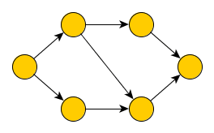
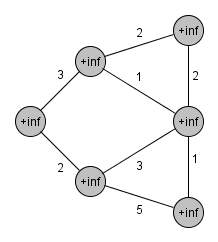
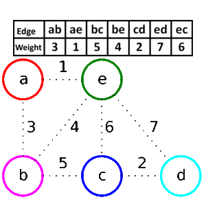

# 1. - Základy teorie grafů

>Základy teorie grafů – souvislost, kostra grafu, eulerovské, hamiltonovské a rovinné grafy. Vybrané grafové algoritmy – prohledávání grafu, minimální kostra, nejkratší cesta.

## Základní pojmy

- **Vrcholy** - reprezentují objekty
- **Hrany** - reprezentují vztahy mezi objekty

**Jednoduchý graf** - neobsahuje smyčky a paralelní hrany

**Metagraf** - může obsahovat smyčky a paralelní hrany

**Jednoduchý neorientovaný graf**

- uspořádáná dvojice G = (V,H)
 - V je konečná množina vrcholů
 - H je podmnožina množiny **neuspořádaných** dvojic prvků V (množina hran) 

**Jednoduchý orientovaný graf**
- uspořádáná dvojice G = (V,H)
 - V je konečná množina vrcholů
 - H je podmnožina množiny **uspořádaných** dvojic 
 - u->v != v->u

### Možné reprezentace grafu

- **výčet množiny** vrcholů a hran V={v1,v2,...,vn} H = {{v1,v3},{v1,v2},...}
- **grafická reprezentace** (graf)
- **seznamem vrcholů a seznamy jejich následovníků**
	- v1 -> v3 -> v5
	- v2 -> v3 -> v5
	- v4 -> v5
	- ...
- **matice incidence**
	- sloupce jsou jednotlivé hrany
	- řádky jsou jednotlivé vrcholy
	- existence hrany je je zavedena jako jedničky ve spojených vrcholech
	- tedy v jednom sloupci jsou právě 2 jedničky
- **matice sousednosti**
	- čtvercová matice dle počtu vrcholů
	- řádky i sloupce odpovídají vrcholům
	- tam kde jsou vrcholy spojené je nenulové číslo (váha)

### Průchod grafem z vrcholu u do v

- **sled**
 - libovolná posloupnost vrcholů a hran (jak se po sobě navazujících hranách dostat z u do v)
 - pokud u=v -> uzavřený sled
- **tah**
 - je sled, kde se nesmí opakovat hrany
 - pokud u=v -> uzavřený tah
- **cesta**
 - je tah, kde se nesmí opakovat vrcholy
 - pokud u=v -> **kružnice** (uzavřená cesta)

### Operace s grafem

- **kontrakce hrany** - vrcholy spojené danou hranou se spojí(merge-nou) v jeden, daná hrana zanikne
- **odstranění hrany** - hrana je odstraněna z množiny hran, vše ostatní zůstává
- **odstranení vrholu** - odstraní se vrchol a všechny hrany s ním spojené
- **dělení hrany** - hrana se rozdělí na 2 hrany s jedním vrcholem uprostřed

### Další důležité pojmy

**PodGraf** - graf vzniklý odebráním vrcholů či hran z původního grafu

**Faktor grafu** - podgraf obsahující všechny vrcholy

**Acyklický graf (les)** - graf, ve kterém neexistuje kružnice

**Strom** - souvislý acyklický graf, kde ekvivaletně platí:

- G je strom
- G je acyklický a zároveň |V| = |H| + 1
- G je souvislý a zároveň |V| = |H| + 1
- Pro mezi libovolnými vrcholy existuje právě jedna cesta

**Kostra grafu** -  takový podgraf souvislého grafu G na množině všech jeho vrcholů, který je stromem (strom, obsahující všechny vrcholy grafu G)

**Isomorfní graf** - graf který vznikne grafickým přeházením, či přeznačením hran

**Homeomorfní graf** - je takový graf, který je buď izomorfní, nebo je-li možné izomorfismu dosáhnout pomocí konečné počtu operací půlení hran

**Úplný graf** - je takový, kde je každý vrchol propojen s každým a rozlišujeme

- K5 - úplný graf (pentagram)
- K3,3 - úplný bipartiní graf (dvě trojice, kde je každý vrchol propojen se všemi v protější trojici)

**Stupeň vrcholu**

- *Neorientovaný graf* (značíme deg(u))
 - počet hran, které do daného vrcholu zasahují
 - případné smyčky počítáme dvakrát
- *Orientovaný graf* (rozlišujeme deg+(u) a deg-(u))
 - deg+(u) počet vstupních hran vrcholu u
 - deg-(u) počet výstupních hran vrcholu u
 - celkový stupeň uzlu je roven součtu vstupujících a vystupujících hran

**Skóre grafu** - posloupnost stupňů vrcholů grafu G seřazená nerostoucím způsobem

**Souvislý graf** - je takový, který má právě 1 komponentu (mezi libovolnou dvojici vrcholů existuje u-v cesta)

**Komponenta grafu** - maximální souvislý podgraf

## Eulerovský graf

- tzv. "jednotažky", lze je nakreslit jedním tahem
- je souvislý graf G (obecně s paralelními hranami), kde existuje **Eulerův tah** (je jedno jestli otevřený nebo uzavřený)

**Eulerovský tah**

- takový u-v tah, který obsahuje každou hranu právě jednou
- otevřený u != v
- uzavřený u=v (**eulerovská kružnice**)

**Kritérium eulerovskosti**

- souvislý graf je eulerovský práve tehdy, když má všechny vrcholy sudého stupně, nebo právě 2 vrcholy lichého
- pokud má všechny sudé, tak existuje eulerovská kružnice
- pokád má 2 liché, tak existuje neuzavřený eul. tah, který začíná v libovolném 1 z vrcholů lichého stupně a končí v tom druhém

**Problém čínského listonoše**
- hledáme uzavřený sled nejmenší možné váhy, který obsahuje každou hranu alespoň jednou

## Hamiltonovský grafy
- je souvislý graf, ve kterém existuje **Hamiltonovská kružnice**.

**Hamiltonovská kružnice** - kružnice, která je *faktorem* (podgraf, který obsahuje všechny původní vrcholy)

**Problém obchodního cestujícího**

- Máme úplný, ohodnocený graf
- hledáme hamiltonovskou kružnici nejmenší možné váhy

## Rovinné grafy

- jsou grafy, u kterých existuje rovinné nakreslení, tj. nakreslení bez křížení hran

**Kuratovského věta**
- graf G je rovinný, pokud neobsahuje podgraf homeomorfní s **K3,3** (úplný bipartitní graf) nebo **K5** (úplný graf)

## Prohledávání grafu

Hledáme cestu z vrcholu u do vrcholu v.

### Do hloubky (DFS - LIFO)

- algoritmus vezme první hranu (obvykle nejlevnější), dostane se k dalšímu vrcholu
- tam opět vezme první hranu a takto postupuje dokud nenarazí na vrchol, který nemá další hranu, nebo na konečný vrchol
- v tu chvíli se vrátí na předchozí vrchol a jde druhou hranou
- při procházení do hloubky se využívá zásobník (LIFO)

*Prohledávání do hloubky*

### Do šířky (BFS - FIFO)

- algoritmus nejprve vyčerpá všechny dostupné hrany a až pak se přesune na další vrchol  
- při procházení do šířky se využívá fronta (FIFO)

*Prohledávání do šířky*

## Minimální kostra

Minimální kostra je kostra s nejmenší možnou váhou.

**Jarníkův - Primův**

- algoritmus vychází z libovolného uzlu a udržuje si seznam již objevených uzlů a jejich vzdáleností od propojené části grafu
- vkaždém svém kroku připojí ten z uzlů, mezi nímž a projenou částí grafu je hrana nejnižší délky
- označí sousedy nově připojeného uzlu za objevené, případně zkrátí vzdálenosti od již známých uzlů, pokud byla nalezena výhodnější hrana
- v okamžiku, kdy jsou propojeny všechny uzly, algoritmus terminuje.

*Jarníkův - Primův algoritmus*

**Borůvkův algoritmus**

- princip skládání komponent
- na začátku všechny vrcholu jako samostatné komponenty
- algoritmus je pak postupně propojuje pomocí nejlevnějších hran
- zastaví se jakmile dosáhne jedné komponenty

*Borůvkův algoritmus*

**Kruskalův algoritmus**

- seřadí si hrany od nejlevnější po nejdražší a postupně přidává hrany
- hrana je přidána, pokud alespoň jeden z vrcholů dané hrany ještě nebyl viděn

*Kruskalův algoritmus*

## Nejkratší cesta

Hledání nejkratší cesty z vrcholu u do vrcholu v.

**Dijkstrův algoritmus**

- počáteční vrchol má skóre 0 a všechny ostatní nekonečno
- každý následující vrchol dostane skóre součtem skóre vrcholu a váhy hrany, kterou jsou spojené
- pokud se do daného vrcholu lze dostat více hranami, tak výsledné skóre tohoto vrcholu je to menší
- výsledná cesta je pak cesta přes vrcholy s nejmenším skóre

*Dijkstrův algoritmus*

**Floydův-Warshallův algoritmus**
- hledá nejkratší cestu mezi všemi dvojicemi vrcholů
- umí pracovat s negativně ohodnocenými hranami, pokud se nevyskytuje záporný cyklus
- https://en.wikipedia.org/wiki/Floyd%E2%80%93Warshall_algorithm
- https://www.youtube.com/watch?v=KQ9zlKZ5Rzc

**Bellmanův-Fordův algoritmus**
- narozdíl od Dijkstrova algoritmu umí pracovat se záprně ohodnocenými hranami, je ale pomalejší
- umí poznat, zda je v grafu tzv. záporný cyklus dozažitelný ze startu (a úloha v tomto případě nemá smysl)
- https://en.wikipedia.org/wiki/Bellman%E2%80%93Ford_algorithm
- https://www.youtube.com/watch?v=hxMWBBCpR6A
