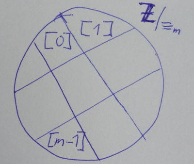

# 2. - Základy teorie dělitelnosti

> Základy teorie dělitelnosti – základní pojmy (NSD, NSN, Eukleidův algoritmus), řetězové zlomky, kongruence modulo m, úplná a redukovaná soustava zbytků, počítání v (Zm, +, .), řešení kongruencí 1. stupně a jejich soustav.

## Základní pojmy

Relace *býti dělitelem* ... 

 dělí  právě tehkdy, když existuje nějaké celé číslo , že 

-  ... *dělitel* čísla 
-  ... *násobek* čísla 
-  ... podíl

**Společný dělitel**

 je *společný dělitel* čísel , jestliže

 ... (dělí obě čísla beze zbytku)

**Společný násobek**

 je *společný násobek* čísel  , jestliže

 ... (obě čísla dělí tento násobek beze zbytku)

### Největší společný dělitel (NSD)

 ... **největší společný dělitel** čísel 

Pokud , pak  existuje vždy a je určen jednoznačně.

Platí: 

 čísla jsou **nesoudělná**

#### Jak nalézt NSD?

1. metoda hrubé síly
2. Euklidův algoritmus
3. dvojkový NSD algortimus
4. pomocí kanonických rozkladů

Pro více čísel:

- kanonické rozklady (prvočísla)
- udělám NSD dvou a postupně přidávám další čísla 

### Nejmenší společný násobek (NSN)

 ... nejmenší společný násobek čísel 

Existuje a je určen jednoznačně.

#### Jak nalézt NSN?

1. metoda hrubé síly
2. Euklidův algoritmus

Pro více čísel: obdobně jako u NSD.

### Souvislost mezi NSD a NSN

### Kanonické rozklady

Pro nalezení  vezmu z rozkladů ty prvočísla, která se vyskytují *ve všech* rozkladech a to v jejich *nejmenší* mocnině.

Pro nalezení  vezmu z rozkladů *všechna* prvočísla a to v jejich *nejvyšší* mocnině.

### Euklidův algoritmus

NSD je poslední nenulový zbytek ().

#### Příklad

Nalezněte  a 

|  |  |  |  |
| ---:  | ---: | ---: | ---: |
| 192 | 108 | 1 | 84 |
| 108 | 84 | 1 | 24 |
| 84 | 24 | 3 | **12** |
| 24 | 12 | 2 | 0 |

### Řetězové zlomky

Číslo má ukončený rozvoj v řetězový zlomek právě tehdy, když je racionální.

Pro tvorbu zlomku se využijí koeficienty  z Euklidova rozvoje.

## Kongruence modulo m

Řekneme, že čísla  jsou *kongruentní modulo* , jestliže po vydělení číslem  dávají stejný zbytek.

Zápis ... 

### Početní pravidla

Nechť , potom platí:

- ,
- ,
- .

Konguence *se stejným modulem* lze upravovat.

**Možné operace**

- převod členů na jednu stranu ... 
- vynásobení obou stran konstantou ... 
- přičtení konstanty k oboum stranám ... 
- umocnění obou stran konstantou ... 

**Změna modulo**

- 
- 
- 
- 

### Rozklad na třídy ekvivalence

Kongruence je (viz [9. Gramatiky - Vlastnosti binárních relací](https://github.com/tomaskrizek/tul-szz-it-nv/blob/master/09_gramatiky/09_gramatiky.md#vlastnosti-bin%C3%A1rn%C3%ADch-relac%C3%AD)):
  - reflexivní ,
  - symetrická ,
  - tranzitivní .

Tzn., relace  (býti kongruentní modulo m) na množině  definuje rozklad množiny na třídy ekvivalence, které se nazývají *zbytkové třídy modulo m*.

### Soustava nejmenších nezáporných zbytků modulo m

Pro výpočty se používají reprezentanti ze zbytkových tříd, označované např. [2]. To označuje třídu, do které spadají všechna čísla, která po dělení m dávají zbytek 2. V zápisech se potom obvykle vynechávají hranaté závorky.

 ... **úplná soustava nejmenších nezáporných zbytků modlulo m**

*Zbytková třída modulo *

**Redukovaná soustava zbytků modulo m**

- zůstanou pouze zbytky, které jsou nesoudělné s 
- označení 

## Počítání v 

### Sčítání modulo m

- existuje *neutrální prvek* ...  (po jeho přičtení se výsledek nezmění)
- ke všem prvkům lze nalézt *opačný prvek* (tzn. takový, že po jeho přičtení dostávám výsledek )

**Příklad** v 

- 
- 
- 

| + | 0 | 1 | 2 | 3 |
|---|---|---|---|---|
|**0**| 0 | 1 | 2 | 3 |
|**1**| 1 | 2 | 3 | 0 |
|**2**| 2 | 3 | 0 | 1 |
|**3**| 3 | 0 | 1 | 2 |

### Násobení modulo m

- existuje *neutrální prvek* ...  (po vynásobení 1 se výsledek nezmění)
- k jednotlivým prvkům může existovat *inverzní prvek* ...  ()

**Příklad** v 

|  | 1 | 2 | 3 | 4 |
|---|---|---|---|---|
|**1**| 1 | 2 | 3 | 4 |
|**2**| 2 | 4 | 1 | 3 |
|**3**| 3 | 1 | 4 | 2 |
|**4**| 4 | 3 | 2 | 1 |

Pozn.: Pokud cokoliv vynásobím prvek ze třídy 0, bude i výsledek 0.

- 
- potřebuju se zbavit 2, v tabulce najdu jakým číslem to musím vynásobit, abych dostal 1 ... musím násobit 3
- 
- 
- 
- 

Řešení *nemusí existovat*, např. 

## Řešení kongruencí prvního stupně

**Existence řešení**

Nemá řešení pro .

### Existuje jedno řešení

Pokud , existuje právě jedno řešení.

**Příklad**

1. Ověření existence (právě jednoho) řešení

  

2. Euklidův algoritmus pro 

  |  |  |  |  |
  | ---:  | ---: | ---: | ---: |
  | 379 | 269 | 1 | 110 |
  | 269 | 110 | 2 | 49 |
  | 110 | 49 | 2 | 12 |
  | 49 | 12 | 4 | 1 |
  | 12 | 1 | 12 | 0 |

3. **Přibližné zlomky**

  

  |  | -1 | 0 | 1 | 2 | 3 | 4 |
  | --- | --- | --- | --- | --- | --- | --- |
  |  | 1 | 1 | 3 | 7 | **31** | *379* |
  |  | - | 1 | 2 | 2 | 4 | 12 |

4. 

  

  

### Existuje více řešení

Pokud , existuje více řešení.

**Příklad**

1. Ověření existence a zjištění počtu řešení

  

2. Vydělení kongruence 

  

3. Nalezení řešení 

  Pro tuto kongruenci se použije výše popsaný postup pro nalezení jednoho řešení.

  

4. Nalezení zbývajících řešení.

  Další řešení jsou pouze násobky  menší než .

  

## Řešení soustav kongruencí

### Čínská věta o zbytku

*Podmínka řešitelnosti*: V soustavě jsou všechny m po dvou nesoudělné.

**Příklad**

1. 

2. Vytvořím kongruence 

  - 
  - 
  - 
  - 

3. Vyřeším kongruence

  - 
  - 
  - 
  - 

4. Naleznu řešení původní soustavy.

  

  

  

  

### Zobecněná Čínská věta o zbytku

Umožňuje řešit obecné soustavy kongruencí, kde

