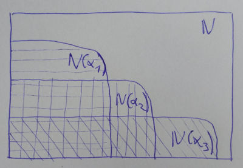
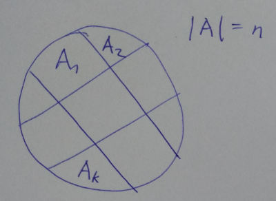

# 4. Základy klasické kombinatoriky

> Základy klasické kombinatoriky – princip inkluze a exkluze, Dirichletův princip, zobecněný binomický koeficient, subfaktoriály, Fibonacciho, Catalanova a Stirlingova čísla, problematika rozkladů – varianty, (ne)rozlišitelné objekty, (ne)rozlišitelné skupiny, využití diofantických rovnic a vytvořujících funkcí v oblasti rozkladů.

## Problematika

Máme n objektů, vybíráme k-tice.

*Rozdělení pojmů*

### Variace k-té třídy

= *uspořádané* k-tice prvků

- **Bez opakování** (všechny prvky různé)

  | 1. | 2. | ... | k. |
  | --- | --- | --- | --- |
  | n  | n-1 | ...| n-k+1 |

  

  **Příklad**: Na startu stojí šest závodníků, kolika způsoby se mohou závodnící umístit na stupni vítězů.

- **S opakováním**

  | 1. | 2. | ... | k. |
  | --- | --- | --- | --- |
  | n  | n | ...| n |

  

  **Příklad**: Kolik různých binárních čísel lze sestavit pomocí tří bitů?

### Permutace
= variace, kde  (uspořádané n-tice)

- **Bez opakování**

  

  

  **Příklad**: Na ústní zkoušku dorazilo sedm studentů. Kolik existuje různých pořadí, ve kterém mohou studenti jít postupně ke zkoušce?

- **S opakováním**

  -  ... prvků 1. druhu
  -  ... prvků 2. druhu
  - ...
  -  ... prvků k. druhu

  

  **Příklad**: Osm studentů má na koleji připraveno ubytování ve třech pokojích. Dva jsou třílůžkové a jedna Dvoulužkový. Kolik je způsobů rozdělení studentů do pokojů?

### Kombinace k-té třídy

= *neuspořádané k-tice*

- **Bez opakování**

  n různých objektů, každý v jednom exempláři

  

   ... kombinační číslo "n nad k" (*binomický koeficient*)

  **Vlastnosti**

  -  (charakteristický vektor - pro každý prvek určím zda je/není v kombinaci)
  -  ... symetrie
  -  ... Pascalova identita
  - 
  - 

  **Příklad**: Mám k dispozici pět lidí. Kolika způsoby z nich můžu vybrat trojici?

- **S opakováním**

  n různých exemplářů, každý v libovolném počtu

  

  **Odvození**:

  - 1 reprezentuje, že vyberu objekt
  - 0 se použije jako oddělovač
  - sestavím bitový řetězec, kde použiju n-1 oddělovačů a k výběrů

  **Příklad**: V hospodě mají 4 druhy piva, kolika způsoby si mohu dát 2 libovolná.

## Základní kombinatorická pravidla

### Pravidlo součtu

Počet způsobů, jak vybrat objekt z A nebo B, je roven součtu mohutností množin A a B.

### Pravidlo součinu

Počet způsobů, jak vybrat uspořádanou dvojici  je roven násobku mohutnosti množin.

### Dirichletův princip

Při libovolném rozdělení n objektů do k skupin platí, že alespoň jedna skupina obsahuje alespoň  objektů.

Prakticky: n krabiček, n+1 kuliček ... jedna krabička musí obsahovat dvě kuličky

### Princip inkluze a exkluze

Některé kombinatorické úlohy je jednodušší řešit tak, že nehledám, které objekty **splňují** dané vlastnosti, ale místo toho najdu objekty, které dané vlastnosti **nesplňují** a ty odečtu od celku.

 ... počet objektů

 ... potenciální vlastnosti objektů

 ... objekty, které **mají** vlastnost 

 ... objekty, které **nemají** vlastnost 

![\\ N(\overline{\alpha_1}, \overline{\alpha_2}, \ldots, \overline{\alpha_n}) = N\\  ~~~~~~~~~~~~~~~~~~~~~~~~~~~- N(\alpha_1) - N(\alpha_2) - \ldots - N(\alpha_n)\\  ~~~~~~~~~~~~~~~~~~~~~~~~~~~+ N(\alpha_1, \alpha_2) + N(\alpha_1, \alpha_3) + \ldots + N(\alpha_{n-1}, \alpha_n)\\  ~~~~~~~~~~~~~~~~~~~~~~~~~~~~~~~ - N(\alpha_1, \alpha_2, \alpha_3) - N(\alpha_1, \alpha_2, \alpha_4) - \ldots - N(\alpha_{n-2}, \alpha_{n-1}, \alpha_n)\\  ~~~~~~~~~~~~~~~~~~~~~~~~~~~ \ldots \\  ~~~~~~~~~~~~~~~~~~~~~~~~~~~ + (-1)^n N(\alpha_1, \alpha_2, \ldots, \alpha_n)](https://latex.codecogs.com/svg.latex?%5C%5C%20N%28%5Coverline%7B%5Calpha_1%7D%2C%20%5Coverline%7B%5Calpha_2%7D%2C%20%5Cldots%2C%20%5Coverline%7B%5Calpha_n%7D%29%20%3D%20N%5C%5C%20%7E%7E%7E%7E%7E%7E%7E%7E%7E%7E%7E%7E%7E%7E%7E%7E%7E%7E%7E%7E%7E%7E%7E%7E%7E%7E%7E-%20N%28%5Calpha_1%29%20-%20N%28%5Calpha_2%29%20-%20%5Cldots%20-%20N%28%5Calpha_n%29%5C%5C%20%7E%7E%7E%7E%7E%7E%7E%7E%7E%7E%7E%7E%7E%7E%7E%7E%7E%7E%7E%7E%7E%7E%7E%7E%7E%7E%7E&plus;%20N%28%5Calpha_1%2C%20%5Calpha_2%29%20&plus;%20N%28%5Calpha_1%2C%20%5Calpha_3%29%20&plus;%20%5Cldots%20&plus;%20N%28%5Calpha_%7Bn-1%7D%2C%20%5Calpha_n%29%5C%5C%20%7E%7E%7E%7E%7E%7E%7E%7E%7E%7E%7E%7E%7E%7E%7E%7E%7E%7E%7E%7E%7E%7E%7E%7E%7E%7E%7E%7E%7E%7E%7E%20-%20N%28%5Calpha_1%2C%20%5Calpha_2%2C%20%5Calpha_3%29%20-%20N%28%5Calpha_1%2C%20%5Calpha_2%2C%20%5Calpha_4%29%20-%20%5Cldots%20-%20N%28%5Calpha_%7Bn-2%7D%2C%20%5Calpha_%7Bn-1%7D%2C%20%5Calpha_n%29%5C%5C%20%7E%7E%7E%7E%7E%7E%7E%7E%7E%7E%7E%7E%7E%7E%7E%7E%7E%7E%7E%7E%7E%7E%7E%7E%7E%7E%7E%20%5Cldots%20%5C%5C%20%7E%7E%7E%7E%7E%7E%7E%7E%7E%7E%7E%7E%7E%7E%7E%7E%7E%7E%7E%7E%7E%7E%7E%7E%7E%7E%7E%20&plus;%20%28-1%29%5En%20N%28%5Calpha_1%2C%20%5Calpha_2%2C%20%5Cldots%2C%20%5Calpha_n%29)

*Vennův diagram znázorňující princip inkluze a exkluze pro tři vlastnosti*

## Zobecněný binomický koeficient

Viz kombinace bez opakování.

|  | 0 | 1 | 2 | 3 |
| --- | --- | --- | --- | --- |
| -3 | **1** | **-3** | **6** | **-10** |
| -2 | 1 | -2 | 3 | -4 |
| -1 | 1 | -1 | 1 | -1 |
| *0* | *1* | *0* | *0* | *0* |
| 1 | 1 | 1 | 0 | 0 |
| 2 |  **1** | 2 | 1 | 0 |
| 3 | 1 | **3** | 3 | 1 |
| 4 | 1 | 4 | **6** | 4 |
| 5 | 1 | 5 | 10 | **10** |

Pozn.: Na levé straně () jsou samé nuly.

### Binomická věta

### Multinomický vzorec

Zobecnění binomické věty pro více proměnných.

### Newtonův vzorec

Nechť , potom:

## Catalanova čísla

**Základní problém**

- Mám šachvnici [m, n]
- Pohybuju se vždy o jeden krok ve směru x nebo ve směru y
- Kolik způsoby se lze dostat z počátku do [m, n] **aniž bych překročil diagonálu**? ... 

**Praktické problémy**

- Kolika způsoby lze správně uzávorkovat výraz ?
  - Musí být dodrženo pravidlo, že v libovolné části výrazu je na levé straně více nebo stejně otevíracích závorek než uzavíracích.
  - Počet způsobů 

- *Kolik permutací lze realizovat pomocí zásobníku?*
  - Nelze vybírat z prázdného zásobníku
  - Vybírat lze pouze zeshora, stejně tak vkládat
  - Počet způsobů opět 

### Subfaktoriály

Kolik existuje permutací, ve kterých žádný prvek není na svém místě?

Použije se princip IE, kde  je vlastnost, že -tý prvek je na svém místě.

 ... počet permutací na n-prvkové množině, kde právě k prvků je na svém místě

### Fibonacciho čísla

## Rozklady

- **Nerozlišitelné objekty**
  - _Rozlišitelné skupiny_
    - Bez omezení
    - Neprázdné skupiny
    - S omezujícími podmínkami
  - _Nerozlišitelné skupiny_
- **Rozlišitelné objekty**
 - _Rozlišitelné skupiny_
 - _Nerozlišitelné skupiny_

### Nerozlišitelné objekty do rozlišitelných skupin

Rozděluji n nerozlišitelných objektů do k rozlišitelných skupin.

1. Bez omezení

  Odpovídá počtu řešení diofantické rovnice:

  

  - Vytvářím bitový řetězec, kde
  - 1 je objekt,
  - 0 je oddělovač skupin.

  

  **Vytvořující funkce**

  

  

2. Skupiny jsou *neprázdné*

  - k objektů umístím natvrdo (po jednom do každé skupiny)
  - Tvořím bitový řetězec ze zbytku objektů a oddělovačů.

  

  **Vytvořující funkce**

  

3. Omezení počtů jednotlivých skupin

  U skupin můžu specifikovat, kolik má obsahovat nejméně a nejvíce objektů.

  

  Převede se na standardní tvar.

  

  Potom se řeší pomocí principu inkluze a exkluze, kde:

  

  

### Nerozlišitelné objekty do nerozlišitelných skupin

- Mám n nerozlišitelných objektů.
- Počet skupin nepředepisuji.
- = *počet rozkladů přirozeného čísla n na nezáporné sčítance*
- odpovídá počtu řešení diofantické rovnice

**Vytvořující funkce**

...

### Rozlišitelné objekty do rozlišitelných skupin

- n rozlišitelných objektů
- k rozlišitelných skupin
- = počet rozkladů množiny na k tříd
- = počet ekvivalencí na množině, které mají k tříd ekvivalence
- = Stirling subset number

*Rozklad množiny o  prvcích na  tříd ekvivalence*

**Stirling subset number**

**Stirling cycle number**

Kolik existuje permutací na n-prvkové množině, které lze zapsat ve tvaru součinu k disjunktních cyklů?

= n prvková množina, rozděluji do k tříd ve kterých prvky rozmisťuju na kružnici

= 

### Rozlišitelné objekty do nerozlišitelných skupin
Tuto problematiku jsme neřešili.
