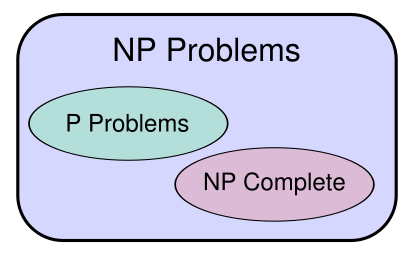

# 07. - Časová náročnost algoritmů

>Časová náročnost algoritmů. Průměrné a nejhorší chování. Úlohy P, NP a NP-úplné.

- Máme funkci  a snažíme se popsat její asymptotické chování.
- Časová složitost se také označuje jako asymptotická složitost.
- Kromě časové složitosti se někdy určuje i paměťová náročnost.
- Používá se symbolika:
  -  ... velké O
  -  ... velké omega
  -  ... velké theta
- 
- 

## Porovnání složitostí

V tabulce seřazeno od nejrychlejší po nejnáročnější.

| Notace  | Název | Příklad algoritmu |
| ------- | ----- | ----------------- |
|  | konstantní | nalezení prvku v hashovací tabulce |
|  | logaritmická | vyhledání prvku metodou půlení intervalu v seřazeném poli |
|  | lineární | vyhledání prvku v neseřazeném poli |
|  | linearitmická | merge sort |
|  | kvadratická | řazení pole výběrem |
|  | kubická | násobení matic |
|  | exponenciální |  |
|  | faktoriálová | problém obchodního cestujícího hrubou silou |
|  | | |

##  (Velké O)

- Omezuje růst funkce shora
- Používá se nejčastěji pro udávání asymptotické složitosti algoritmů (oproti ostatním dvěma notacím)
- Říká, že funkce  **neroste rychleji** než kladný násobek funkce 

**Zápis**

 ( je prvkem velkého ) právě tehdy, když:

##  (Velké omega)

- Omezuje růst funkce zdola
- Říká, že funkce  **roste alespoň tak rychle** jako  (až na multiplikativní konstantu)

**Zápis**

##  (Velké theta)

- Omezuje růst funkce shora i zdola
- Říká, že funkce  **roste stejně rychle** jako funkce  (až na multiplikativní konstanty)

**Zápis**

## Průměrná a nejhorší složitost

- V praxi se často udává
  - Nejhorší složitost ... složitost, v nejhorším možném případě
  - Průměrná složitost ... složitost úlohy v průměrném případě
- Tyto hodnoty nemusí být stejné
- Zatímco složitost v nejhorším případě lze analyticky spočítat, průměrnou složitost je u řady algoritmů nutno zjistit statisticky.

**Příklad**

- Quick sort
  - Nejhorší složitost 
  - Průměrná složitost 
  - Závisí na vhodné volbě pivota
  - V praxi se algoritmus používá, protože ve většině případů funguje rychle a je jednoduchý na implementaci

- Vyhledávání prvku v nesetříděném poli
  - Nejhorší složitost 
  - Průměrná složitost 
  - *Pozn. autora*: Zde to asi nemá význam příliš rozlišovat, jelikož se jedná o stejnou složitost, která se liší pouze konstantou.

## Úlohy P, NP, NP-úplné

[Video na youtube](https://www.youtube.com/watch?v=YX40hbAHx3s)

1. Úlohy P (polynomial time)
  - Úlohy řešitelné v polynomiálním čase 
  - Příklady:
    - Násobení
    - Řazení

2. Úlohy NP (non-deterministic polynomial time)
  - Úlohy, jejichž *řešení lze ověřit v polynomiálním čase*
  - Patří sem všechny úlohy z P, ale kromě toho i další, které už nepatří do P, např.:
    - Faktorizace - rozklad na prvočísla (asymetrická kryptografie)
    - Návrh desek plošných spojů
    - Problém obchodního cestujícího

3. Úlohy NP-úplné
  - Jsou úlohy, které jsou NP, nejsou P a *lze na ně převést všechny ostatní NP úlohy*
  - Pokud by se našlo řešení NP-úplné úlohy, které by bylo schopné řešit danou úlohu v polynomiálním čase, znamenalo by to, že  (všechny NP úlohy bychom dokázali vyřešit v polynomiálním čase)
  - Konsenzus je, že , ale zatím to nebylo dokázáno (jedná se o jeden z [Millenium Prize Problems](https://en.wikipedia.org/wiki/Millennium_Prize_Problems))
