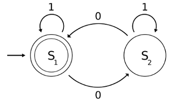
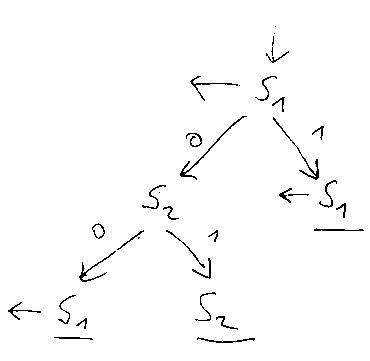
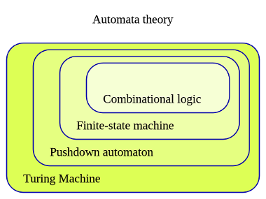

# 8. Konečné automaty

> Definice konečného automatu, jazyky rozpoznávané konečnými automaty.

## Formální definice

Konečným automatem je

, kde

-  je konečná množina všech stavů (stavový prostor),

-  je konečná množina vstupních symbolů (abeceda),

-  je přechodová funkce,

  

  

-  je počáteční stav,

-  je množina koncových stavů.

### Přeloženo

Konečný automat (KA) je reprezentován pomocí stavů. Je schopen pracovat s nějakými vstupními znaky, kterým se říká abeceda. Ze vstupu čte postupně znaky této abecedy. S každým přečtením znaku se může přesunout do jiného vnitřního stavu. Jeden z těchto stavů se označí za vstupní - tam automat začíná svojí činnost. Některé (lze i žádné) stavy se označí jako koncové. Pokud se automat dostane do koncového stavu, ukončí svoji činnost a vstupní slovo (posloupnost znaků dané abecedy) bylo rozpoznáno (akceptováno).

## Jazyk rozpoznávaný KA

Množina všech slov, které je schopen KA  rozpoznat tvoří jazyk . Formálně:

Jazyk  je **rozpoznatelný** KA, jestliže existuje KA  takový, že .

Jazyky, které KA rozpoznávají jsou **regulární**. Viz .

## Reprezentace automatu

Následující KA rozpoznává binární čísla, která mají sudý počet nul. 

KA je možné reprezentovat několika způsoby.

1. Formální zápis

  

  

  

  

  

2. Stavovým diagramem

  

3. Tabulkou

  | &nbsp; |  0  |  1  |
  | --- | --- | --- |
  |  |  |  |
  |  |  |  |

  Pomocí šipek se označí stav jako vstupní (), výstupní () nebo vstupní i výstupní zároveň ().

4. Stavovým stromem

  

## Nerodova věta

Pomocí nerodovy věty lze určit, zda lze daný jazyk rozpoznat pomocí KA. Používá se důkaz sporem, tzn. předpokládám, že jazyk lze rozpoznat KA a pokud dojdu ke sporu, tak závěr je, že jazyk nelze rozpoznat konečným automatem.

### Formálně

Jazyk  nad abecedou  je rozpoznatelný KA právě tehdy když existuje pravá kongruence konečného indexu, že jazyk  je tvořen sjednocením některých tříd z faktorového rozkladu , kde  je pravá kongruence konečného indexu.

- *pravá kongruence konečného indexu* (PKKI) ... Mám dvě slova u, v, které jsou ekvivalentní. Pokud k obou připíšu zprava stejné slovo w, tak jsou slova uw a vw stále ekvivalentní.

### Lidsky řečeno

Mám nějaký jazyk. Jelikož ho chci rozpoznávat *konečným* automatem, který má *konečný* počet stavů, tak můžu množinu všech slov rozdělit do nějakého konečného počtu tříd, protože každé vstupní slovo uvede automat do některého ze stavů. To je faktorový rozklad.

Potom vezmu **některé** tyto třídy (která obsahují různa slova) a ty sjednotím. To je dané tím, že pouze některé stavy automaty jsou finálními stavy (ve kterém je slovo rozpoznáno). Pokud toto sjednocení odpovídá požadovanému jazyku, tak lze tento jazyk rozpoznat KA.

### Příklad

Nechť  KA ,   PKKI ""  ... začátek důkazu sporem - předpokládám, že jazyk je rozpoznatelný KA

 ... množinu všech slov rozložím podle PKKI

 ... tříd rozkladu je celkem 

Nyní si musím vhodně zvolit slova, abych potom došel ke sporu. Zvolím si jich záměrně . Potom nevyhnutelně (Dirichletův princip) musí dvě slova patřit do jedné třídy.

Pomocí PKKI připíšu slovo . Výsledná slova by měla stále patřit do stejné třídy, což nepatří, protože  a slovo  patří do jazyka , zatímco slovo  do jazyka  nepatří. Docházím ke **sporu** a tím pádem mohu prohlásit, že jazyk  *není rozpoznatelný KA (jakýmkoliv)*.

## Nedeterministické automaty

- Oproti deterministickému KA (DKA):
  - místo jednoho počátečního stavu má množinu vstupních stavů,
  - po přečtení znaku je možné se z jednoho stavu dostat do *více* stavů.
- Stejně silný jako DKA (rozpoznávají stejné jazyky).
- Lze převést na DKA.
- Může být jednodušší na návrh.
 
## Porovnání síly konečných automatů

Turingův stroj je nejsilnější a dokáže realizovat libovolný algoritmus.

Slabším nástrojem je zásobníkový automat (KSZ1).

Poté jsou konečné automaty, které jsou schopny rozpoznávat regulární jazyky.

Konečné automaty jsou silnější nástroj než kombinační logika.

## Uzávěrové vlastnosti

> Mohla by na to dojít řeč v souvislosti s jazyky rozpoznávanými KA, ale není to úplně součástí otázky, nevím zda uvést.

