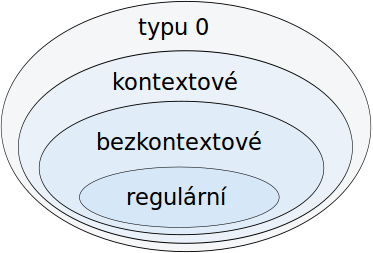
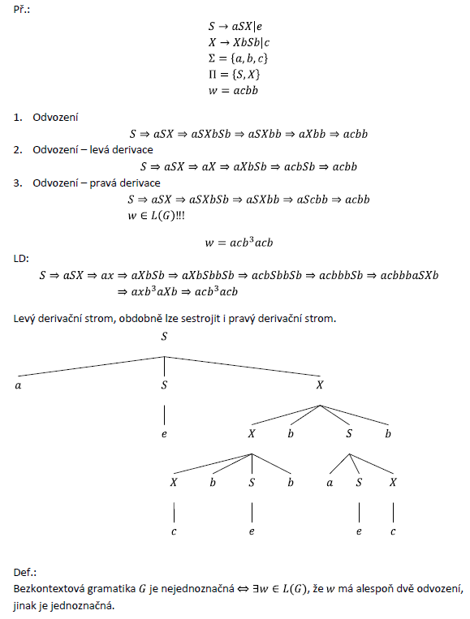

# 9. - Gramatiky

> Gramatiky, Chomského hierarchie, vztah gramatik ke konečným strojům.

Gramatika se skládá z množiny pravidel, pomocí kterých může být každé slovo předepsaným způsobem vygenerováno z předem daného počátečního symbolu. Máme nějakou abecedu symbolů (řekněme třeba a, b), což odpovídá **terminálním symbolům**. Dále máme nějaké proměnné zvané též **neterminální symboly**, například X, Y. Pak potřebujeme počáteční proměnnou, ze které je možné odvodit všechna slova, která umí gramatika generovat. Řekněmě, že počáteční symbol bude X. Nakonec k tomu přidáme **přepisovací pravidla**, pomocí kterých je možné přepisovat terminální a neterminální symboly na jiné. Generování probíhá tak, že vezmeme **počáteční symbol**, na něj aplikujeme kterékoli z pravidel, na získaný řetězec opět aplikujeme kterékoli z pravidel a tak dále, dokud nevygenerujeme požadované slovo. Pokud je pro každé slovo nejvýše jeden postup generování, gramatika je **jednoznačná**.

**Formální definice:**

Gramatika  je uspořádaná čtveřice , kde

 je množina neterminálů,

 je množina terminálů,  (terminální a neteminální symboly jsou odlišné),

 je počáteční neterminál,

 je konečná množina přepisovacích pravidel.

**Konvence:**

- jednotlivé terminály značíme – a, b, c, …
- řetězce terminálů značíme – u, v, w, …
- jednotlivé neterminály – A, B, C … X, Y, Z
- řetězce neterminálů a terminálů – α, β, γ, …
- prázdný řetězec značíme symbolem e nebo také ε

### Přepisovací pravidla

Pravidla mají tvar , kde .

To znamená, že pomocí přepisovacích pravidel můžu změnit řetězec , který může být složen z terminálních i neterminálních symbolů na řetězec , který zase může obsahovat libovolné terminální a neterminální symboly (nebo prázdné slovo ).

#### Příklady pravidel

| Pravidlo | Popis |
| -------  | ----- |
|  |  neterminál  se přepíše na  |
|  | neterminál  se přepíše na neterminál  |
|  | neterminál se  přepíše buď na terminál  nebo na neterminál  (spojení více pravidel do jednoho) |
|  | terminál  následovaný neterminálem  se přepíše na terminální symboly  |

### Příklad gramatiky

Taková gramatika generuje jazyk

Funguje to tak, že vycházím z počátečního symbolu, zde . Postupně používám různá pravidla, abych vygeneroval slovo, které chci získat. Třeba pro získání  by to probíhalo následovně:

Což se dá zapsat jako  ( se přepíše pomocí gramatiky  na ).

### Přepisovací systém

 ...  se **přímo přepíše** na 

 ...  se **přepíše** na  (nevypisují se jednotlivé kroky, ale pouze počátek a konec)

 je **reflexivní a tranzitivní binární relace (viz níže - vlastnosti relací)

### Generativní gramatika

Pro analýzu *shora dolů* se používají generativní gramatiky. Shora dolů znamená, že mám počáteční symbol S, ze kterého vytvářím nějaké slovo, tedy:

Generativní gramatiky jsou ty, co byly popsány výše.

### Analytické gramatiky

Pro analýzu *zdola nahoru* se používají analytické gramatiky. Zdola nahoru znamená, že vycházím z nějakého slova a snažím se získat počáteční symbol, tedy:

Analytické gramatiky se od generativních liší tak, že u přepisovacích pravidel (ve formátu ) obsahuje  alespoň jeden neterminál.

Jazyk  rozpoznávaný analytickou gramatikou  je potom:

## Chomského hierarchie

Gramatiky se dělí na základě omezení přepisovacích pravidel do několika typů podle Chomského hierachie. Ta definuje následující typy gramatik:

Důležité je si uvědomit, že regulární gramatika je zároveň i bezkontextová, kontextová i typu 0. Stejně tak třeba kontexová gramatika je zároveň i typu 0. Všechny gramatiky jsou tím pádem typu 0.

Různé typy gramatik jsou schopné rozpoznávat různé typy jazyků a pro jejich implementaci je potřeba jiný typ konečného stroje. Výhodou gramatik vyšších typů je právě fakt, že jejich implementace je jednodušší. Následující tabulka znázorňuje typy gramatik, jazyků, strojů pro implementaci a omezení pro přepisovací pravidla.

| Gramatika | Jazyky | Konečný stroj | Formát přepisovacích pravidel |
| --------- | ------ | ----- | ------------------------------ |
| Typ 0     | Rekurzivně spočitatelné | TS, PS, KSZ2  |  (žádná omezení) |
| Kontextová (typ 1) | Kontextové |           |  |
| *Bezkontextová* (typ 2) | Bezkontextové | nedeterministický KSZ1 | 
| *Regulární* (typ 3) | Regulární | KA |  |

U přepisovacích pravidel platí konvence:

- *písmena řecké abecedy* 
- *velká písmena* představují **neterminální symboly**
- *malá písmena* představují **terminální symboly**

### Vztah ke konečným strojům

Viz předchozí tabulka. Připomenutí:

#### Turingův stroj (TS)

- čtecí hlava, nekonečná páska, program
- na pásce se lze pohybovat doleva/doprava, je možné číst a zapisovat

#### Postův stroj (PS)

- pamět je typu fronta (FIFO)
- z jednoho konce se čte, z druhého se zapisuje

#### Konečný stroj se zásobníky (KSZn)

- paměť je typu zásobník (LIFO)
- zapisuje se i se čte z vrcholu zásobníku
- pokud má alespoň 2 zásobníky, dokáže to,co TS nebo PS

#### Zásobníkový automat (KSZ1)

- jiné označení pro KSZ1
- konečný stroj s jedním zásobníkem nedokáže to, co TS, PS nebo KSZ2+

#### Konečný automat (KA)

- žádná paměť pro zápis
- pouze si pamatuje (se nachází v) aktuální stav

## Vlastnosti binárních relací

> Není to úplně součástí otázky, ale mohla by na to přijít řeč. Je to dobré vědět, ale pokud se na to někdo vyložené nezeptá, asi bych to nezmiňoval.

Pro libovolnou binární relaci mohou (a nemusí) platit následující vlasnosti.

Nechť  je binární relace.

1. **Reflexivita**

  

  Všechny prvky z  jsou v relaci samy se sebou.

2. **Symetrie**

  

  Pokud  je v relaci s , potom i  je v relaci s . (nebo *právě tehdy když* - zde to lze zaměnit)

3. **Antisymetrie**

  

  Pokud  je v relaci s  a zároveň je i  v relaci s , potom se jedná o totožný prvek.

4. **Tranzitivita**

  

  Pokud  je v relaci s  a zároveň je  v relaci s , potom je i  v relaci s .

### Relace ekvivalence

Pro relaci ekvivalence  platí:

- reflexivita
- symetrie
- tranzitivita

K libovolné relaci ekvivalence existuje právě jediný rozklad na třídy ekvivalence.

### Částečné uspořádání

Pro relaci částečného uspořádání  platí:

- reflexivita
- antisymetrie
- tranzitivita

## Syntaktická analýza

*Příklad syntaktické analýzy*
