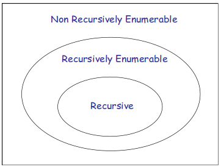

# 10. - Turingův stroj
>Turingův stroj, problém zastavení, totální a parciální rozhodnutelnost tříd problémů, rekurzivní a rekurzivně spočetné množiny, jejich vztah.

## Turingův stroj

- Lze pomocí něj implementovat libovolný algoritmus
- V porovnání s KA je to silnější nástroj
- Rozpoznává jazyky typu 0
- Stejně složité úlohy jsou schopny řešit i Postovy stroje nebo Konečné stroje se dvěma a více zásobníky
- Základní části:
  1. Páska
    - Slouží jako paměť
    - Nekonečná
  2. Čtecí hlava
    - Určuje pozici na pásce
    - Umožňuje čtení/zápis libovolného znaku na pásku
    - Pohybuje se vždy o jeden krok doleva (L) nebo doprava (R)
  3. Program
    - Zapisovali jsme jako konečný, ohodnocený a orientovaný graf
    - Lze zapsat i pomocí insturkcí
    - Definuje počáteční stav
    - Definuje množinu koncových stavů
    - Graf znázorňuje přechody mezi jednotlivými stavy a činnost čtecí hlavy (čtení, zápis, posun)
- Na začátku pásky je zapsáno vstupní slovo, čtecí hlava je na začátku
- Činnost TS: Pro libovolné vstupní slovo TS A buď
  - Zastaví (STOP)
    - Akceptuje slovo ... AKC(A)
    - Zamítne slovo ... ZAM(A)
  - Cykluje ... CYK(A)

### Formální definice

TS  se definuje nad vstupní abecedou .

, kde

-  je množina stavů stroje (neprázdná)
-  je abeceda stroje (neprázdná),  (abeceda stroje se skládá ze vstupní abecedy, pomocných znaků a prázdného symbolu)
-  je parciální zobrazení, které přiřazuje nekoncovému stavu stroje a vstupnímu symbolu následný stav stroje, symbol z abecedy stroje (pro zápis) a směr posunu čtecí hlavy
  
-  je počáteční stav
-  je množina koncových stavů

### Problém zastavení

### Totální a parciální rozhodnutelnost problémů

Máme třídu problémů na které lze odpovědět ANO/NE a k nim odpovídající algoritmus (TS), který všechny tyto problémy řeší.

**Totálně rozhodnutelné problémy**

Třída problému je *totálně rozhodnutelná* právě tehdy, když existuje TS A, který pro všechny problémy z dané třídy zastaví svoji činnost a vydá odpověď (AKC/ZAM) - tedy nikdy necykluje.

- Příklady:
  - Problém ekvivalence automatů
  - Problém odvození v kontextových gramatikách
- Pokud je třída problémů *totálně rozhodnutelná*, tak je i *parciálně rozhodnutelná* (neplatí naopak!)

**Parciálně rozhodnutelné problémy**

- Třída problémů je *parciálně rozhodnutelná* právě tehdy, když existuje TS A, který:

  - je-li odpověď na daný problém ANO, tak zastaví akceptováním AKC(A),
  - je-li odpověď na daný problém NE, tak buď zastaví zamítnutím ZAM(A) nebo cykluje CYK(A)

- Např. *problém zastavení* TS je parciálně rozhodnutelný.
- Pokud jsou obě třídy problémů  *parciálně rozhodnutelné*, pak je třída problémů  *totálně rozhodnutelná* (tím pádem je i  totáně rozhodnutelná)

*Pozn.:* Existují i problémy, které nejsou ani parciálně rozhodnutelné, např. problém **ne**zastavení TS.

### Rekurzivní a rekurzivně spočetné množiny

#### Rekurzivně spočetná množina

Množina  se nazývá **rekurzivně spočetná** právě tehdy, když existuje TS, který

1. akceptuje každé slovo 
2. buď zamítne nebo cykluje pro slova 

#### Rekurzivní množina

Množina  se nazývá **rekurzivní** právě tehdy, když existuje TS, který

1. akceptuje všechna slova ,
2. zamítne všechna ostatní slova  (a tedy *nikdy necykluje*)

Množina  je *rekurzivní* právě tehdy, když obě množiny  jsou *rekurzivně spočetné*.

#### Vztah mezi RSM a RM

 ... rekurzivní množiny jsou podmnožinami rekurzivně spočetných množin

*Vztah RM a RSM*

Existuje i množina, která není ani RSM. Daný jazyk tím pádem *není rozpoznatelný* Turingovým strojem.

