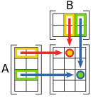
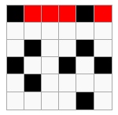
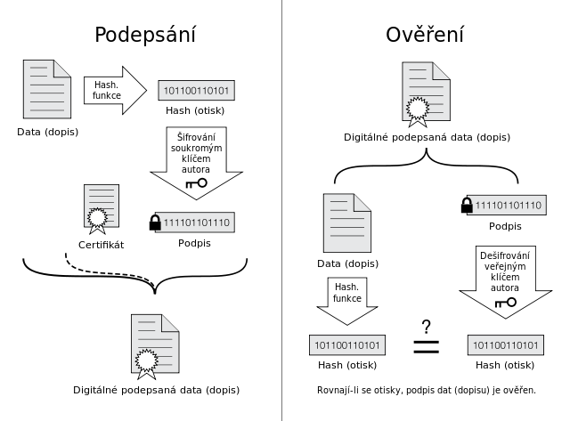
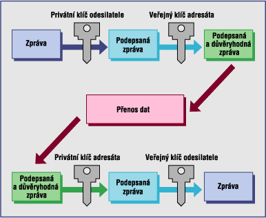

# 11. - Pojmy šifrování
> Pojmy šifrování, kódování, symetrické šifry (afinní, Vigener, Hill, jednoduchá transpozice), asymetrické šifry (RSA), Feistelovy šifry, princip, příklady (DES, AES, NDS).

## Základní pojmy
**Kryptologie** je věda, která se zabývá šifrováním (kryptos = skrytý), její části jsou:

- **kryptografie** - věda o tvorbě šifer, využívá šifrování k ukrytí dat
- **kryptoanalýza** - věda o jejich luštění, zabývá se hledáním způsobu jak šifrované zprávy dešifrova (hledání klíče nebo systému)

**Steganografie** je věda, která se zabývá ukrýváním zprávy, spadají sem různé mikrofilmy a neviditelné inkousty.

Rozlišujeme dva procesy:

- **Šifrování** je proces, který převádí čitelnou zprávu neboli *prostý text* na její nečitelnou podobu neboli *šifrový text*.
- **Dešifrování** je pak proces opačný.

**Kryptosystém** je systém umožňující šifrování a dešifrování zpráv. Bezpečnost šifrovacího systému není závislá na utajení šifrovacího algoritmu.

**Klíč** je tajná informace, bez níž nelze šifrový text přečíst.

**Kompromitace** je ztráta klíče jiným způsobem než kryptoanalýzou.

Šifra může být:

- **Bloková šifra** šifruje a dešifruje zprávu po stejně velkých blocích.
- **Proudová šifra** šifruje zprávu bit po bitu tak, jak do šifrátoru přichází. Šifrovací klíč může být periodicky opakován.

Nebo také:

- **Symetrická šifra** je taková, která pro šifrování i dešifrování používá tentýž klíč. Symetrický šifrovací systém je nejpoužívanější typ šifrovacího algoritmu. Tento systém je velmi rychlý a používá se při velkém množství dat.
- **Asymetrická šifra** používá veřejný klíč pro šifrování a soukromý klíč pro dešifrování. Asymetrický šifrovací systém je založen na principu jednocestné funkce. Pro všechna x lze vypočítat y=f(x), ale pro všechna y se nedají vypočítat x.

O šifrovacím algoritmu můžeme prohlásit:

- **Šifrovací algoritmus může být zlomen** - znamená, že s dostatkem času a prostředků může být nalezen způsob jak dešifrovat jím zašifrované zprávy.
- **Prakticky nezlomitelný** - je znám postup jak se domoci otevřeného textu, ale ne v rozumném čase (se současnou technologií a znalostmi!).

Asi nejjednoduší metodou zlomení některých šifer je **frekvenční analýza**. Pokud víme, v jakém jazyce byl napsán otevřený text, tak zároveň známe percentuelní zastoupení písmen v otevřeném textu. Pokud  zjistíme frekvenci písmen v zachyceném šifrovaném textu, tak prostým porovnáním frekvencí znaků zjistíme posun. Se znalostí posunu jsme schopni dešifrovat zachycený text.

**Moderní kryptografie je postavena na pricipu, že dvě prvočísla umíme snadno vynásobit, ale jejich faktorizace (rozklad na prvočísla) je výpočetně velmi složitý (u dostatečně velkých čísel).**

## Šifrování vs kódování
**Šifrování** si klade za cíl převest prostý text do takové podoby (šifrovaný text), tak aby nebylo možné ho bez znalosti klíče přečíst.

**Kódování** je změna vstupní zprávy na zprávu jinou, narozdíl od šifrování není cílem zprávu utajit. Kódujeme za účelem:

- **zmenšení objemu** přenášené zprávy (*minimální kódy*)
- **zabezepečení** zprávy proti chybám (*opravné kódy*)

## Symetrické šifry
### Substituční šifry
#### Caesarova šifra
Caesarova šifra je jednoduchou substituční šifrou, jejíž princip spočívá v posunu každého písmene otevřeného textu o konstantní počet míst v abecedě. Ačkoliv se v době Julia Caesara používala jen varianta posunu o 3 písmena, tak název se Caesarova šifra používá pro všechny varianty tohoto šifrovacího systému.

**Ci = (Ti + k) mod m** - šifrování

Ti = (Ci - k) mod m - dešifrování

- Ci - i-tý znak šifrovaného textu
- Ti - i-tý znak otevřeného textu
- k - posun
- m - délka abecedy

| Otevřená abeceda | A | B | C | D | E | F | G | H | I | J | K | L | M | N | O | P | Q | R | S | T | U | V | W | X | Y | Z |
|---|---|---|---|---|---|---|---|---|---|---|---|---|---|---|---|---|---|---|---|---|---|---|---|---|---|---|
| Šifrovaná abeceda | D | E | F | G | H | I | J | K | L | M | N | O | P | Q | R | S | T | U | V | W | X | Y | Z | A | B | C |

*Caesarova šifra s posunem o tři písmena*

AHOJ => DHRM

#### Tabulka záměny
Šifrování pomocí tabulky záměny, které je založeno na záměně znaku za jiný bez jakékoli vnitřní souvislosti či na základě znalosti klíče (hesla). Písmena v hesle se při vypisování zbylé abecedy vynechávají.

| Otevřená abeceda | A | B | C | D | E | F | G | H | I | J | K | L | M | N | O | P | Q | R | S | T | U | V | W | X | Y | Z |
|---|---|---|---|---|---|---|---|---|---|---|---|---|---|---|---|---|---|---|---|---|---|---|---|---|---|---|
| Šifrovaná abeceda | V | E | S | L | O | A | B | C | D | F | G | H | I | J | K | M | N | P | Q | R | T | U | W | X | Y | Z |

*Tabulka záměny s použitím hesla VESLO*

| Otevřená abeceda | A | B | C | D | E | F | G | H | I | J | K | L | M | N | O | P | Q | R | S | T | U | V | W | X | Y | Z |
|---|---|---|---|---|---|---|---|---|---|---|---|---|---|---|---|---|---|---|---|---|---|---|---|---|---|---|
| Šifrovaná abeceda | V | E | S | L | O | P | Q | R | T | U | W | X | Y | Z | A | B | C | D | F | G | H | I | J | K | M | N |

*Možná varianta tabulky záměny s použitím hesla VESLO*

AHOJ => VCKF nebo AHOJ => VRAU

#### Affiní šifra
Afinní šifra je substituční šifra, která částečně eliminuje zásadní nevýhodu Caesarovy šifry, kterou je málo možností transformace a tím i velmi primitivní kryptoanalýzu.

**Ci = a . Ti + b mod m** - šifrování

Ti = (Ci -b) . a ^ (-1) mod m - dešifrování

- Ci – i-té písmeno šifrovaného textu
- Ti – i-té písmeno otevřeného textu
- a – parametr a, gcd(a,m) = 1
- b – parametr b
- m – modulo (jako modulo obvykle volíme prvočíslo, aby bylo předem jasné, že gcd(a, m) = 1, a zároveň abychom útočníkovi nezjednodušovali práci (pokud modulo není prvočíslo, tak je méně možností, jak se text dá šifrovat - je tedy snazší šifru prolomit)).

Otevřený text: THEINITIAL (a = 5, b = 9, m = 26)

- T ⇒ 19 ⇒ 5*19 + 9 mod(26) = 0  ⇒ A
- H ⇒ 7  ⇒ 5*7  + 9 mod(26) = 18 ⇒ S
- E ⇒ 4  ⇒ 5*4  + 9 mod(26) = 3  ⇒ D
- I ⇒ 8  ⇒ 5*8  + 9 mod(26) = 23 ⇒ X
- N ⇒ 13 ⇒ 5*13 + 9 mod(26) = 22 ⇒ W
- I ⇒ 8  ⇒ 5*8  + 9 mod(26) = 23 ⇒ X
- T ⇒ 19 ⇒ 5*19 + 9 mod(26) = 0  ⇒ A
- I ⇒ 8  ⇒ 5*8  + 9 mod(26) = 23 ⇒ X
- A ⇒ 0  ⇒ 5*0  + 9 mod(26) = 9  ⇒ J
- L ⇒ 11 ⇒ 5*11 + 9 mod(26) = 12 ⇒ M

THEINITIAL => ASDXWXAXJM

#### Hillova šifra
Šifra založená na maticovém násobenní. Šifrovacím klíčem nazveme matici, kterou použijeme k zakódování zprávy. Je třeba, aby byly splněny následující podmínky:

- Matice je typu mxm (čtvercová) a platí, že počet znaků zprávy je dělitelný m.
- Determinant matice a počet znaků abecedy jsou nesoudělná čísla.
- Matice je invertibilní (regulární). (potřebujeme inverzní matici)

**A . H = B** - šifrování

**B . H^(-1) = A** - dešifrování 

- A – matice prostého textu
- H – Hillova matice (klíč)
- B – matice šifrovaného textu

*Připomenutí násobenní matic*

Dešifrujte NTBWWFYN pomocí Hillovy matice H(3, 2; 7, 5).

![\[\large B = NTBWWFYN \rightarrow \begin{pmatrix} N & T\\ B & W\\ W & F\\ Y & N\\ \end{pmatrix} = \begin{pmatrix} 13 & 19\\ 1 & 22\\ 22 & 5\\ 24 & 13\\ \end{pmatrix}\]](https://latex.codecogs.com/svg.latex?%5Clarge%20B%20%3D%20NTBWWFYN%20%5Crightarrow%20%5Cbegin%7Bpmatrix%7D%20N%20%26%20T%5C%5C%20B%20%26%20W%5C%5C%20W%20%26%20F%5C%5C%20Y%20%26%20N%5C%5C%20%5Cend%7Bpmatrix%7D%20%3D%20%5Cbegin%7Bpmatrix%7D%2013%20%26%2019%5C%5C%201%20%26%2022%5C%5C%2022%20%26%205%5C%5C%2024%20%26%2013%5C%5C%20%5Cend%7Bpmatrix%7D)

![\[\large H = \begin{pmatrix} 3 & 2\\ 7 & 5 \end{pmatrix} \rightarrow \begin{pmatrix} 3 & 2 & | & 1 & 0\\ 7 & 5 & | & 0 & 1 \end{pmatrix} \sim \begin{pmatrix} 1 & 0 & | & 5 & 24\\ 0 & 1 & | & 19 & 3 \end{pmatrix} = H^{-1}\]
](https://latex.codecogs.com/svg.latex?%5Clarge%20H%20%3D%20%5Cbegin%7Bpmatrix%7D%203%20%26%202%5C%5C%207%20%26%205%20%5Cend%7Bpmatrix%7D%20%5Crightarrow%20%5Cbegin%7Bpmatrix%7D%203%20%26%202%20%26%20%7C%20%26%201%20%26%200%5C%5C%207%20%26%205%20%26%20%7C%20%26%200%20%26%201%20%5Cend%7Bpmatrix%7D%20%5Csim%20%5Cbegin%7Bpmatrix%7D%201%20%26%200%20%26%20%7C%20%26%205%20%26%2024%5C%5C%200%20%26%201%20%26%20%7C%20%26%2019%20%26%203%20%5Cend%7Bpmatrix%7D%20%3D%20H%5E%7B-1%7D)

![\[\large A = B . H^{-1} \rightarrow \begin{pmatrix} 13 & 19\\ 1 & 22\\ 22 & 5\\ 24 & 13\\ \end{pmatrix} . \begin{pmatrix} 5 & 24\\ 19 & 3 \end{pmatrix} = \begin{pmatrix} 10 & 5\\ 7 & 12\\ 23 & 23\\ 3 & 17\\ \end{pmatrix} \rightarrow \begin{pmatrix} K & F\\ H & M\\ X & X\\ D & R\\ \end{pmatrix}\]
](https://latex.codecogs.com/svg.latex?%5Clarge%20A%20%3D%20B%20.%20H%5E%7B-1%7D%20%5Crightarrow%20%5Cbegin%7Bpmatrix%7D%2013%20%26%2019%5C%5C%201%20%26%2022%5C%5C%2022%20%26%205%5C%5C%2024%20%26%2013%5C%5C%20%5Cend%7Bpmatrix%7D%20.%20%5Cbegin%7Bpmatrix%7D%205%20%26%2024%5C%5C%2019%20%26%203%20%5Cend%7Bpmatrix%7D%20%3D%20%5Cbegin%7Bpmatrix%7D%2010%20%26%205%5C%5C%207%20%26%2012%5C%5C%2023%20%26%2023%5C%5C%203%20%26%2017%5C%5C%20%5Cend%7Bpmatrix%7D%20%5Crightarrow%20%5Cbegin%7Bpmatrix%7D%20K%20%26%20F%5C%5C%20H%20%26%20M%5C%5C%20X%20%26%20X%5C%5C%20D%20%26%20R%5C%5C%20%5Cend%7Bpmatrix%7D)

NTBWWFYN => KFHMXXDR

### Aditivní šifry
#### Viegnerova šifra
Jedná se o speciální případ polyalfabetické šifry, což znamená, že pro šifrování není použita celá abeceda. Caesarova šifra je speciálním případ Vigenèrovy šifry s heslem o délce jeden znak. Vigenèrova šifra používá heslo, jehož znaky určují posunutí otevřeného textu a to tak, že otevřený text se rozdělí na bloky znaků dlouhé stejně jako heslo a každý znak se sečte s odpovídajícím znakem hesla. Vigenèrova šifra způsobuje změny pravděpodobnosti rozložení znaků a tím podstatně znemožňuje kryptoanalýzu na základě analýzy četnosti znaků v textu. (obvykle se pro šifrování používá spíše Viegnerův čtverec - předpočítané kombinace)

**Ci = Ti  Ki mod m** - šifrování

Ti = Ci - Ki mod m - dešifrování

- Ci - i-tý znak šifrovaného textu 
- Ti - i-tý znak otevřeného textu 
- Ki - i-tý znak hesla textu (v případě, že je heslo kratší než text (což je obvyklé) dochází k opakování hesla) 
- m - délka abecedy

| Otevřený text | S | T | A | S | T | N | E | A | V | E | S | E | L | E |
|---|---|---|---|---|---|---|---|---|---|---|---|---|---|---|
| Klíč  | H | E | S | L | O | H | E | S | L | O | H | E | S | L |
| Šifrovaný text | A | Y | T | E | I | V | J | T | H | T | A | J | E | Q |

*Příklad s použitím slova HESLO jako klíče k zašifrování*

STASNEAVESELE => AYTEIVJTHTAJEQ

#### Vermanova šifra
Obdoba Viegnerovy šifry, klíč je však zcela náhodný a stejně dlouhý jako otevřený text. Bez znalosti klíče nerozluštitelná.

### Transpoziční šifry
Principem transpoziční šifry je změna pořadí znaků (jejich permutace) na základě předem dohodnutého systém. Jinými slovy transpoziční šifra mění pořadí znaků, nikoliv jejich vzhled. Výhodou této šifry je její jednoduchost, k zašifrování není potřeba hluboká znalost matematiky a zvládne ho i dítě. Většina transpozičních šifer je založena na určitém geometrickém postupu. Text je zapsán do určitého geometrického obrazce a poté jiným způsobem přepsán do výsledného šifrovaného textu. Existuje mnoho variant, například **čtení odzadu**,** čtení každého N-tého písmene**, **text do spirály ve čtverci** nebo **transpoziční mřížka**.

*Transpoziční mřížka, černá pole značí vystříhaná okénka a červená vršek. Příložením na čtverec a postupným otáčením a přepisováním viditelných znaků text rozluštíme.*

### Blokové šifry
#### Feistelovo šifrování
#### DES
#### AES

## Asymetrické šifry
### RSA

## Extra

### Elektronický podpis

*Elektronický podpis*

### Asymetrická kryptografie v praxi

*Asymetrická kryptografie  v praxi*