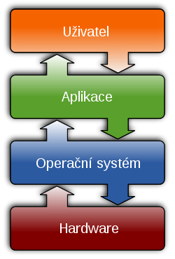
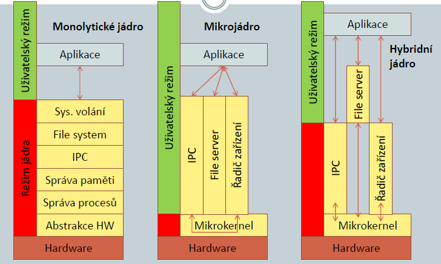
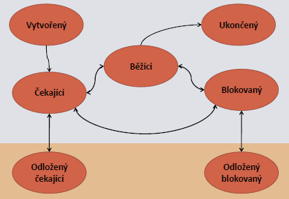
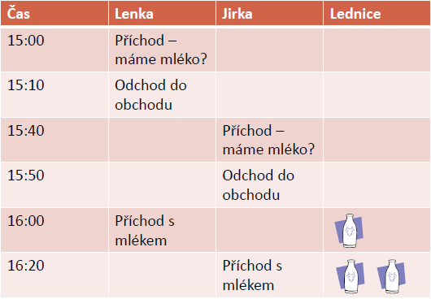
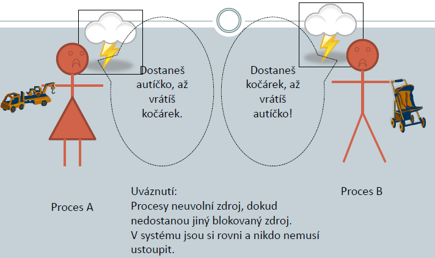

# 13. - Operační systém
> Operační systém a jeho základní úlohy – správa paměti, správa procesů, životní cyklus procesu, přidělování procesoru, správa periferií, problém uváznutí a metody jeho předcházení.

##Operační systém
Operační systém je základní programové vybavení počítače, které je zavedeno do paměti počítače při jeho startu a zůstává v činnosti až do jeho vypnutí. Skládá se z jádra (kernel) a pomocných systémových nástrojů. Hlavním úkolem operačního systému je zajistit uživateli možnost ovládat počítač, vytvořit pro procesy stabilní aplikační rozhraní (API) a přidělovat jim systémové zdroje.

*Operační systém*

**Požadavky na OS:**

- Rychlost
- Nenáročnost na zdroje
- Bezchybnost
- Přenositelnost
- Pořizovací a provozní náklady
- Snadnost vývoje aplikací

**Jdou bohužel proti sobě!**

### Funkce operačního systému

- **Správa programů (procesů)**
 - Zavedení do paměti, přidělení paměti, spuštění
 - Přidělování zdrojů a procesového času
 -Ukončení a uvolnění zdrojů
 -Dobré rozhraní pro programátora
-Správa paměti
 - Přidělování operační paměti
 - Práce s úložišti
- **I/O operace**
 - Jednotný přístup k souborům a zařízením
 - Ochrana před kolizí a nekonzistencí dat
- **Manipulace se soubory**
 - Prostřednictvím souborového systému přístup k souborům v úložištích
 - Ochrana před kolizí a nekonzistencí
 - Bezpečnost přístupu
- **Komunikační služby**
 - Zajištění komunikace mezi spuštěnými programy
 - Např.: sdílení paměti nebo zasílání zpráv
- **Detekce chyb a obnova**
 - Odchycení HW chyb (nedostatek papíru v tiskárně) i SW chyb (dělení nulou)
 - Správná odpověď na každý typ chyby, programy jen předávají chybové hlášení

### Základní části operačního systému

1. **Kernel (jádro)**
 1. přiděluje paměť i procesorový čas
 2. řídí optimální spolupráci mezi procesy
 3. zodpovídá za abstrakci HW (poskytuje API - abstraktní vrstva pro lepší programování)
 4. přiděluje HW aplikacím
2. **Systémové nástroje**
 1. Správa zařízení (formát disku, kopírování..)
 2. Správa uživatelů
 3. Pomocné nástroje - skripty, utility (pomocné programy)
3. **Rozhraní**
 1. API - programátorské rozhraní (standartní knihovny, přístup k hw, )
 2. UI - uživatelské rozhraní (nemusí být součástí, do jádra se řadí kvůli zvýšení výkonu )

### Režimy procesoru
Typicky má procesor dva režimy provozu:

- **Nechráněný – bez omezení**
 - Dostupná celá instrukční sada
 - Lze adresovat celou operační paměť
 - Lze měnit všechny registry procesoru
 - Kernel mode, unprotected mode…
- **Chráněný – s omezením**
 - Pokus vykonat některé instrukce končí chybou
 - Část paměti je skrytá, nelze ji adresovat
 - Pokus o změnu některých registrů končí chybou
 - User mode, protected mode…

**Režim je vlastnost procesoru, OS ji jen využívá. Některé procesory implementují hned několik režimů, takzvaných protection rings (nepoužívá se kvůli přenositelnosti). Přecházení mezi režimy je náročná operace, ale chrání OS před napadením nebo neúmyslným poškozením.**

### Kernel

- Pracuje v nechráněném režimu. (chráněné režimy jsou funkcí procesoru)
- Přiděluje a spravuje paměť.
- Přiděluje procesorový čas – řídí procesy.
- Ovládá HW zařízení, přiděluje HW aplikacím.
- Odpovídá za abstrakci HW.

**Typy jader:**

- **„Maximální jádro“ - monolytické:**
 - Všechny systémové funkce jsou zahrnuty v jádře OS.
 - Rychlé a efektivní.
 - Náročné na pamět.
 - Náchylné k chybám.
- **„Minimální jádro“ - mikrojádro:** (hlavně realtime OS)
 - Zajišťuje pouze abstrakci HW, správu procesů a komunikaci.
 - Zbylé funkce jsou realizovány jako procesy.
 - Pomalé, kvůli častému přepínaní režimu.
 - Malé a odolné vůči chybám.
- **„Hybridní jádro“ - modulární**
 - Jádro „malé“ jako u mikrokernelu.
 - Služby OS jsou oddělené od jádra, ale také v prostoru jádra.
 - Teoreticky spojuje výhody obour.
 
 
 
*Typy jader*

### Přerušení
Událost, která nastává nahodile a asynchronně vzhledem k procesorovému času, probíhajícímu výpočtu a hodinovému taktu. Při vzniku události je přerušen stávající výpočet, vyřešena událost a následně je výpočet obnoven.

Během přerušení dochází ke změně **kontextu**. Kontext je vše, co potřebujeme k obnovení výpočtu (hodnota instruction pointeru, obsah registrů, návratová adresa, ...).

**Změna IP (instruction pointeru):**

- **Skok (nedochází ke změně kontextu)**
 - podmíněný
 - nepodmíněný
- **Přerušení (dochází k zálohování kontextu)**

**Zdroje přerušení:**

- **Vnější (hardwarové)**
 - *Řadič přerušení*, obvod budí procesor a stanovuje důležitost přerušení.
 - *Maskovatelné přerušení* lze za chodu systému zakázat a ignorovat.
 - *Nemaskovatelné přerušení* nastává vždy a ignorovat jej nelze (například reset).
- **Vnitřní (procesorové)**
 - Obsloužení chyb výpočtu
 - Dáno procesorem: u „intelů“ např. dělení nulou, problémy s pamětí, chyba koprocesoru
- **Softwarové**
 - Vyvoláno programově instrukcí pro přerušení (Intel: INT n)
 - Probíhá synchronně s taktem procesoru
 - Slouží zejména k volání služeb OS = systémová volání a přechod mezi chráněným a nechráněným režimem
 - Ve srovnání s podprogramy má pevnou adresu pro obslužnou rutinu

**Obsluha přerušeni:**

1. Uložení aktuálního kontextu.
2. Volitelně zákaz ostatních přerušení.
3. Do IP se načítá začátek obslužné rutiny, aktualizují se registry řídící chod výpočtu.
4. Provede se obslužná rutina.
5. Volitelně povolení ostatních přerušení.
6. Obnoví se původní výpočet s pomocí uloženého kontextu.

### Start systému

- **Linux:**
 1. Spustí se jádro (typicky /boot/vmlinuzXXX)
 2. Osahání dostupného HW
 3. Start démona init, který startuje zbytek systému a řídí ostatní procesy
 4. Připojení kořenového diskového oddílu
 5. Start terminálů a možnost přihlášení uživatele
 6. Variabilně start automaticky spouštěných úloh (dle konfigurace)
 7. Variabilně start grafického uživatelského prostředí dle konfigurace
- **Windows:**
 1. Načte se soubor ntldr z kořenového adresáře startovacího oddílu
 2. Je-li v souboru boot.ini definováno menu pro start systému, je zobrazeno
 3. Spuštění detekce HW
 4. Spuštění jádra systému (dle obsahu boot.ini, typicky ntoskrnl.exe)
 5. Spuštěna vrstva pro abstrakci HW (hal.dll)
 6. Variabilně start automaticky spouštěných úloh (dle konfigurace)
 7. Jádro spouští programy winlogon.exe a Isass.exe – umožní připojení uživatelů

## Správa paměti
Soubor metod, které využívá OS při přidělování operační paměti jednotlivým procesům, které jsou v počítači spuštěny. Proces při vzniku musí mít přidělenou část paměti, a jinde pracovat nesmí. Jádro řídí přidělování paměti procesům, udržuje stav o volné/využité paměti, ochraňuje paměť
proti přepsání.

**Druhy pamětí:**

- **Stavové registry** – cca 10 – 50, vnitřní paměťové buňky procesoru, uchovávají informaci o kontextu
- **Datové registry** – dle typu procesoru – cca 10 – 50, slouží k výpočtům a zpracování dat při vykonávání instrukce; vypovídají o „síle“ procesoru
- **Cache** – vyrovnávací paměť mezi vnější pamětí a registry; snižuje zpoždění způsobené přístupem do vnější paměti
 - Velikost od 10k do 4G (64bitové procesory, nová jádra)
 - L1, L2, L3: úrovně (level 1, level 2…): čím nižší úroveň, tím je paměť rychlejší a zároveň menší; L1 je v jádře procesoru a na jeho frekvenci, L2 někdy ano, někdy ne
- **Vnitřní paměť** – RAM:
 - Operační paměť: zde probíhají všechny „operace“; zde je uloženo vše, s čím spuštěný OS pracuje; zde OS aplikuje svou správu paměti.
 - Základní vlastnost: po odpojení napájení data mizí
- **Vnější paměť** – trvalá úložiště – disky, CD, DVD, flash…
 - Obrovské kapacity, ale nejmenší přístupová rychlost
 - Slouží jen jako zdroj dat, případně jako „odkladiště“ čekajících procesů

### Metody spravy paměti

1. **Přidělování bez dělení do bloků** - typicky pro starší systém, kde běží jen jedna úloha (bez multitaskingu), ve víceúlohových systémech se vše ukládá a vrací do OP z disku
 - Výhody: jednodušší jádro - nemusí obsahovat rutinu pro přidělení paměti
 - Ochrana paměti: nutná jen kontrola přístupu do oblasti jádra, napřříklad hodnoty z registrů může měnit pouze jádro
2. **Přidělování pevných bloků pamětí** - po startu systému se paměť rozdělí do bloků 16kB, 32kB… Tyto bloky mají konstatntní velikost po celou dobu běhu systému. Procesy na základě požadavku na paměť dostanou patřičně velký blok.
 - Výhody: rychlejší přepínání kontextu - více procesů v paměti, jednoduchá správa paměti - pouze tabulka s využitím bloků
 - Nevýhoda: nelze spouštět procesy, které mají nárok větší než je největší blok, neefektivní využití paměti
3. **Dynamické přidělování paměti** - po startu systému je paměť nerozdělená, procesy po spuštění berou paměť, kolik potřebují. Při ukončení ji uvolní. Náročné na implementaci

**Memory Allocator** - správa paměti, většinou v kernelu, přiděluje volné bloky dle algoritmu, optimalizace na rychlost - paměť je “levnější”.

**Fragmentace** - Důsledek dynamického přidělení paměti, po určitém čase v dynamickém přidělování se objevují náhodně volné bloky.

###Strategie přidělování

1. **Best FIT** - přidělení nejmenšího možného bloku - snaha šetřit paměť
 - Nevýhody: proces vrací malé množství pamětí. Nutné projít všechny volné bloky paměti
2. **Worst FIT** - použije se nějvětší blok, co proces nevyužije, to vrátí. Dobrá strategie, protože se vrací velké bloky dat které jsou dále použitelné, ale dlouhodobě nevýhodné, neboť velké bloky brzy dojdou Vhodné kombinovat s jinými strategiemi.
3. **First FIT** - použije se první blok (bloky jsou seřazeny), co vyhovuje, co proces nevyužije, to vrátí. Dost používaná, dobré výsledky.
 - Nevýhody: velké bloky na začátku paměti jsou rozporcovány na menší
4. **Next FIT** - přidělí se první blok, který se po posledním použitým blokem, optimalizace FirstFitu - snaha o rychlejší hledání.
 - Nevýhody - sklony k fragmentaci (měřením se ukazuje, že výrazněji, než předchozí metody)

Při překladu programů se generují konkrétní adresy, to je problém. Nejen kvůli tomu se využívá **virtualizace paměti**, proces má svůj kontejner s virtuálními adresami a fyzické adresy vidí pouze jádro operačního systému. Virtuální prostor se dále děli na stránky o kterých si OS drží statistiku využití a pokud dochází pamět, začne **swapovat,** neboli odkládat málo používané stránky na pevný disk. Pokud jsou naopak odložené stránky potřeba, dochází k navrácení do operační paměti.

## Správa procesů

### Zdroje vlastněné procesem

- **Obraz kódu programu** - kopie originálního programu načtená do paměti
- **Paměť** (typicky oblast ve virtuální paměti), která obsahuje:
 - Kód
 - Data
 - Zásobník (pro volání procedur, skoky a další události)
- **Práva** - informace o vlastníkovi procesu a o oprávněních procesu
- **Kontext** - registry procesoru, fyzické paměťové adresy
 - Je-li proces vykonáván, uloženo typicky jako registry v procesoru, jinak v paměti
- **Informace o zdrojích** uložena v datových strukturách nazývaných PCB – process control blocks (přesná podoba dána OS)
- **Virtuální paměť** - „iluze“ souvislého paměťového prostoru pro procesy (ve skutečnosti různě fragmentováno a fyzicky různě implementováno)

### Přidělování procesoru
Aby systém fungoval jak má, je nutné, aby současně zpracovával více procesů, musí tedy docházet ke střídání činnosti, kterou realizuje procesor.

- **Nepreemtivní (kooperativní) multirprocesing** - Využívali jej starší OS, proces se musí procesorového času vzdát sám, což není optimální. Pokud by byl program naprogramován chybně, proces se nevzdá procesorového času a celý systém může zamrznou vlivem jednoho špatného vlákna.
- **Preemptivní multiprocesing** - Plánovací modul OS určije, komu přidělí procesorový čas a jaký proces pozastaví. Je to výhodnější, programátor nemusí řešit jak se budou vlákna střídat. Je ale stále nutné řešit synchronizaci prostředků, které vlákna mohou vyžívat

### Strategio rozhodování o spuštění procesů 

1. **Dlouhodobá** - při pokusu o spuštění programu se zjišťuje, zda byl vytvořen proces; určuje počet současně běžících procesů
2. **Střednědobá** - ve všech systémech s virtuální pamětí; odklad procesů do záložní paměti; odstraňovány jsou dlouhodobě nespuštěné nebo s nízkou prioritou
3. **Krátkodobá** - s časovým rámcem se vyhodnocuje, jaký proces bude běžící; řídí se i přepínání procesů při přerušení
 1. FIFO, FCFS - first come first server; procesy se řadí ve frontě; přidělování procesoru vždy na zásobník - dlouhé odezvy; bez priorit, jednoduché
 2. SJF, SRT - nejkratší očekávaný úsek; přednost mají kratší ůlohy nebo ty, které nevyužijí celé časové kvantum; odhad dle minulé činnosti; dobrá průchodnost nečeká se na ukončení dlouhých úloh
 3. Preemptivní plánování s prioritou - řazení do fronty dle důležitosti; proces s nízkou důležitostí může být přerušen procesem s vyšší důležitostí; mohou i čekat pokud je více procesů s vyšší prioritou
 4. Round Robin - cyklická obsluha; úlohy jsou cyklicky střídány; rychlá odezva; doba závisí pouze na počtu spuštěných procesů; rychlé procesy jsou dokončeny dříve než FCFS, delší dříve než SJF

### Stavy procesu

- **Běžící proces** (running) je vykonáván (má přidělen procesor).
- **Čekající proces** (waiting) čeká na přidělení procesorového času.
- **Vytvořený proces** (created) po vzniku má kopírovány do paměti zdroje ze záložních médií; následně je správcem procesů označen jako čekající.
- **Ukončený proces** (terminated) zůstává v paměti, dokud není vymazán, ale už nedostane přidělen procesor; není-li vymazán, stává se z procesu zombie.
- **Blokovaný proces** (blocked) čeká na nějaký další zdroj (vstup uživatele, čtení ze souboru). Až se dočká, převede jej správce procesů do stavu čekajícího procesu.
- Procesy, které nebyly dlouho aktivní, jsou odsunuty do záložní paměti:
 - **Odložený a čekající** (swapped and waiting)
 - **Odložený a blokovaný** (swapped and blocked)

*Stavy procesu*

### Komunikace mezi procesy

- **Sdílení paměti** (memory sharing): společný přístup do určité oblasti paměti
- **Zasílání zpráv** (messaging): asynchronní předání dat mezi odesílatelem a příjemcem; data jsou většinou kopírována k příjemci
- **Volání vzdálené procedury** (remote procedure call): program spouští proceduru, která je uložena na jiném místě, například lze volat funkci přes síť
- **Synchronizace** (synchronization): procesy se musí sejít v určitém okamžiku – synchronizační primitiva

## Správa periferií

## Souběh
Dva (a více) provádí současně nějakou operaci nad stejnými daty; přitom operace nejsou korektně ukončeny a překrývají se. Zmatek v datech (nekonzistentní data). Viz také okruh [27. Paralelní systémy](https://github.com/tomaskrizek/tul-szz-it-nv/blob/master/27_paralelni_systemy/27_paralelni_systemy.md).

*Souběh*

###Ochrana před souběhem
**Atomické operace:**

- Lze u jednoduchých operací či datových struktur.
- Kritickou sekci realizujeme např. jednou instrukcí.
 
**Výlučný přístup:**

- Dalšími prostředky zajistíme, že v kritické oblasti s daty pracuje vždy jen jeden proces.
 - Zákaz přerušení
 - Synchronizační primitiva (vyžaduje čekání, operační systém přiřadí čas jinému procesu)

### Transakce
Aby nedocházelo k nekonzistencím , zavádíme transakce.

**Vlastnosti transakcí:** (ACID)

- Atomicity (atomičnost):
 - Operace zahrnuté v transakci se chápou jako atomické.
 - Provedou se buď všechny, nebo žádná z nich.
- Consistency (konzistence):
 - Při realizaci transakce musí být zachována konzistence dat.
 - Je-li konzistence ohrožena, je transakce zrušena.
- Isolation (izolace):
 - Celá transakce se zvenku jeví jako celek.
 - Při kroku zpět se nekrokují jednotlivé operace, vrací se celá transakce.
- Durability (trvalost):
 - Když transakce proběhne, jsou výsledky uloženy a nemohou být ztraceny.

**Kroky:**

- Zahájení (begin)
- Potvrzení (commit): pro potvrzení, že transakce proběhla v pořádku; data jsou změněna, změna je uložena a data zůstávají konzistentní.
- Vrácení do původního stavu (roll-back): pro „krok zpět“ v situaci, kdy během realizace transakce dojde k chybě.

**Realizace:**

- Pesimistická realizace: předpokládáme, že nastane chyba.
 - Změny dat během transakce zaznamenávány do dočasných objektů.
 - Po ukončení transakce jsou dočasné objekty označeny jako trvalé.
 - Existují dvojí data: nově vytvářená a původní.
 - Rychle se ruší, ale náročná na paměť.
- Optimistická realizace: předpokládáme, že chyba spíše nenastane.
 - Změny dat rovnou trvalé.
 - Během transakce se vytváří záznam o změnách, aby bylo možné obnovit původní data (roll-back record).
 - Je-li transakce úspěšně dokončena, záznam se smaže.
 - Data existují jen jednou.
 - K návratu zpět slouží záznam, což je pracnější, šetříme ale paměť v průběhu transakce.

**Moderní systémy používají transakce, takže když vypadne proud nezhroutí se celý systém.** (Může být implementováno například na úrovni filesystému.)

## Uváznutí
Procesy se vzájemně blokují: A má zamčen zdroj ZA, B má zamčen zdroj ZB. A nebude pokračovat, dokud nebude volné ZB, B nebude pokračovat, dokud nebude volné ZA. Systém se zastaví. Bez zásahu shora nelze řešit. Viz také okruh [27. Paralelní systémy](https://github.com/tomaskrizek/tul-szz-it-nv/blob/master/27_paralelni_systemy/27_paralelni_systemy.md).

*Uváznutí*

**K uváznutí může dojít v systému, kde jsou současně splněny tyto čtyři podmínky (Coffman, 1971):**

- je možný výlučný přístup k některým zdrojům
- prostředky jsou přidělovány postupně, proces může držet prostředky a čekat na další
- nelze násilím odebrat přidělený prostředek
- může vzniknout kruh procesů, které na sebe vzájemně čekají.

**Prevence** = při návrhu systému
- Systém navrhujeme tak, aby uváznutí nemohlo vzniknout.
- V principu se snažíme navrhnout takový systém, v němž neplatí alespoň jedna z výše citovaných podmínek.
 
**Předcházení** = za běhu
- Systém z principu uváznutí umožňuje.
- Za chodu vyhodnocujeme požadavky na zdroje a rozhodujeme, zda požadavku vyhovíme .
- „Hračky přiděluje rodič a přemýšlí při tom“.

### Předcházení souběhu
**Podmínka č. 1: Odstraníme výlučný přístup.**

- Virtualizace prostředků – procesy pracují s „náhražkou“ skutečného zdroje (soubor místo tiskárny).
- Spooling (simultaneous peripherial output online) – proces nepracuje přímo se zařízením, ale s předřazenou frontou (tiskárny, disky).

**Podmínka č. 2: Nedovolíme držet neomezeně zdroj.**

- Žádá se jen jednou: proces dostane buď vše, nebo nic (když nemůžu dát procesu autíčko a kočárek zároveň, nedám mu nic a nechám jej čekat).
- Nevýhoda: Nízká efektivita nakládání zdroji (procesy jsou raději hamouni, ať mají jistotu).
- Alternativa: prostředky jen tomu, kdo zrovna nemá nic (nikdo nemá právo požadovat další hračku, když už nějakou má).
- Nevýhoda: Hladovění - proces může dlouho čekat na všechny své zdroje.

**Podmínka č. 3: Povolíme zásah shora.**

- Odebírat by mělo jen jádro, ne procesy sobě navzájem; jinak může vést k chaosu.
- Nutná obnovitelnost, musí se obnovit původní stav zdroje – lze např. pro procesor nebo operační paměť.
- Systém v roli rodiče - rozhodne na základě znalosti souvislostí a s předcházením nejhorším situacím, že musí být vydáno autíčko či kočárek.

**Podmínka č. 4: Roztrhneme kruh čekání.**

- Všechny zdroje se číslují.
- Prostředky číslovány, proces např. nesmí žádat o prostředky s nižším číslem, než je jeho první přidělený prostředek.
- Zdroje jednoho typu musejí být požadovány najednou.
- Znovu je zde systém v roli rodiče: „Už sis vzal autíčko, dokud je nevrátíš, nemáš právo žádat o kočárek.“

### Další možnosti jak řešit uváznutí
**Ignorování („pštrosí algoritmus – hlava v písku“):**

- Systém uváznutí vůbec neřeší.
- Při uváznutí zásah vyšší moci: uživatel vypne procesy.

**Vyhýbání se konfliktu („bankéřův algoritmus“)**

- Systém zná nároky procesů; před přidělením kritického zdroje se zjišťuje, zda je možné pokračovat i v případě, že proces zdroj zabere – vyhodnocuje se možnost ukončení ostatních procesů.
- Bankéřův? Bankéř má vždy méně peněz, než kolik má sjednaných úvěrů, on prostě předpokládá, že klienti nebudou chtít všichni současně všechny peníze.

**Vyhodnocení bezpečného/nebezpečného stavu**

- Průběžně vyhodnocujeme, co je již alokováno a zda nehrozí cyklus.
- Nepovolíme požadavky, které by vedly k uváznutí.
- Nutná schopnost detekce uváznutí a vyhodnocení stavu systému.
- V případě uváznutí prostě procesy zabijeme všechny nebo jeden náhodný a otestujeme znovu.