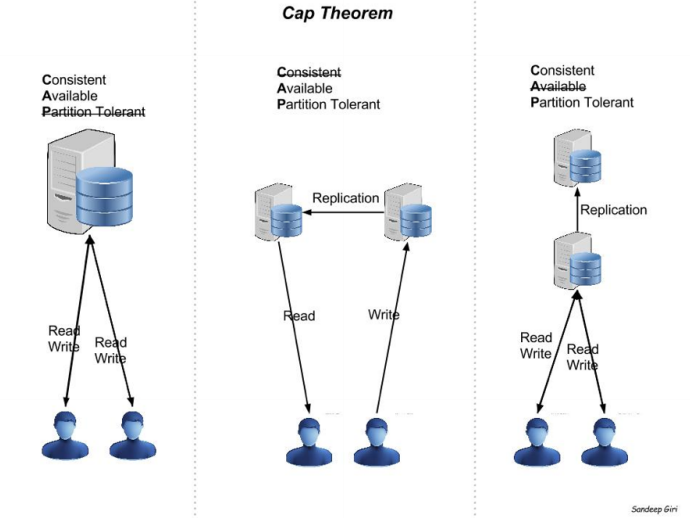

# 14. - Databázové systémy

> Databázové systémy – relační a objektový model dat, NoSQL databáze (typy škálování, teorém CAP).

## Databázové systémy
**databáze** = organizovaná kolekce dat

**DBS** (databázový systém) = **SŘBD** (systém řízení báze dat; nebo anglicky DBMS - database management system) + **DB** (databáze; data)

SŘBD typicky obsahuje:
- parser - převod dotazovacího jazyka (např. SQL) do strojové podoby
- optimalizátor - optimalizace výrazu z pohledu výkonu
- operator evaluator (vyhodnocovatel výrazů)
- plan executor (vykonavatel plánů) - plán je strojová podoba příkazu, která je vyhodnocená, optimalizovaná a připravená k provedení
- lock manager - správa zámků
- transaction manager - správa transakcí

### Základní modely DBS
- [Navigační databáze](https://en.wikipedia.org/wiki/Navigational_database) - [hiearchický model](https://en.wikipedia.org/wiki/Hierarchical_database_model), [síťový model](https://en.wikipedia.org/wiki/Network_model) a [grafový model](https://en.wikipedia.org/wiki/Graph_database)
- [Relační model](https://en.wikipedia.org/wiki/Relational_model)
- [Objektový model](https://en.wikipedia.org/wiki/Object_database)
- [Dokumentový model](https://en.wikipedia.org/wiki/Document-oriented_database)

## Relační model dat - RMD
Založen na pevném matematickém základu roku 1970 panem E. F. Coddem. 

### Základní rysy
- oddělení dat a jejich implementace
- symetrický přístup k datům - při manipulaci s daty se nezajímáme o přístupové mechanizmy k datům
- prostředky pro manipulaci s daty:
 - **relační kalkul**
 - **relační algebra** 

### Základní pojmy
- **databázová relace** - množina (výsledek dotazu, tabulka, aj.); nesmí obsahovat duplicitní prvky
- **entita** - definovaná množina dat (např. tabulka)
- **atribut** - An; jméno atributu
- **doména atributu** - Dn; definiční množina hodnot atributu
- **schema relace** - je R(An:Dn); říká nám to, jaký je název relace, kolik má sloupců a jaké jsou jejich názvy a domény = definice databázové tabulky
- **atribut relace** - je dvojice An:Dn
- **n-tice** - jsou prvky relace
- **řád relace** - n z pojmu n-tice určuje řád relace
- **relační schema** - je dvojice (R,I), kde R je schema relace a I je množina integritních omezení

### Integrita databáze a integritní omezení
Integrita databáze znamená, že databáze vyhovuje zadaným pravidlům – integritním omezením. Tato integritní omezení jsou součástí definice databáze, a za jejich splnění zodpovídá SŘBD.

Mezi integritní omezení patří:
- **primární klíč** - množina atributů jednoznačně určující n-tici relace,
- **kandidáti primárního klíče** - obdoba primárního klíče, avšak kandidátů může být více,
- **klíčový atribut** - atribut, který je součástí některého klíče,
- **neklíčový atribut** - atribut, který není součástí žádného klíče,
- **referenční integrita** - popisuje vztahy mezi daty ve dvou relacích,
- **cizí klíč** - atribut, kterého se týká referenční integrita (foreign key).
- **kardinalita** - vlastnost binárních vztahů která určuje kolik instancí entit vstupuje do vztahu (např. 1:1, 1:N, M:N),
- **parcialita** - vyjadřuje, zda je účast ve vztahu povinná nebo volitelná,
- silné entitní typy - součástí klíče jsou atributy pouze z dané entity (nikoli z jiných)
- slabé entitní typy - součástí klíče je atribut z jiné entity,
- duplicitní prvek - relace nesmí obsahovat duplicitní prvky.

### Relační tabulka
Každá relační tabulka musí splňovat následující podmínky:
- sloupce mohou být v libovolném pořadí,
- řádky mohou být v libovolném pořadí,
- sloupce musí být homogenní = ve sloupci musí být údaje stejného typu,
- každému sloupci musí být přiřazeno jednoznačné jméno (tzv. atribut),
- v relační tabulce nesmí být dva zcela stejné řádky,
- dle relační teorie lze pomocí základních operací (sjednocení, kartézský součin, rozdíl, selekce, projekce, přejmenování) uskutečnit veškeré operace s daty.

## Objektový model dat - OMD
Objektová databáze je systém správy databází, ve kterém je informace reprezentována formou objektů. To by mělo přirozeněji a věrněji popisovat
skutečný svět a entity modelované v databázi. Lze je rozdělit na **objektově orientované** a **objektově relační**. Objektově orientované jsou si podobné s objekty v objektově orientovaných programovacích jazycích. Pro obě skupiny neexistuje žádný standard. V praktickém využití jej nalezneme minimálně oproti relačnímu modelu.

### Objektově orientovaný datový model
OOSŘBD využívají datového modelu, který má objektově orientované aspekty jako třídy s atributy a metodami a integritními omezeními; poskytují objektové identifikátory (OID) pro každou trvalou instanci třídy; podporují zapouzdření (encapsulation); násobnou dědičnost (multiple inheritance) a podporují abstraktní datové typy.

Kombinují prvky objektově orientovaného programování s databázovými schopnostmi. Rozšiřují funkčnost objektových programovacích jazyků (C++, Java) a poskytují plnou schopnost programování databáze. Datový model aplikace a datový model databáze se ve výsledku hodně shodují a výsledný kód se dá mnohem efektivněji udržovat. Objektově orientovaný jazyk (C++, Java) je jazykem jak pro aplikaci, tak i pro databázi. Poskytuje těsný vztah mezi objektem aplikace a uloženým objektem.

### Objektově relační datový model
ORSŘBD využívají datový model tak, že "přidávají objektovost do tabulek". Všechny trvalé informace jsou stále v tabulkách, ale některé položky mohou mít bohatší datovou strukturu, nazývanou abstraktní datové typy (ADT). ADT je datový typ, který vznikne zkombinováním základních datových typů. Podpora ADT je atraktivní, protože operace a funkce asociované s novými datovými typy mohou být použity k indexování, ukládání a získávání záznamů na základě obsahu nového datového typu.

## Srovnání RMD a OMD
Relační model je jednoduchý a elegantní, ale je naprosto rozdílný od objektového modelu. Relační databáze nejsou navrhovány pro ukládání objektů a naprogramování rozhraní pro ukládání objektů v databázi je velmi složité. Relační databázové systémy jsou dobré pro řízení velkého množství dat, vyhledávání dat, ale poskytují nízkou podporu pro manipulaci s nimi. Jsou založeny na dvourozměrných tabulkách a vztahy mezi daty jsou vyjadřovány porovnáváním hodnot v nich uložených. Jazyky jako SQL umožňují tabulky propojit za běhu, aby vyjádřily vztah mezi daty.

Naproti tomu objektové modely jsou založeny na objektech, což jsou struktury, které kombinují daný kód a data. Objektové databázové systémy umožňují využití hostitelského objektového jazyka jako je třeba C++, Java přímo na objekty "v databázi"; tj. místo věčného přeskakování mezi jazykem aplikace (např. C) a dotazovacím jazykem (např. SQL) může programátor jednoduše používat objektový jazyk k vytváření a přístupu k metodám. Krátce řečeno, OMD jsou výborné pro manipulaci s daty. Pokud navíc opomeneme programátorskou stránku, dá se říct, že některé typy dotazů jsou efektivnější než v RMD díky dědičnosti a referencím. 

## NoSQL databáze
**NoSQL** = Not only SQL database

NoSQL je nerelační systém řízení báze dat navržený pro distribuovaná datová uložiště, nevyžadující pevné schéma databáze, nepoužívající JOIN operace a horizontálně škálující.

### Distribuovaná databáze 
Systém, který je složen z několika počítačů a softwarových komponent, které spolu komunikují pomocí počítačové sítě.

Výhody:
- spolehlivost - pokud některý uzel má výpadek, tak to neohrozí funkci celého systému,
- rozšiřitelnost - distribuovaný systém je možné snadno rozšířit přidáním nových serverů,
- sdílení zdrojů - je základní pro mnoho aplikací, data jsou sdílena v distribuovaném systému,
- flexibilita - je snadnější instalovat, implementovat a odladit nové služby,
- rychlost, výkon.

Nevýhody:
- závislost na počítačové síti,
- obecně složitější na správu,
- obecně méně bezpečné než autonomní systémy.

### Škálování
Schopnost přidat vlastnosti, aby byly uspokojeny nové nároky uživatelů.

**vertikální škálování** - přidání zdrojů do již existujícího systému, aby se zvýšila jeho kapacita, průchodnost atd. (např. přidat procesor, paměť, ...)

**horizontální škálování** - přidání nových uzlů (např. nový počítač do již existující infrastruktury)

### CAP teorém
Při návrhu distribuované aplikace je nutné brát v potaz následující požadavky:
- **konzistence** (Consistency) - data musí zůstat konzistentní i po provedení operace,
- **dostupnost** (Availability) - systém musí být stále dostupný, tzn. že každý dotaz dostane odpověď, zda byl proveden úspěšně či selhal,
- **partition tolerance** - systém musí být schopen stále komunikovat, i když je komunikace mezi severy nespolehlivá.

Teoreticky není možné splnit všechny tři požadavky najednou. CAP říká, že základní požadavky na distribuované systémy musí splňovat dva ze tří požadavků. Různé NoSQL databáze tedy podporují různé kombinace C, A, P. 

- CA - data jsou konzistentní mezi všemi uzly, pokud jsou všechny uzly online. Můžeme číst/zapisovat z kteréhokoli uzlu a být si zároveň jisti, že data jsou stejná. 
- CP - data jsou konzistentní mezi všemi uzly a zachovávají partition tolerance (zamezují desychroznizaci) tím, že pokud je uzel offline data jsou nedostupná.
- AP - systém je dostupný díky replikaci, k synchronizaci dojde hned jak bude partition znovu dostupná. Nicméně není garantováno, že všechny uzly budou mít stejná data.

## SŘBD vs. NoSQL
SŘBD
- strukturovaná a organizovaná data
- SQL, DML, DDL, ACID
- transakce, konzistence

NoSQL
- nemá deklarativní dotazovací jazyk
- nemá definované schéma
- ukládá dvojice klíč-hodnota; Uložení sloupců, dokumentů, grafů
- případná konzistence upřednostněna před ACID
- podpora nestrukturovaných a nepředvídatelných dat
- CAP teorém
- upřednostňují vysoký výkon, dostupnost a rozšiřitelnost
