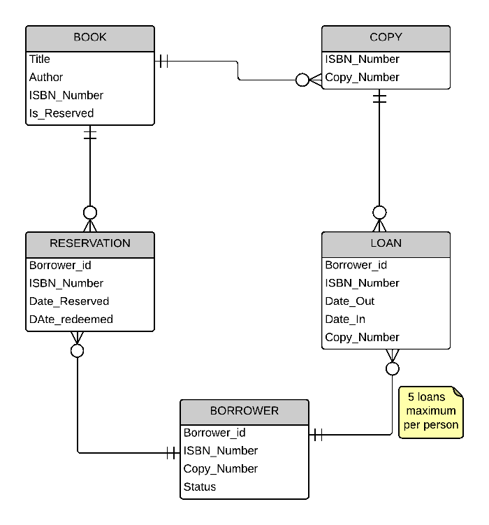
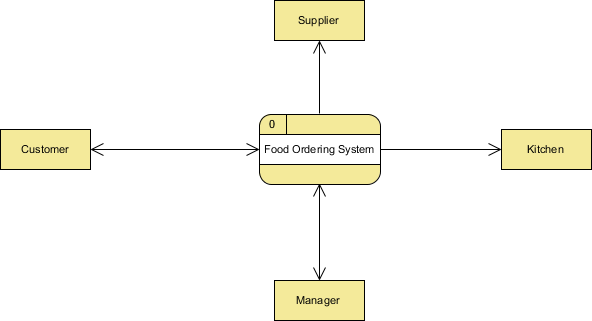

# 15. - Normalizace, modelování, optimalizace

> Normalizace v relačním modelu, bezztrátová dekompozice, datové modelování (ER/ERA diagramy), funkční analýza (DFD diagramy), optimalizace databázových struktur (typy indexů a případy jejich využití).

## Normalizace v RMD
Normalizace je sada pravidel, jak postupovat při transformaci struktury entit a relací ER modelu na strukturu fyzického uspořádání tabulek a relací v databázi. Dojde tím k odstranění redundantních dat, omezení složitosti a zabránění tzv. aktualizačních anomálií. Provedení normalizace by mělo vést k přehlednější, rozšiřitelnější a výkonnější databázi. Normalizované schema **musí zachovat všechny závislosti** původního schematu a relací. To znamená, že se musíme pomocí přirozeného spojení dostat k původním datům.

**Aktualizacní anomálie (Codd):**

*Aktualizační anomálie je nechtěný vedlejší efekt operace nad databází, při kterém dojde ke ztrátě nebo nekonzistenci dat.*

Relace: *PROGRAM_KINA(PK: JMENO_KINA, PK: JMENO_FILMU, ADRESA, DATUM, CAS)*

- INSERT (chceme-li přidat nové kino s adresou, lze to jen když se tam hraje nejaký film)
- UPDATE (zmení-li se adresa kina, je nutné ji měnit vícekrát)
- DELETE (nehraje-li kino zrovna nic, ztrácíme jeho adresu)

Normalizace se provádí za pomoci **normálních forem** (NF). Mezi ně patří:

Pozn.: Obecně lze říci, že u každé databáze není nutné aplikovat všechny zde uvedené NF. Vždy záleží na konkrétním uvážení. Nicméně z praktických důvodů se v mnoha případech provádí normalizace alespoň do 3NF.

### 1. normální forma
Relace je v první normální formě, pokud každý její atribut obsahuje jen atomické hodnoty. Tedy hodnoty z pohledu databáze již dále nedělitelné.

Následuje příklad na provedení 1NF. Na počátku máme jednu entitu **Osoba** (viz Tabulka 1), která uchovává údaje o osobě. 

| Jméno | Přijmení | Adresa | Telefony |
| --- | --- | --- | --- |
| Jan | Novák | Jana Nováka 2, Praha 1 | 123456789;012345678;789456123 |
| Petr | Holák | Komentského 5, Brno | 159487263;321654987 |
*Tabulka 1: Entita Osoba bez provedení normalizace*

Aby entita *Osoba* byla v 1NF musíme buďto rozdělit atribut telefon do více atributů (pouze za předpokladu, že jsme si jisti, že se množství telefonních čísel nezvýší), nebo oddělit telefoní čísla do samostatné tabulky. V tomto příkladu je zvolen druhý postup, tedy přesun telefonních čísel do samostatné entity **Telefon**. To umožňuje každé osobě přidávat libovolný počet telefonních čísel.

| ID | Jméno | Přijmení | Adresa |
| --- | --- | --- | --- |
| 1 | Jan | Novák | Jana Nováka 2, Praha 1 | 
| 2 | Petr | Holák | Komentského 5, Brno | 
*Tabulka 2: Entita Osoba po převodu do 1NF*

| ID Osoby | Číslo |
| --- | --- |
| 1 | 123456789 |
| 1 | 012345678 |
| 1 | 789456123 |
| 2 | 159487263 |
| 2 | 321654987 |
*Tabulka 3: Entita Telefon po převodu do 1NF*

### 2. normální forma
Relace se nachází ve druhé normální formě, jestliže je v první normální formě a každý neklíčový atribut je plně závislý na primárním klíči, a to na celém klíči a nejen na nějaké jeho podmnožině. Z čehož vyplývá, že druhou normální formu musíme řešit pouze v případě, že máme vícehodnotový primární klíč.

Následuje příklad pro provedení 2NF. V entitě **Sklad** (viz Tabulka 4) je název zboží, výrobce, telefon na výrobce, cena zboží a množství na skladě. Primárním klíčem (PK) této relace je kombinace atributů název a výrobce.

| Název (PK) | Výrobce (PK) | Telefon | Cena | Množství |
| --- | --- | --- | --- | --- |
| Tyčinka milkyway | Milka | +420123456789 | 10Kč | 7000 |
| Mléčná čokoláda | Orion | +420987654321 | 25Kč | 5800 |
*Tabulka 4: Entita Sklad v 1NF*

Telefon výrobce ovšem není závislý na celém klíči, ale pouze na atributu výrobce. To by vedlo k aktualizační anomálii a to k té, že pokud by se vymazaly veškeré výrobky od výrobce Milka, ztratilo by se telefoní číslo na výrobce Milka, což není zrovna žádané. Řešením je opět rozpad na dvě entity - **Výrobek** (viz Tabulka 5) a **Výrobce** (viz Tabulka 6).

| ID Výrobce (PK) | Název (PK) | Cena | Množství |
| --- | --- | --- | --- |
| 1 | Tyčinka milkyway | 10Kč | 7000 |
| 2 | Mléčná čokoláda | 25Kč | 5800 |
*Tabulka 5: Entita Výrobek v 2NF*

| ID Výrobce (PK) | Název | Telefon |
| --- | --- | --- |
| 1 | Milka | +420123456789 |
| 2 | Orion | +420987654321 |
*Tabulka 6: Entita Výrobce v 2NF*

### 3. normální forma
Relace se nachází ve třetí normální formě, splňuje-li předchází dvě formy a žádný z jejich atributů není tranzitivně závislý na klíči. Jiné vyjádření téhož říká, že relace je v 3NF, pokud je ve 2NF a všechny neklíčové atributy jsou navzájem nezávislé.

Volně přeloženo lze říci, že tranzitivní závislost je taková závislost mezi minimálně dvěma atributy a klíčem, kde jeden atribut je funkčně závislý na klíči a druhý atribut je funkčně závislý na prvním atributu.

Následuje příklad pro provedení 3NF. Firma chce uchovávat informace o zaměstnancích v entitě **Zaměstnanec** (viz Tabulka 7).

| ID (PK) | Jméno | Příjmení | Město | PSČ | Funkce | Plat |
| --- | --- | --- | --- | --- | --- | --- |
| 1 | Jack | Smith | Jihlava | 58601 | CEO | 150000 |
| 2 | Franta | Vomáčka | Praha 10 | 10000 | Senior Software Architect | 80000 |
*Tabulka 7: Entita Zaměstnanec ve 2NF*

Z entity Zaměstnanec (viz Tabulka 7) je vidět kromě závislosti všech atributů na klíči ještě závislost PSČ a Města a závislost Platu na Funkci. Závislost ID -> Město -> PSČ je tranzitivní závislost PSČ na klíči, stejně tak závislost ID -> Funkce -> Plat. Řešením problému je opět rozpad na více relací, v tomto případě dokonce na 3, protože jsme 3NF porušili rovnou dvakrát. Novými entitami jsou **Město** (viz Tabulka 9) a **Funkce** (viz Tabulka 10).

| ID (PK) | Jméno | Příjmení | Město ID | Funkce ID |
| --- | --- | --- | --- | --- |
| 1 | Jack | Smith | 1 | 1 |
| 2 | Franta | Vomáčka | 2 | 2 |
*Tabulka 8: Entita Zaměstnanec ve 3NF*

| ID (PK) | Město | PSČ |
| --- | --- | --- |
| 1 | Jihlava | 58601 |
| 2 | Praha 10 | 10000 |
*Tabulka 9: Entita Město ve 2NF*

| ID (PK) | Funkce | Plat |
| --- | --- | --- |
| 1 | CEO | 150000 |
| 2 | Senior Software Architect | 80000 |
*Tabulka 10: Entita Funkce ve 2NF*

### Boyce Coddova normální forma (BCNF)
Boyce Coddova normální forma se pokládá za variaci třetí normální formy. Je vymezena stejnými pravidly jako 3NF. Říká, že 3NF musí platit i mezi hodnotami uvnitř složeného kandidátního klíče.

K porušení BCNF (tzn. že relace nebude v BCNF) musejí být splněny podmínky:
- relace musí mít více kandidátních klíčů,
- minimálně 2 kandidátní klíče musí být složené z více atributů,
- některé složené kandidátní klíče musí mít společný atribut.

### 4. normální forma
Relace je ve čtvrté normální formě tehdy, je-li v BCNF a všechny vícehodnotové závislosti obsažené v relaci jsou zároveň funkčními závislostmi. Vícehodnotovou závislost atributů lze definovat následovně: V relaci R, která je v BCNF, s atributy A, B, C nastává vícehodnotová závislost atributu B na atributu A právě tehdy, jestliže množina hodnot B přiřazená dvojici hodnot A, C závisí jen na hodnotě atributu A a je nezávislá na hodnotě atributu C.

### 5. normální forma
Relace je v páté normální formě jestliže je ve 4NF a nemůže být dále bezeztrátově rozložena. Jinými slovy relace, která má n klíčových atributů (n >= 3) a která se rozloží na relace o n-1 klíčových atributech, nemůže být opětovně spojena operací přirozeného spojení do jedné relace, aniž by došlo ke ztrátě informace.

*Konkrétní příklady 4. a 5. formy jsou dostupné na:*

- [http://www.manualy.net/article.php?articleID=13](http://www.manualy.net/article.php?articleID=13)
- [http://programujte.com/clanek/2008071900-normalizace-relacnich-databazi/](http://programujte.com/clanek/2008071900-normalizace-relacnich-databazi/)

## Bezztrátová dekompozice
**bezztrátová dekompozice** = proces dělení původní relace na více schémat bez ztráty sémantiky 

- spojení tabulek, které vzniknou dekompozicí musí dát přesně původní tabulku (musí se zachovat závislosti)

S dekompozicí se setkáme při normalizování jednotlivých entit.

## Datové modelování (ER diagramy)
**ER diagram** = **ERD** = vztahový model (entity relationship diagram) používaný v softwarovém inženýrství i pro modelování databází; konceptuální zobrazení dat; obrázek je podobný vývojovému diagramu.

Základní pojmy:
- **entita**  - věc která je středem zájmu, ke které chceme sbírat data,
- **entitní množina** - množina entit téhož typu, které sdílí stejné vlastnosti či atributy,
- **atribut** - vlastnost entity, která nás v daném kontextu zajímá a jejíž hodnotu chceme znát,
- **doména atributu** - množina přípustných hodnot atributu.

**Parcialita vztahu**:
- alespoň jeden prvek musí být (1),
- ani jeden prvek nemusí být (O).

**Kardinalita vztahu**:
- 0:0,
- 1:1,
- 1:N,
- M:N.

## Funkční analýza (DFD diagramy)
**DFD diagram** = diagram datových toků (data flow diagram) používaný v softwarovém inženýrství pro modelování funkcí systému.

DFD je typicky vícevrstvé. Nejvyšší vrstva zachycuje funkčnost celého analyzovaného problému. Nižší vrstvy se blíže věnují konkrétním částem problému. Počet takto vzniklých vrstev není nikde předepsán, vždy záleží na analytikovi, jakým způsobem analýzu a zpracování DFD zvolí. Obecně je nutné brát v potaz, že DFD slouží jak vývojářům k pochopení problému, tak i pro zákazníka ke specifikaci problému a jeho řešení.

Základní pojmy:
- **proces** - část systému, která mění vstupy na výstupy (symbolem je ovál či kruh),
- **tok** - znázorňuje přesun informací z jedné části systému do jiné (symbolem je šipka),
- **sklad** - slouží k uložení dat k pozdějšímu použití (symbolem jsou dvě vodorovné čáry s pojmenováním),
- **terminátor** - představuje externí entity, které komunikují se systémem a stojí vně systému (symbolem je obdélník).

Chyby, které je nutné při vytváření DFD eliminovat:
- černé díry - proces má pouze vstupy,
- samogenerující fce - proces má pouze výstupy,
- sklady, ve kterých se jen čte nebo zapisuje.

## Optimalizace databázových struktur
**Index** = pomocná datová struktura, která slouží k urychlení základních operací nad záznamy

*(obvykle se automaticky vytvářejí pro klíčové a unikátní atributy)*

Typy indexů:
- **clustered index** - pokud jsou data uložena skoro stejně jako záznamy v indexu; častá reorganizace; náročné na údržbu při častém vkládání,
- **unclustered index** - záznamy nejsou tříděny podle žádného klíče; jednoduchá údržba; více indexů na jeden soubor,			
- **dense index** - index obsahuje ukazatel na každý záznam v datovém souboru; rychlé pro vyhledávání; náročné na kapacitu,
- **sparse index** - index obsahuje ukazatel pouze na přibližné místo v datovém souboru, kde by se měl záznam nacházet; pokud jej nenalezne musí prohledávat sekvenčně,
- **primární index** - je vytvořen na atributech které obsahují primární klíč,
- **sekundární index** - index, který není primárním indexem.

### Stromové indexy
**ISAM** 
- statická struktura
- počet diskových operací je roven hloubce stromu
- problém přetékání při vkládání nových záznamů

**B+**
- dynamická struktura
- odstraňuje problém s přetékáním (u ISAM) 
- operace vložení a mazání jsou vážené
- minimální obsazenost 50% pro každý uzel mimo root
- vyhledávání je sekvenční projití od kořene k listu
- operace na B+ stromech je nutné udržovat podle pravidel dále...

**Vložení dat do B+ stromu**

1. najít požadovaný list „L“
2. vložit data do L - pokud je volný tak pouze zapsat; v opačném případě rozdělit L na nový uzel L a L2, provést redistribuci záznamů, vložit index ukazující z L2 na otce L

Tento postup se může rekurzivně propagovat do celé větve stromu. Tímto strom roste.

**Mazání dat z B+ stromu**

1. najít požadovaný list „L“
2. odstranit záznam	- pokud je L nejméně z poloviny plný tak smazat; pokud má L pouze (d-1) záznamů provést redistribuci, půjčit si záznamy od sousedních uzlů; jinak spojit L a souseda	

V případě spojování L a souseda je třeba smazat i záznamy ukazující	na tyto dva uzly. Spojování lze propagovat až do root a tím snížit hloubku stromu.

### Hash indexy            
Principem je využití hash funkce pro mapování hledané hodnoty do místa, kde se bude nacházet (tedy například stránky na disku, či skupinu záznamů)

Typy Hash indexů:
- static hashing - stejné problémy jako ISAM
- extendible hashing - pro dynamické DB
- linear hashing - sofistikovanější metody pro indexování

#### Static hashing
Máme seznam „buckets“ (koše). Jeden primární a případně více dalších (přetékajících) košů. Soubor obsahuje n-1 košů s tím, že v každém je na počátku jedna stránka. Každý koš může obsahovat záznamy uložené jako hromada, tříděný soubor, hash soubor.

**Hash funkce** je základní prvek ovlivňující efektivitu. Musí distribuovat záznamy do košů rovnoměrně.

**Vyhledávání**  

Při hledání záznamu, nejprve aplikuje hash funkce, která identifikuje koš, ve kterém se bude daná položka nalézat.

**Vkládání**

Použijeme hash funkci, abychom identifikovali správný koš, do kterého budeme vkládat záznam. Pokud zde již není místo, musíme přidat tzv. overflow bucket.

**Mazání** 

Použijeme hash funkci pro identifikaci koše, kde budeme mazat. Pokud se jednalo o poslední záznam v overflow bucket, pak se tento označí jako prázdný.

**Overflow bucket**

Hlavním problémem je právě zmíněný pevný počet košů, které při vládání mohou začít přetékat. Případně pokud se bude hodně mazat, pak
budeme plýtvat místem. Pomocí hash funkce nelze přímo adresovat konkrétní prvky. Je nutné po výpočtu hash a identifikaci koše projít všechny ostatní.
  	
#### Extendible hashing
Hledáme řešení pro problém s přetékajícími koši. U statického se to muselo přeorganizovat, pokud jsme nechtěli mít overflow buckets. K přeorganizování je třeba celý soubor načíst a pak ho znovu zapsat, což je drahé a časově/paměťově náročné. Řešením je použití adresáře ukazatelů na koše. Pro zdvojnásobení počtu košů stačí pracovat s adresářem ukazatelů.

**Vkládání**

Stejným způsobem najdeme v adresáři ukazatel na koš kam	máme vložit. Pokud je v koši místo přidáme. Pokud ne, pak to musíme řešit. Vytvoříme nový koš,  rozdělíme data do dvou košů a zdvojnásobíme adresář s ukazateli.

**Globální hloubka** 

Určuje počet bitů, které se použijí k adresování v rámci adresáře (počet bitů na konci hash hodnoty).

**Lokální hloubka**  

Pokud budeme vkládat tak, že se budou dále vytvářet nové koše, může se stát, že bude třeba opět zdvojnásobit adresář.

#### Linear hashing
Dynamický hash, navržený pro operace vložení a mazání. Máme zde více hash funkcí h0 , h1 , h2 , ... Rozsah funkce je vždy dvakrát větší než
byl u jejího předchůdce (tedy h1 má dvakrát větší rozsah než h0). Pokud h0 adresovalo do M košů, pak h1 do 2M košů. 

### Bitmapové indexy
- vhodné pro atributy s malou kardinalitou 
- jako ideální poměr se ukazuje být 1%
- vhodné pro statické tabulky 
- díky malé kardinalitě vhodné pro dotazy s více podmínkami ve WHERE klauzuli
- uloženy jako bity -> každá hodnota v tabulce je jeden bit (true/false)
 
|    datum   |           místo výskytu          | id_druhu | část_dne | BI AM | BI PM |
|------------|----------------------------------|----------|----------|-------|-------|
| 23.2.2007  | povodí Berounky – oblast Alkazar | 300812   | AM       | 1     | 0     |
| 14.1.1999  | Lidečko – Pulčínské skály        | 3403412  | PM       | 0     | 1     |
| 31.11.2009 | Rejvíz – malé mechové jezírko    | 130045   | AM       | 1     | 0     |
| 1.11.2008  | Niagarské vodopády               | 8459712  | PM       | 0     | 1     |
| 11.4.2004  | Ostrava – Pod Sýkorovým mostem   | 7239710  | PM       | 0     | 1     |
*Tabulka 11: Příklad Bitmap indexu*
