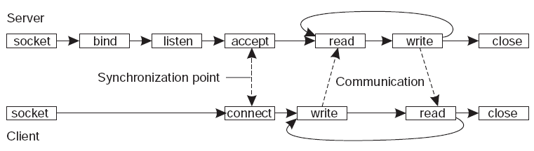

# 17. - Programování síťových operací
> Programování síťových operací, koncepce socketů a jejich využití, blokující a neblokující komunikační operace.

## Síťové programování
Síťovým programováním rozumíme proces vytváření programů, které jsou spolu schopné komunikovat přes síť. Nemusí se však jednat pouze o komunikaci dvou různých počítačů v síti, programy mohou pomocí síťového rozhraní (localhost) komunikovat mezi sebou i rámci jednoho počítače. Aby programátor nemusel znát podrobně všechny komunikační vrsty a protokoly potřebné k navázaní spojení, poskytuje operační systém rozhraní zvané **síťový socket**. Síťové sockety jsou postaveny na protokolu **TCP/IP** a jejich podporu najdeme ve většině standartně používaných programovacích jazycích.

## Sockety
Socket je obecný model point to point (roura) komunikace. Socket je obecně nezávislý na **TCP/IP** protokolu a poprvé byl představen jako programátorské rozhraní zvané [Berkley sockets](https://en.wikipedia.org/wiki/Berkeley_sockets) v operačním systému BSD (Berkley Software Distribution). Tento model implementují například **Unixové sockety**, které slouží pro meziprocesovou komunikace. V dnešní době je však pod pojmem Socket myšlena spíše implementace **síťových Socketů** postavených na protokolu** TCP/IP**, právě těmi se budeme dále zabývat.

### Typy socketů
- **Unix Domain Sockets** - Sockety pužívané pro meziprocesovou komunikaci v prostředí Unixu.
- **Internet Domain Sockets** - Síťové sockety, podporované napříč platformami.
 - **TCP** - streamovanáspojovaná komunikace (Nejdříve se musí navázat spojení mezi párem socketů, server socketnaslouchá na portu, klientský navazuje spojení.)
 - **UDP** - nespojovaná datagramová komunikace (S každým zaslaným datagramem se zasílá lokální socke tdescriptor a adresa příjemce.)
 - **RawIP** - obvykle dostupné jen routerech a nízkoúrovňových službách jako je  (ICMP) ping. (OS již obvykle nepodporují, lze falšovat hlavičky a tak dále.)

### Síťové sockety
Síťový socket je jeden **koncový bod** dvoubodového komunikačního spojení mezi dvěma programy na síti. Koncový bod tvoří dvojice **jméno hostitele** a **číslo portu**. Každé spojení je identifikováno dvěma koncovými body, takzvaný **socketpair**.

**Níže jsou uvedeny základní funcke poskytované socketem:**

- **socket()** vytváří nový socket daného typu, identifikovaný celým číslem, s alokovanými systémovými prostředky.
- **bind()** je obvykle používán na straně serveru a typicky spojuje lokální port s IP adresou.
- **listen()** se používá na straně serveru uvádí TCP socket do stavu listen.
- **connect()** se používá na straně klienta a přiřazuje volný lokální port k socketu. V případě TCP socketu vytvoří nové TCP spojení.
- **accept()** se používá na straně serveru. Potvrzuje příchozí požadavek na ustavení nového TCP spojení od vzdáleného klienta a vytváří nový socket.
- **send()** a **recv()**, nebo **write()** a **read()**, nebo **sendto()** a **recvfrom()**, se používají pro odesílání a přijímání dat z/na vzdálený socket.
- **close()** požádá systém o uvolnění prostředků, které měl socket alokované. V případě TCP je spojení přerušeno.
- **gethostbyname()** a gethostbyaddr() se používají pro vzájemný překlad jmen hostů a adres. Podporováno je pouze IPv4.
- **select()** je využíván k čekání, než bude socket nebo seznam socketů připraven.
- **poll()** se používá ke kontrole stavu socketu ze skupiny socketů. Skupina může být kontrolována, zda je možné do některého socketu zapsat, číst z něj, nebo zda nenastala nějaká chyba.
- **getsockopt()** umožňuje získat aktuální stav dané vlastnosti socketu.
- **setsockopt()** umožňuje nastavit hodnotu dané vlastnosti socketu.

*Převzato z Berkley Sockets spíše pro orientaci, reálně se může v závisloti na implementaci.*

### Komunikace
Komunikace probíhá tak jak je znázorněno na následujícím obrázku.



*Model komunikace přes Socket*

### Příklad
Uvedený příklad je v Javě, která má oddělené třídy pro `Socket` a `ServerSocket`.


**Klient**

```java
import java.io.*;
import java.net.*;
class TCPClient {
 public static void main(String argv[]) throws Exception {
  String sentence;
  String modifiedSentence;
  BufferedReader inFromUser = new BufferedReader(new InputStreamReader(System.in));
  Socket clientSocket = new Socket("localhost", 6789);
  DataOutputStream outToServer = new DataOutputStream(clientSocket.getOutputStream());
  BufferedReader inFromServer = new BufferedReader(new InputStreamReader(clientSocket.getInputStream()));
  sentence = inFromUser.readLine();
  outToServer.writeBytes(sentence + '\n');
  modifiedSentence = inFromServer.readLine();
  System.out.println("FROM SERVER: " + modifiedSentence);
  clientSocket.close();
 }
}
```

**Server**

```java
import java.io.*;
import java.net.*;
class TCPServer {
 public static void main(String argv[]) throws Exception {
  String clientSentence;
  String capitalizedSentence;
  ServerSocket welcomeSocket = new ServerSocket(6789);
  while (true) {
   Socket connectionSocket = welcomeSocket.accept();
   BufferedReader inFromClient = new BufferedReader(new InputStreamReader(connectionSocket.getInputStream()));
   DataOutputStream outToClient = new DataOutputStream(connectionSocket.getOutputStream());
   clientSentence = inFromClient.readLine();
   System.out.println("Received: " + clientSentence);
   capitalizedSentence = clientSentence.toUpperCase() + '\n';
   outToClient.writeBytes(capitalizedSentence);
  }
 }
}
```

## Blokujíci a neblokující operace
Každý  socket může být nastaven do dvou módů - **blokujícího** a **neblokujícího**. V blokujícím řežimu je celá aplikace zastavena a čeká se na potvrzení o přijetí dat. To může trvat značnou dobu, po kterou je hlavní vlákno aplikace blokováno. Druhým způsobem je pak neblokující režim, v tomto režimu se požadovaná funkce ihned vrátí (obvykle impleměntováno jako podvlákno) bez ohledu na dokončení vnitřní logiky. Hlavní vlákno tedy v podstatě ihned pokračuje dál ve vykonávání programu. Nemáme však jistotu, že byla odesílaná data správně doručena. Defaultně  jsou vlákna nastavena jako blokující.

- **Blokující operace** - zastaví běh hlavního vlákna, dokud se její běh nedokončí
 - nevýhody můžeme řešit provaděním operace ve vlastním vlákně (**thread**)
 - při častém vykonávání blokujících operací může aplikace využít vláken i více najednou (**thread pool**)
 - případně lze použí **pooling** (cyklicky se ptáme neblokující operací typu ready() jestli jsou data bufferu a v případě úspěchu zahájíme blokujícíc recv())
- **Neblokující operace** - dovolí hlavnímu vláknu ihned pokračovat v běhu, úspěšné dokončení se však špatně ověřuje
 - ověření se v tomto případě musí provádět opětovným dotazováním později v programu
 - v některých jazycích je možné využít takzvaný **callback**

Jako blokující operace jsou záměrně implementovány funkce různých synchronizačních primitiv, viz okruh [27. Paralelní systémy](https://github.com/tomaskrizek/tul-szz-it-nv/blob/master/27_paralelni_systemy/27_paralelni_systemy.md).

