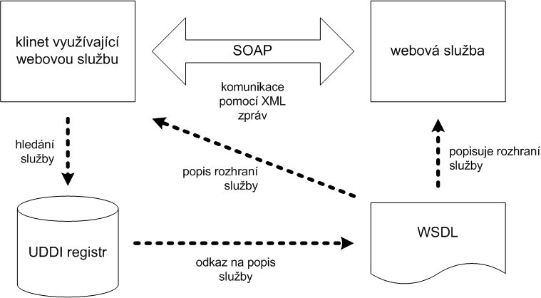

# 18. - WWW Aplikace

> WWW aplikace, programování na straně klienta a serveru, jejich možnosti a omezení, nejběžnější používané prostředky a jazyky, uchovávání stavové informace, cookie.

## Webové aplikace

- uživatelsky orientované
- očekává se rýchlá odezva
- architektura klient-server
- komunikace přes HTTP(S)
- WWW původně narvžen pro publikování dokumentů, ne aplikace -> HTTP bezestavový, request/response
- problém s bezpečností aplikací

### Statické stránky

- server pouze vydává data

### Třívrstvá architektura

- dynamická
- kód stránek je generován

**Vrstvy:**

1. prezentační vrstva (HTML, CSS, JavaScript)
2. aplikační vrstva (PHP, Python, Ruby, JavaScript, Java, ...)
3. datová vrstva (SQL, PostreSQL, MongoDB, ...)

## Server-side

### Vlasnosti, omezení prog. na serveru

- pro dynamické generování stránek
- klientovi se posílá pouze výsledný kód, který vznikne interpretací skriptu
- interakce se skriptem - *pomocí URL*
  - odkazem (GET)
  - formulářem (POST)
- lze předat vstupní parametry (součást URL, formulářová data)
- prog. jazyky - PHP, Python, Ruby, Java, ASP, CGI, SSI, ...
- technologie - Apache server, nginx, ...


### PHP

- skriptovací jazyk
- syntaxe vychází z C a částečně z Unix shellu
- dynamicky typované proměnné
- není třeba deklarovat proměnné
- globální proměnné obsahují užitečná externí data ($_GET, $_POST)
- umožňuj pracovat s HTTP hlavičkami

### Python

- skriptovací jazyk
- modul pro jednoduchý HTTP server
- dynamicky typované proměnné se silnou typovou kontrolou
- Django framework pro psaní webovýh aplikací

## Client-side

### Vlasnosti, omezení prog. na straně klienta

- nutná podpora prohlížeče
- kód je součástí stránky, kterou si klient vyžádal
- asynchronní komunikace se serverem pomocí Javascriptu - AJAX
- vylepšení GUI (jQuery)
- single page aplikace

### HTML

- verze 5
  - sémantické strukturování stránky
  - multimédia - audio, video bez Flash
  - podpora offline aplikací ([HTML5 Local Storage](http://www.w3schools.com/HTML/html5_webstorage.asp))
  - vylepšené formuláře
  - podpora různých zařízení (oproti XHTML)
- struktura jazyka
  - tagy
  - atributy + hodnoty

### CSS

- pro úpravu vzhledu stránek
- oddělení obsahu od vizuální formy
- umožňuje přidělení parametrů různým prvkům stránky a nastavení hodnot těchto parametrů
- dědění/kaskádování stylů
  - prvky získávání formátování od nadřazených prvků
  - později definovaný styl přepisuje původní chování
  - `!important`
- selektory
  - element `h1`
  - pomocí atributů `a[href=...]`
  - pseudoelementy `:first-line`
  - identifikátory `#id`
  - třídy `.class`
- podrobnější selektory mají vyšší prioritu

```
selektor {
  parametr1: hodnota;
  parametr2: hodnota
}
```

### JavaScript

- multiplatformní, běží v prohlížeči
- objektově orientovaný + funkcioální
- vychází z C
- *event driven* - řízený událostmi
- dynamické typování, slabá typová kontrola
- skript se provede v místě vložení
- využití:
  - práce s dokumentem, tvorba / získání obsahu
  - validace formulářů, zobrazení chyb
  - AJAX - komunikace se serverem
  - single page aplikace
  - ...
- existuje mnoho frameworků

### Document Object Model (DOM)

- dokument jako strom sestavený z elementů, které mají obsah a mohou mít atributy s dalšími hodnotami
- `<html>` kořen stromu 
- pomocí DOM lze jednoznačně identifikovat každý prvek

## Uchovávání stavové informace

- HTTP - bezestavový protokol
- předávání stavových informací  
  - součást URL
  - data formuláře
  - cookies
  - externí zdroj - session, databáze

### Cookie

- server nastaví cookie, u klienta se uloží
- cookie je pak součástí HTTP requestů
- nevýhody:
  - data se přenáší mezi klientem a serverem - bezpečnost, nevhodné pro větší data
  - lze je ukrást, podvrhnout nebo upravit

### Session (PHP)

- identifikátor uložen v cookie
- data uložena na straně serveru
- k datům lze přistupovat pomocí $_SESSION

## Webové služby

### SOAP

- komunikační protokol pro výměnu zpráv
- orientován na volání metod a výměnu dat
- popis služby v souboru WSDL (poskytované metody, jejich argumenty a návratové hodnoty; umístění služby)
- registr pro zveřejnění webové služby - UDDI
- založené na XML



*Komunikace webservices: Jiří Kosek, http://www.kosek.cz/diplomka/html/websluzby.html*

### REST

- orientace na práci se zdroji a daty
- přenos dat pomocí HTTP bez dodatečných zpráv (oproti SOAP)
- čtyři základní operace: Create, Retrive, Update, Delete
- využívá metody a stavové kódy HTTP
- formát pro výměnu dat - JSON, XML, ATOM/RSS, ...

