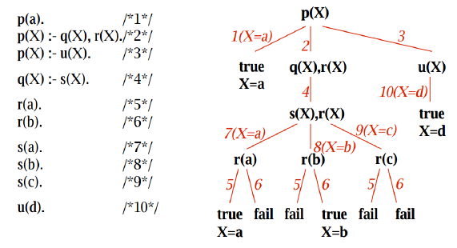

# 19. - Alternativní přístupy k programování
>Alternativní přístupy k programování – funkcionální programování a Lambda kalkulus, náhrada cyklu rekurzí, logické programování, rezoluční mechanismus a jazyk Prolog.

Hlavní dva přístupy k programování jsou:

- **Imperativní** - Přímočarý popis algoritmu, postup řešení krok za krokem, ukládání mezivýsledků do proměnných.
- **Deklarativní** - Je počítači řečeno, co má vykonat, nikoli jak. Program je strukturován jako soubor vlastností, které má výsledek mít.

Vyšší programovací jazyky se dále dělí takto:

- **Procedurální (imperativní)**
  - Strukturované (např. C, BASIC, Cobol)
  - Objektově orientované (např. Smalltalk, Java)
- **Neprocedurální (deklarativní)**
  - Funkcionální (např. **Lisp**, Haskell)
  - Logické (např. **Prolog**, Gödel)

Toto rozdělení není absolutní a moderní  programovací jazyky jsou obvykle **multiparadigmatické**. To znamená, že různá paradigmata nějakým způsobem podporují a kombinují. Například Python podporuje *procedurální*, *objektově orientované* i *funkcionální* paradigma. Z historického pohledu je za **alternativní** považován **deklarativní přístup**, protože ten imperativní (jako sada instrukcí) je pro nizkoúrovňové programování přirozenější.  Ale například funkcionální jazyky nejsou žádnou novinkou (Lisp 1958), jen poslední dobou získávájí na popularitě. Jde však spíš o jazyky, které jsou částečně (přebírají to nejlepší - impure) funkcionální, ty strikně (pure) funkcionální příliš rozšířené nejsou (příliš formální a tím nepraktické na psaní).

Na TUL se v rámci předmětu Alternativní metody programování učí (učí to Pavel Satrapa a je asi jediný také, kdo by se na to mohl zeptat) především dva jazyky, kterými se budeme dále zabývat.

- **Prolog** - zástupce *logického paradigmatu*
- **Scheme** (dialekt Lispu)  - zástupce *funkcionálního paradigmatu*

## Funcionální programování

- funkcionální paradigma patří mezi deklarativní programovací principy
- postaveno na formálním výpočtovém modelu nazvané λ-kalkul, kde jsou všechny konstrukce funkcemi
- funkce jsou objektem první třídy, mohou být předávány jako parametry jiným funkcím (tzv. funkcím vyšších řádů) nebo naopak vraceny jinými funkcemi jako výsledky
- obvykle se vyhýbá změnám stavů a proměnlivým datům, fuknce pracuje pouze se svým vstupem a vrací výstup
- funkce nemění stav kolem sebe, dobře se testuje
- změn stavu realizována jako vytvoření nového stavu (zachován původní)
- pro opakování/cykly se používá rekurze
- výpočtem funkcionálního programu je posloupnost vzájemně ekvivalentních výrazů, které se postupně zjednodušují 
- výsledkem výpočtu je výraz v normální formě, tedy dále nezjednodušitelný
- program je chápán jako jedna funkce obsahující vstupní parametry mající jediný výstup, tato funkce pak může být dále rozložitelná na podfunkce

### Lambda kalkul
Lambda kalkulus je formální systém pro deklaraci funkcí s pravidly pro jejich vyhodnocování. Jeho první verze pochází ze třicátých let 20. století. Popsal jej Alonzo Church, který se snažil vytvořit nový funkcionální základ pro matematiku. K tomuto účelu sice jeho systém použit zatím nebyl, ale našel využití jinde.

Lambda kalkulus lze chápat jako jednoduchý, univerzální, netypovaný a striktně formální programovací jazyk. Je výpočetně ekvivalentní s Turingovým strojem. V šedesátých letech 20. století se začal používat v informatice, především pro studium vyčíslitelnosti a formálních jazyků. Lambda kalkulus se také stal inspirací a teoretickým základem mnoha funkcionálních programovacích jazyků. Je totiž výsledným programům a lidskému myšlení bližší, než klasické výpočetní modely (např. Turingův stroj), které příliš připomínají hardware.

Základní stavební jednotkou lambda kalkulu je tzv. lambda výraz. Množinu lambda výrazů lze chápat jako soubor pravidel pro výpočet.

Formálně lze každý lambda výraz vyjádřit v Backus-Naurově formě takto:

```
 <výraz> ::= <proměnná>
<výraz> ::= ( λ <identifikátor> . <výraz> )
<výraz> ::= ( <výraz> <výraz> )
```

Funkce s více parametry sice v lambda kalkulu neexistují, ale každou takovou funkci lze převést na funkci s parametrem jedním tak, že vnější funkce vrací vnitřní funkci, které předá parametr. Tento převodní proces se nazývá Currying.


### Náhrada cyklu rekurzí
Každý algoritmus využívající rekurzi lze přepsat do nerekurzivního tvaru struktury a naopak. Rekuzze viz rekurze.

```java
//iterativni pristup
public static long factorial(int num) {
        long result = 1;
        if(num == 0) {
            return 1;
        }
        else {
            for(int i = 2; i <= num; i++) {
                result *= i;
            }
            return result;
        }

//rekurzivni pristup
public static long factorial(int num) {
        if(num == 0) {
            return 1;
        }
        else {
            return num * factorial(num - 1);
        }
    }
```

**Oblíbená technika ve funkcionálním programování, viz příklad ve Scheme.**

### Scheme
- jeden ze dvou hlavních dialektů funkcionálního programovacího jazyka Lisp.
- deklarativní multiparadigmatický jazyk, převládá funcionální přístup
- vše je definováno jako seznam (mnoho závorek)
 - **promenná:** (define var1 value)  
 - **funkce:** (define x2 (lambda (x) (* x x)))
 - **seznam:** (list 1 2 3)

**Příklad** (nalezení nejmenšího prvku v seznamu)

Pro seznam máme dvě základní procedury:

- **(car seznam)** vydá první prvek seznamu - (**head**)
- **(cdr seznam)** vydá zbytek seznamu (bez 1. prvku) - (**tail**)

```scheme
(define (minim lst)
    (cond ((null? (cdr lst)) (car lst))
          ((< (car lst) (minim (cdr lst))) (car lst))
          (else (minim (cdr lst)))) )

(minim '(3 4 2 9 3 8)) 
```

**Příklad demonstruje také nahrazení cyklu rekurzí.**

## Logické programování

- aplikace matematické logiky v programování
- interpretem je rezoluční stroj, který z faktů a pravidel odvozuje/ověřuje další fakta
- především deklarativní přístup (popis logických vztahů), procedurální složka potlačena

### Prolog

- využivá se v oboru umělé inteligence a počítačové lingvistiky
- 2 režimy :
 - **konzultační** (zadávají se fakta a pravidla)
 - **dotazovací** (kladou se otázky)
- základní částí:
 - definice faktů o objektech a vztazích mezi nimi
 - definice pravidel pro odvozování dalších faktů
 - kladení otázek
- program rozdělen na termy (term je buď atom, číslo, proměnná, nebo složený term)
 - atom => ‘nazdar’
 -  číslo => 23
 - proměnná => X
 - složený term => prarodic(X, Y):- rodic(X, Z), rodic(Z, Y).

**Příklad**

```prolog
rodic(jana,petr).
rodic(emil,petr).
rodic(ivana,jana).
rodic(alfons,jana).
rodic(otylie,emil).
prarodic(X,Y) :- rodic(X,Z), rodic(Z,Y).
?- prarodic(ivana,petr). %Yes
?- prarodic(otylie,emil). %No
?- prarodic(X,petr). X=ivana; X=alfons; X=otylie; %No
```

### Rezoluční mechanismus v prologu (jediné co jsem našel a moc tomu nerozumím)
Způsob vyhdonocování na základě predikátů => tvorba derivačního stromu.



> V dotazovacím režimu vrátí Prolog pouze první větev s hodnotou True, pro druhý dotaz se provede backtracking a vrátí se další. To lze opakovat, dokud jsou k dispozici nějaké platné hodnoty.

Prohledávám strom do hloubky dokud nenaleznu výsledek pro který je predikát TRUE, pokud dojdu k listu (TRUE,FALSE) bud vrátím výsledek a nebo se vracím.

Během průchod stromem se používá srovnávání

- srovnávání (unifikace)
 - stejné jméno a struktura predikátu (není zobrazeno ve stromu nahoře)
 - konstanta vůči konstantě – musí být shodné ( 5 )
 - proměnná vůči konstantě – vytvoří se vazba ( 7,8,9,10)
 - proměnná vůči proměnné – zůstane volná (2,3,4)


