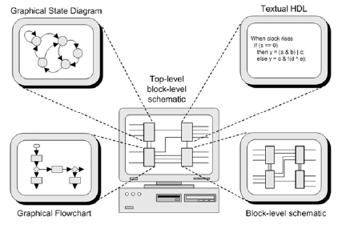

# 24. - Programovatelné zákaznické obvody
> Rozdělení a architektury programovatelných zákaznických obvodů, jazyky pro popis technických prostředků, charakteristické rysy jazyka VHDL.

## Rozdělení a architektury programovatelných zakázkových obvodů
## FPGA
## Jazyky pro popis technických prostředků
### Urovně abstrakce
- **Behaviouristická úroveň**
 - popis chování systému
 - volba algoritmů a architektury
 - volba mezi HW a SW realizací
- **Úroveň FB (RTL - Register Transfer Level)**
 - popis tokem dat (stavový diagram)
 - FB: logické operátory, paměti, multiplexery, čítače, …
 - nezávislá na technologickém procesu
- **Úroveň logického schématu**
 - popis spojovací tabulkou mezi logickými prvky
 - jednoznačný přechod na úroveň tranzistorů

### Formy popisu



*Formy popisu*

### Jazyky
**HDL jazyky:**

- **VHDL** (popsáno podrobněji níže)
- **Verilog HDL**
 - vývoj od osmdesátých let (Verilog–XL) (firma Gateway Design Automation)
 - v roce 1995 - IEEE Std 1364-1995
 - udržován OVI (Open Verilog International)
 - rozšířený zejména v Americe a Asii
 - jednodušší a omezenější ve srovnání s VHDL
 - v roce 2001 – revize IEEE Std 1364-2001
 - podobný jazyku C

*Nové jazyky vznikají zejména z důvodu dosažení větší abstrakce od hardwaru, kladou důraz na popis na úrovni algoritmů (nejsou koncipovány pro přímý popis HW - nejsou to HDL jazyky).*

**Non HDL jazyky:**

- **SystemVerilog** – standard IEEE Std 1800-2005 (vychází z Verilogu)
- **SystemC** – standard IEEE Std 1666-2005 (vychází z objektového jazyka C++)
- **Handel-C** – Celoxica (vychází z jazyka C)

## VHDL
**VHDL** je programovací jazyk sloužící pro popis hardware. Používá se pro návrh a simulaci digitálních integrovaných obvodů, například programovatelných hradlových polí (CPLD, FPGA, …), nebo různých zákaznických obvodů (ASIC).

### Vývoj

- HDL - Hardware Description Language (jazyk pro popis hardware)
- VHDL - Very High Speed Integrated Circuits HDL (velmi rychlé integrované obvody)
- Vývoj od roku 1983 v rámci projektu VHSIC
- 1987 - standard IEEE 1076-1987 (IEEE="Institut pro elektrotechnické a elektronické inženýrství")
- 1993 - revize IEEE Std 1076-1993
- 1999 - revize IEEE Std 1076.1-1999 VHDL-AMS (Analogue & Mixed Signals)
- 2000 - revize IEEE Std 1076-2000
- 2002 – revize IEEE Std 1076-2002
- V návrhových systémech implementovány převážně verze VHDL-87 a VHDL-93

### Charakterizace

- všeobecně přístupný otevřený standard
- jazyk pro popis technických prostředků elektronických systémů
- vhodné pro návrh metodou shora-dolů (top-down)
- nezávislé na budoucí technologii realizace
- důraz na funkci obvodu (oproštění od detailů)
- umožňuje opakované používání modelů (knihovny)
- využití pro dokumentaci a modelování
- paralelní jazyk (ne sekvenční)
- snadná výměna částí návrhů mezi návrháři (IP core)
- libovolná část návrhu může být osamostatněna
- model VHDL může být simulován v různých systémech
- podpora testovatelnosti (Boundary Scan Architecture)
- „upovídaný“ jazyk (opakování bloků, deklarace)
- ne všechny konstrukce jazyka musí být syntetizovatelné (lze pouze simulovat)

### Styly popisu architektur

- **Behaviorální styl**
 - popis na vysoké úrovni abstrakce
 - neuvažujeme detaily (šířky sběrnic, hodinové signály)
  - použití hlavně pro simulaci
- **Styl popisující tok dat** – styl typu RTL (Register Transfer Level)
 - vhodné pro syntézu
 - návrhář si řídí architekturu svého návrhu
- **Styl strukturální**
 - vkládání komponent do netlistu (např. z knihoven)
 - omezení možností syntézy

### Příklad
V následujícím příkladu je popsáno hradlo XOR v jazyce VHDL

```vhdl
-- Circuit : XOR Gate

--import std_logic from the IEEE library
library ieee;
use ieee.std_logic_1164.all;

--ENTITY DECLARATION: name, inputs, outputs
entity xorGate is	
   port( A, B : in std_logic;
            F : out std_logic);
end xorGate;

--FUNCTIONAL DESCRIPTION: how the XOR Gate works
architecture func of xorGate is 
begin
   F <= A xor B;
end func;
```
