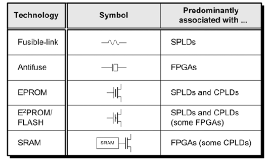
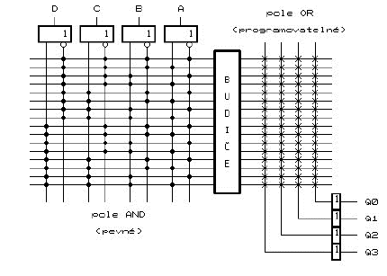
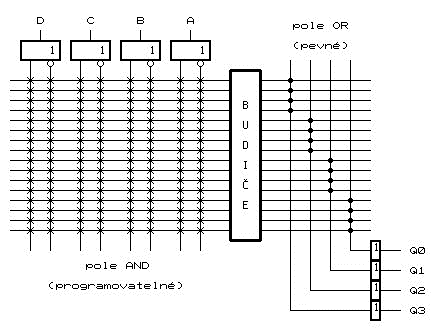
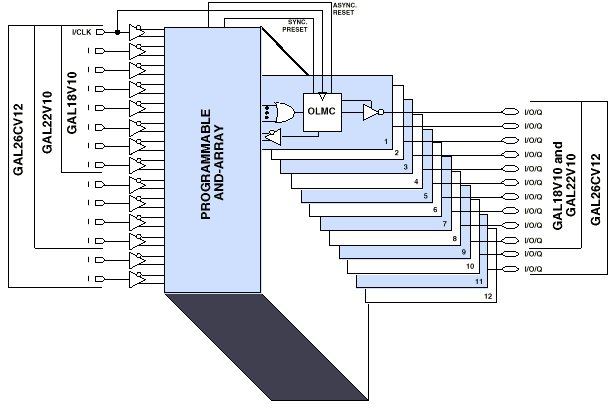
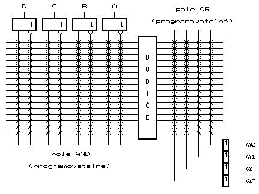
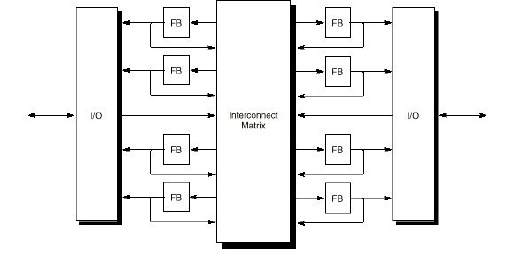
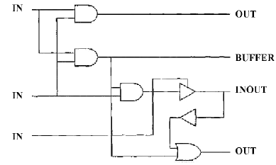

# 24. - Programovatelné zákaznické obvody
> Rozdělení a architektury programovatelných zákaznických obvodů, jazyky pro popis technických prostředků, charakteristické rysy jazyka VHDL.

## Rozdělení a architektury programovatelných zakázkových obvodů (FPLD)
**ASIC** (Application Specific Integrated Circuit), nazývaný i zákaznický integrovaný obvod, je integrovaný obvod navržený a vyráběný pro určitou specifickou aplikaci. Dělíme je takto:

- **Zakázkové** (Custom) - podle uživatele se navrhují se všechny masky technologického procesu
- **Polozakázkové** (Semi-custom) - podle uživatele se navrhují pouze propojovací masky
- **Programovatelné** (Programmable) - uživatel sám programuje funkci (např. přerušováním propojek)

**FPLD** (Field Programmable Logic Device) - **Programovatelné** zakázkové IO dělíme na :

- **PLD** (Programmable Logic Device)
 - *SPLD* (Simple PLD) - pevně daná struktura typu: vstup - pole AND- pole OR- výstup
 - *CPLD* (Complex PLD) - složitější architektury vycházející z SPLD (vrstevnaté, s centrální propojovací maticí).
- **FPGA** (Field Programmable Gate Array) - pravidelná struktura programovatelných log. bloků s vodorovnými či svislými propojovacími linkami a propojovacími maticemi

**Typy propojek:**



*Typy propojek*

**Nejvýznamnější výrobci FPLD:**

1. Xilinx (49 %)
2. Altera (40 %)
3. Lattice Semiconductor (6 %)
4. Microsemi (pův. Actel) (4 %)
5. QuickLogic (1 %)

FPGA obvody představují přes 90 % trhu všech FPLD.

**Návrhové systémy:**

- ISE (Xilinx), Quartus (Altera), Diamond (Lattice), Libero (Microsemi),
- HDL Designer (Mentor Graphics).

## PLD
Programování na základě přepalování/porušování propojek.


*PLD*

### SPLD

**PROM**

- programovatelné pole OR
- počet programovatelných bodů: N = m.(2^n) (n = počet vstupů; m = počet výstupů)
- EEPROM (Electrically Erasable PROM)
- použití jako paměť konstant



*PROM*

**PAL**

- programovatelné pole AND
- počet programovatelných bodů: N = 2m.k.n
- omezený počet součinových termů k
- na výstupu mohou obsahovat klopné obvody



*PAL*

**GAL**

- vychází z obvodů PAL
- na výstupu makrobuňka OLMC (Output Logic Macro Cell)
 - každý I/O lze konfigurovat jako vstup, výstup nebo třístavový výstup
 - některé z konfigurovatelných parametrů pouze globální



*GAL*

**PLA**

- programovatelné pole AND i OR
- počet programovatelných bodů: N = m.k + 2k.n
- odstraňuje omezení v počtu součinových termů



*PLA*

### CPLD

- složitostí mezi PLD a FPGA
- obsahují centrální propojovací matici
 - **MAPL** (Multiple Array Programmable Logic)
 - **MACH** (Macro Array CMOS High-density)
 - **PEEL** (Programmable Electrically Erasable Logic)



*CPLD*

## FPGA
## Jazyky pro popis technických prostředků
### Urovně abstrakce
- **Behaviouristická úroveň**
 - popis chování systému
 - volba algoritmů a architektury
 - volba mezi HW a SW realizací
- **Úroveň FB (RTL - Register Transfer Level)**
 - popis tokem dat (stavový diagram)
 - FB: logické operátory, paměti, multiplexery, čítače, …
 - nezávislá na technologickém procesu
- **Úroveň logického schématu**
 - popis spojovací tabulkou mezi logickými prvky
 - jednoznačný přechod na úroveň tranzistorů

### Formy popisu


*Formy popisu*

### Jazyky
**HDL jazyky:**

- **VHDL** (popsáno podrobněji níže)
- **Verilog HDL**
 - vývoj od osmdesátých let (Verilog–XL) (firma Gateway Design Automation)
 - v roce 1995 - IEEE Std 1364-1995
 - udržován OVI (Open Verilog International)
 - rozšířený zejména v Americe a Asii
 - jednodušší a omezenější ve srovnání s VHDL
 - v roce 2001 – revize IEEE Std 1364-2001
 - podobný jazyku C

*Nové jazyky vznikají zejména z důvodu dosažení větší abstrakce od hardwaru, kladou důraz na popis na úrovni algoritmů (nejsou koncipovány pro přímý popis HW - nejsou to HDL jazyky).*

**Non HDL jazyky:**

- **SystemVerilog** – standard IEEE Std 1800-2005 (vychází z Verilogu)
- **SystemC** – standard IEEE Std 1666-2005 (vychází z objektového jazyka C++)
- **Handel-C** – Celoxica (vychází z jazyka C)

## VHDL
**VHDL** je programovací jazyk sloužící pro popis hardware. Používá se pro návrh a simulaci digitálních integrovaných obvodů, například programovatelných hradlových polí (CPLD, FPGA, …), nebo různých zákaznických obvodů (ASIC).

### Vývoj

- HDL - Hardware Description Language (jazyk pro popis hardware)
- VHDL - Very High Speed Integrated Circuits HDL (velmi rychlé integrované obvody)
- Vývoj od roku 1983 v rámci projektu VHSIC
- 1987 - standard IEEE 1076-1987 (IEEE="Institut pro elektrotechnické a elektronické inženýrství")
- 1993 - revize IEEE Std 1076-1993
- 1999 - revize IEEE Std 1076.1-1999 VHDL-AMS (Analogue & Mixed Signals)
- 2000 - revize IEEE Std 1076-2000
- 2002 – revize IEEE Std 1076-2002
- V návrhových systémech implementovány převážně verze VHDL-87 a VHDL-93

### Charakterizace

- všeobecně přístupný otevřený standard
- jazyk pro popis technických prostředků elektronických systémů
- vhodné pro návrh metodou shora-dolů (top-down)
- nezávislé na budoucí technologii realizace
- důraz na funkci obvodu (oproštění od detailů)
- umožňuje opakované používání modelů (knihovny)
- využití pro dokumentaci a modelování
- **paralelní jazyk** (ne sekvenční)
- snadná výměna částí návrhů mezi návrháři (IP core)
- libovolná část návrhu může být osamostatněna
- model VHDL může být simulován v různých systémech
- podpora testovatelnosti (Boundary Scan Architecture)
- „upovídaný“ jazyk (opakování bloků, deklarace)
- ne všechny konstrukce jazyka musí být syntetizovatelné (lze pouze simulovat)

### Styly popisu architektur

- **Behaviorální styl**
 - popis na vysoké úrovni abstrakce
 - neuvažujeme detaily (šířky sběrnic, hodinové signály)
  - použití hlavně pro simulaci
- **Styl popisující tok dat** – styl typu RTL (Register Transfer Level)
 - vhodné pro syntézu
 - návrhář si řídí architekturu svého návrhu
- **Styl strukturální**
 - vkládání komponent do netlistu (např. z knihoven)
 - omezení možností syntézy

### Základní konstrukce

**Entity a Architecture**
Základní konstrukce, které jsou povinné.

- *Entita* - „černá skříňka“ se vstupy a výstupy (obdoba grafického symbolu)
 - Entita nepopisuje chování modulů (nedefinuje funkci)
- *Architektura* - určuje chování entit
 - tělo architektury má dvě části: deklarační část (např. definice signálů), příkazová část (uzavřeno do begin - end )
 - architektura musí být spojena se specifikovanou entitou
 - rozdílné architektury definují rozdílné pohledy na entity

**Porty** (Brány)

Porty popisují vnější signály entity a jsou charakterizovány:

- jménem (libovolná skupina znaků začínající písmenem)
- datovým typem (lze spojovat porty stejného typu)
- módem (určuje směr toku dat) – 5 módů
 - *IN* – data lze z portu pouze číst
 - *OUT* – data vycházejí z portu (výstupní signál nemůže být použit jako vstup uvnitř entity)
 - *BUFFER* – výstup se zpětnou vazbou (může být buzen pouze z vnitřku entity - data mohou z entity pouze vystupovat, lze zpětně číst)
 - *INOUT* – obousměrný tok (obousměrné vstupy/výstupy)
 - *LINKAGE* – neznámý směr datového toku nebo obousměrný (návaznost na jiné než VHDL modely, např. Verilog)



*Módy portu*

**Datové objekty**

- *Constants* (konstanty) – mají neměnnou hodnotu
- *Variables* (proměnné) – používají se jako pomocné objekty (nepředstavují skutečné signály, nelze je použít jako porty, jsou lokální v procesech)
- *Signals* (signály) – většinou jsou fyzicky přítomné ve formě elektrických signálů

**Příkaz PROCESS**

- představuje nezávislý děj, který se provede při aktivaci
- užívá se zejména pro popis sekvenčních dějů
- příkazy uvnitř procesu se vykonávají sekvenčně
- více procesů v architektuře se vykonává paralelně.

```vhdl
[jméno] : PROCESS [(clock, reset)] -- seznam citlivých proměnných
-- deklarace procesu
BEGIN
-- příkazy procesu
END PROCESS [jméno] ;
```

Seznam citlivých proměnných je při syntéze ignorován, ale je významný pro správné provádění simulace

**Položky LIBRARY a USE**

V systému VHDL je standardně přístupná pouze knihovna Std.standard (není třeba ji připojovat), ostatní je třeba připojit.

- *LIBRARY* – zviditelňuje logická jména návrhových knihoven
- *USE* zviditelňuje specifikované položky v daném package

Obě položky nutno v návrhu opakovat pro každou entitu a package.

```vhdl
LIBRARY jméno_knihovny ;
USE jméno_knihovny.jméno_package.položka ;
```

**Atributy**

- atributy jsou v podstatě speciální funkce, které poskytují dodatečnou informaci jejich nositelích
- nositeli mohou být typy, signály, proměnné, vektory, pole, bloky, architektury, jednotky, …

Atributy:

 - předdefinované (typy, pole, signály, objekty)
 - definované uživatelem (nepříliš standardizované)

```vhdl
-- syntaxe
PREFIX’jméno_atributu[(výraz)]

-- nastala-li na clk vzestupná hrana
IF (clk’event and clk='1') THEN out1 <= data; END IF;
```

**Package**

- hierarchicky je nad entitou a architekturou
- položky deklarované v PACKAGE jsou viditelné v celém návrhu
- vhodné pro deklarace datových typů, komponent, funkcí, procedur apod.

Package obsahuje dvě části:

- deklarační část
- vlastní tělo (pro definice podprogramů, funkcí apod.) není potřeba pro package pouze s datovými typy

**Komponenty (funkční bloky)**

- vhodné pro skládání hotových funkčních bloků
- komponenta musí být definována entitou
- tato entita musí mít přiřazenu architekturu
- komponenta musí být deklarována uvnitř architektury (zpravidla na začátku) nebo v package
- lokální signály propojující komponenty musí být deklarovány uvnitř architektury

**Funkce**

- podprogram, který vrací hodnotu (datový typ)
- funkce mají vstupní operandy a jeden výstupní operand
- typ hodnoty může být skalární nebo složený
- ve funkci nemohou být deklarovány signály (pouze konstanty a proměnné – jejich platnost je omezena pouze na funkci)

```vhdl
FUNCTION jméno_funkce (parametry) RETURN typ IS
-- deklarace
BEGIN
-- sekvenční příkazy
END jméno_funkce ;
```

**Procedury**

- podprogram, který modifikuje vstupní parametry
- módy parametrů mohou být: IN, OUT, INOUT (implicitně IN)
- proceduře lze předávat signály, konstanty i proměnné
- z procedury lze volat další proceduru

```vhdl
PROCEDURE jméno_procedury (seznam_parametrů) IS
-- deklarace
BEGIN
-- sekvenční příkazy
END jméno_procedury ;
```

### Příklad
V následujícím příkladu je popsáno hradlo XOR v jazyce VHDL

```vhdl
-- Circuit : XOR Gate

--import std_logic from the IEEE library
library ieee;
use ieee.std_logic_1164.all;

--ENTITY DECLARATION: name, inputs, outputs
entity xorGate is	
   port( A, B : in std_logic;
            F : out std_logic);
end xorGate;

--FUNCTIONAL DESCRIPTION: how the XOR Gate works
architecture func of xorGate is 
begin
   F <= A xor B;
end func;
```

*Hradlo XOR ve VHDL*
