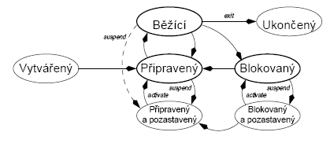
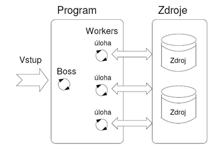
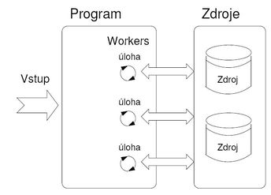
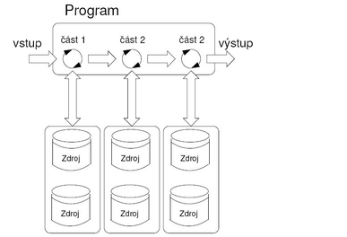

# 27. - Paralelní systémy
>Paralelní systémy, kategorie, paralelizace zpracování, víceprocesorové systémy, programování v paralelních a distribuovaných systémech – přístupy, prostředky, metody vzájemné synchronizace.

## Základní pojmy
**Paralelismus** -  Vytváření souběžnosti, zdánlivý nebo skutečný paralelní běh více procesů zároveň.

- **Skutečný** (paralelismus) - Každý proces má svůj vlastní procesor, v praxi téměř nemožné.
- **Zdánlivý** (pseudoparalelismus) - Několik procesů se navzájem dělí o časové kvantum na jednom CPU, takto funguje drtivá většina moderních systémů.

**Multitasking** -  Schopnost operačního systému provádět (přinejmenším zdánlivě) několik procesů současně.

**Program** - Realizace algoritmu v programovacím jazyce, pro interpretované jazyky je vyskytuje ve formě spustitelného skryptu a pro kompilované jazyky jako spustitelný binární soubor.

**Proces** - Spuštěný program, který OS zavedl do operační paměti a přidělil mu určitá práva a vyhrazenou pamět.

**Vlákno** - Při vytvoření nového procesu je automaticky vždy vytvořeno primární vlákno. Vlákno je objektem OS, ve kterém běží samotný programový kód. Všechny vlákna v rámci procesu sdílí tentýž virtuální adresní prostor.

>V rámci jednoho **procesu** může běžet několik **vláken**, ty mají sdílenou pamět a při jejich střídání nemusí docházet ke změně kontextu. Díky tomu je mezi vláknová komunikace jednoduší a střídání vláken je rychlejší. Použití oddělených procesu se používá například z bezpečnostních důvodů k omezení přístupu do paměti.

## Procesy
### Základní stavy procesů
Následující stavy procesů se vyskytují ve všech víceúlohových systémech:

- **vytvořený** (created) – proces je vytvořen buď příkazem uživatele (u terminálu), nebo na žádost operačního systému o provedení služby, či na žádost jiného procesu (rodiče)
- **připravený** (ready) nebo čekající (waiting) – připravený pro vstup do stavu běžící, čeká pouze na přidělení procesoru
- **běžící** (running) – procesu je přidělen procesor a právě se provádí příslušné programy
- **blokovaný** (blocked) – proces je převeden do tohoto stavu v případě, kdy čeká na dokončení nějaké vstupně–výstupní - - operace, případně na skončení jiného procesu, uvolnění zdroje, synchronizační primitivum a podobně
- **ukončený** (terminated) – proces skončil



*Životní cyklus procesu*

### Plánování procesů
Přepínání kontextu:

- **Nepreemptivní** (kooperativní) multitasking
 - Vyžaduje aktivní spoluúčast (kooperaci) běžícího procesu
 - Po vypršení časového kvanta se musí sám vzdát procesoru
 - **Výhoda** – jednoduchá implementace
 - **Nevýhoda** - chybný proces zastaví celý systém - „zamrzne“
 - Starší verze Win (bez NT32 jádra), starší MacOS

- **Preemptivní** multitasking
 - Procesor přiděluje a odebírá OS
 - Využívá časovač – nutnost HW podpory
 - Využití různých strategií plánování – FCFS, SJF, prioritní atd.
 - **Výhoda** – nedochází k „zatuhnutí“ – OS odebere CPU i vadnému
procesu
 - **Nevýhoda** – složitější implementace
 - Nové Win, MacOS, unixové systémy

Podle času:

- **Krátkodobé plánování** (short-term)
 - CPU scheduling – plánování na úrovni CPU
 - Výběr, kterému procesu bude přiděleno CPU
- **Střednědobé plánování** (medium-term)
 - Výběr, který blokovaný nebo připravený proces bude přesunut z vnitřní paměti na disk (swap)
- **Dlouhodobé plánování** (long-term)
 - Job scheduling – plánování samotných úloh
 - Výběr která úloha bude spuštěna a kdy (např. při dávkovém zpracování)
 - Optimalizace vytížení počítače

## Vlákna
### Podpora v OS
Vlákna můžeme dělit z hlediska správy v OS:

- **Vlákna na uživatelské úrovni** (ULT)
 - správu vláken provádí vláknová knihovna (vytváří a ruší vlákna, plánuje běh vlákna, předává data a zprávy mezi vlákny, uchovává a obnovuje kontext vláken)
 - není potřeba OS
 - přepínání mezi vlákny je nezávislé na OS
 - vytvoření nepotřebuje náročné systémové volání
 - nemohou běžet paralelně
 - priority vláken se uplatňují jen v rámci času procesu
- **Vlákna na úrovni jádra** (KLT)
 - správa vláken provádí OS
 - každé vlákno v uživatelském prostoru je zobrazeno na vlákno v jádře.
 - Samotné jádro vytváří, ruší a plánuje vlákna.
 - vlákna mohou běžet paralelně
 - volání systému neblokuje ostatní vlákna téhož procesu
 - jeden proces může využít více procesorů
 - tvorba, rušení a přepínání mezi vlákny je levnější než mezi procesy
 - vytvoření vlákna je časově náročnější
- **Kombinace** ULT a KLT

### Modely vícevláknových aplikací
Modely řešící způsob jak vytvářit a rozdělit práci mezi vlákny

- **Boss/Worker**
 - hlavní vlákno řídí rozdělení úlohy jiným vláknům
 - hlavní vlákno je zodpovědné za vyřizování požadavků
 - pracuje v cyklu: přijde požadavek – vytvoří se vlákno pro řešení příslušného úkolu – čeká se, až se požadavek vrátí
 - jednotlivé Workers nemusí vědět o vstupu, ale musí o něm vědět Boss, který pak rozděluje úlohy



*Boss/Worker*

- **Peer**
 - vlákna běží paralelně bez specifického vedoucího
 - neobsahuje hlavní vlákno
 - všechny vlákna jsou si rovny
 - vlákno je zodpovědné za svůj vstup a výstup
 - všechny 3 Workery si sahají na vstup pro data



*Peer*

- **Pipeline**
 - zpracování dat sekvencí operací.
 - dlouhý vstupní proud dat
 - sekvence operací, každá vstupní jednotka musí projít všemi částmi zpracování
 - jednotky jsou nezávislé
 - o vstupu ví jen první, udělí se část dat a předá dál



*Pipeline*

- **Producent a konzument**
 - předávání dat mezi vlákny je realizováno vyrovnávací pamětí – buffer
 - producent – vlákno, které předává data jinému vláknu
 - konzument – vlákno, které přijímá data od jiného vlákna
 - přístup do vyrovnávací paměti musí být synchronizovaný (exkluzivní přístup)
 


*Producent/Consument*

## Paralelní systémy
Jako paralelní označujeme systém, v němž může probíhat několik procesů současně (paralelně).

- snaha zvyšovat výkonnost nad hranici danou technologií výroby součástek (mikroprocesorů)
- rozměry, cena a energetická náročnost elektronických prvků klesá rychleji než roste jejich rychlost
- výkonnost většinou neroste lineárně s počtem procesorů (má spíše logaritmický průběh) - vlivem komunikace CPU, synchronizace, nedokonalým vytížením, nevhodnými algoritmy apod.
- od jisté hranice je přidávání procesorů nerentabilní ([Amhdalův zákon](https://cs.wikipedia.org/wiki/Amdahl%C5%AFv_z%C3%A1kon))

**Superpočítač** - Jednolitý počítač, kde jsou komponenty úzce propojeny a komunikují po interní sběrnici a sdílejí pamět. Lze si představit jako velkou základní desku s mnoha sloty. Obrovský výpočetní výkon, ale zároveň i velká počáteční investice a složité možnosti rozšiřování.

**Cluster** - Sada nezávislých počítačů propojených rychlou sítí. Obvykle se vyskytují společně v jedné serverovně a mají stejný operační systém s nadstavbu pro společnou komunikaci. Snadné rozšiřování pouhým přidáváním dalších uzlů.

**Grid** - Podobné jako cluster, ale počítače jsou rozmístěny v internetu a nemusí mít stejný operační systém. Propojení je řešeno přes speciální aplikaci (middleware). Po spuštění aplikace se stáhne sada výpočtů, které počítač provádí a výsledek je odesílán zpět. Viz různé vědecké projekty na hromadné zkoumání genomu či vesmíru. Případně může jít o spojení několika clusterů, kvůli snadné správě a sdílení výpočetního výkonu.

### Architektura
Rozlišujeme 2 druhy architektur:

1. **Paralelní počítače (multiprocesory) se sdílenou pamětí** (superpočítač)
 - Procesory mohou sdílet paměť (RAM) jednoho počítače
 - U symetrických multiprocesorů může běžet kterýkoliv proces na kterémkoliv procesoru, procesory jsou univerzální
 - U asymetrických multiprocesorů je každý procesor specializován na určitý úkol
 - procesory se mohou synchronizovat, ale problém exkluzivity přístupu do paměti
2. **Paralelní počítače(multiprocesory) s distribuovanou pamětí** (cluster)
 - je to více strojů spojených dohromady pomocí komunikační sítě
 - Procesory spolu komunikují zasíláním zpráv
 - masivně paralelní počítače a clustery
 - není problém s exkluzivitou přístupu, ale komunikační problém

### Granularita
Podle složitosti procesu lze paralelní systémy dělit podle zrnitosti (granularity).

- Příkazy, instrukce, atomické operace
- Cykly, iterace
- Podprogramy, programové bloky
- Části úloh, moduly
- Nezávislé kompaktní úlohy, programové celky

Vývoj paralelních systémů logicky postupuje od nižších úrovní granularity k vyšším.

- **Nejnižší** (fine grained)
 - Paralelizace pomocí elementárních podprogramů
 - Řešení na úrovni HW a strojových instrukcí
 - Např. zřetězené zpracování (pipeline) - jedno CPU instrukce předzpracuje, další jednotky vykonávají
- **Střední** (middle grained)
 - Paralelizace na úrovni několika CPU
 - Zde už je možný zásah vývojáře
 - Rozdělení úlohy na několik spolupracujících – nutno řešit sdílení dat, komunikaci, synchronizaci
- **Nejvyšší** (coarse grained)
 - Architektura s řadou CPU + simultánní běh několika úloh
 - Optimální dělení strojového času mezi jendotlivé úlohy

### Flynova klasifikace
Podle toku instrukcí:

- SI (Single Instruction Streem) s jedním tokem instrukcí
- MI (Multilple Instruction Streem) s vícenásobným tokem instrukcí

Podle toku dat:

- SD s jedním tokem dat
- MD s vícenásobným tokem dat

Kategorie:

- **SISD** - Počítač zpracovává data sériově podle jednoho programu (Von-neuman)
- **SIMD** - Počítač používající větší množství stejných procesorů řízených společným programem (vektorové počítače). Procesory provádějí stejnou instrukci, ale s jinými daty.
- **MISD** - Není běžné, vznikla uměle. Série procesorů, které postupně zpracovávají společná data.
- **MIMD** - Multiprocesorový systém, každý procesor je řízen samostatným programem pracujícím na samostatných datech.

Rozšíření Flynna:

- **MSIMD** - (multiple SIMD) Několik podsystémů SIMD, každý podsystém provádí jiný program.
- **SPMD** (same program multiple data stream) - Modifikace SIMD, všechny procesory vykonávají týž program, ale nezávisle na sobě bez synchronizace.

## Paralelizace
### Druhy paralelismu

- **Funkční paralelismus**
 - Složitá činnost (popsaná nějakou funkcí) se rozdělí na více jednodušších, dílčích činností.
 - Každou z těchto dílčích činností vykonává jedno vlákno (proces).
 - Pro složité úlohy nad jednoduchými daty.
 - Analogie se životem: při stavbě rodinného domku se zároveň zavádí elektřina i plyn.
 - Má smysl i na jednoprocesorových počítačích.
- **Datový paralelismus**
 - Používá se v případě relativně jednoduché činnosti nad rozsáhlými daty.
 - Data se rozdělí „na kousky“ a nad každým kouskem dat provede jedno vlákno tutéž činnost.
 - Analogie se životem: dlouhý výkop hloubí parta kopáčů, každý je zodpovědný za jeden úsek výkopu.
 - Prakticky nemá smysl provozovat na jednoprocesorovém stroji.
- **Zřetězené zpracování dat**
 - Vlákna (procesy) si „předávají“ nějaký datový záznam.
 - Každé s ním udělá nějaký „kus práce“ a předá jej dál.
 - V tom okamžiku je již připraveno opět přijmout další záznam.

### Programovací prostředky pro paralelizaci

- **Jazyk s explicitní podporou paralelismu** (paralelismus je přímou součástí jazyka)
 - Podpora paralelismu na úrovních příkazů, procedur a procesů.
 - Typickým představitelem je ADA a High Performance Fortran.
- **Použití speciálních paralelizačních kompilátorů**
 - Možnost použití univerzálního jazyka (např. C nebo Fortran).
 - Kompilátor automaticky detekuje možnou souběžnost kódu v sekvenčním algoritmu.
 - Umožňuje „bezpracný“ převod na paralelní zpracování - řešení není vždy přímočaré.
- **Použití speciálních paralelizačních knihoven**
 - Možnost použití univerzálního jazyka a běžného kompilátoru (výhoda).
 - Paralelizace je realizována pomocí speciálních knihoven externích funkcí a objektů.
 - Nejčastěji jsou používány knihovny PVM (Parallel Virtual Machine) či MPI (Message Passing Interface).
 - Typickými jazyky jsou C, C++, Fortran, Java (balíčky JPVM a mpiJava).

## Synchronizace
### Základní pojmy
**Deadlock** (uváznutí) je odborný výraz pro situaci, kdy úspěšné dokončení nějaké akce je podmíněno předchozím dokončením jiné akce, přičemž tato jiná akce může být dokončena až po dokončení původní akce. Je to hlavní problém více vláknových aplikací.

K uváznutí dojde jen při splnění všech následujících podmínek:

- **Vzájemné vyloučení (Mutual exclusion)** - Prostředek může v jednom okamžiku používat jenom jeden proces (jinak dojde k chybě) – proces může sahat na scaner a ne zároveň i na tiskárnu.
- **Drž a čekej** (Hold & wait) - Proces může žádat o další prostředky, i když už má nějaké přiděleny.
- **Neodnímatelnost** (No preemption) - Jakmile proces zmíněný prostředek vlastní, nelze mu ho bezpečně odejmout, musí ho sám vrátit.
- **Čekání do kruhu** (Circular wait) - Každý proces čeká na svého předchůdce – jakmile se kruh uzavře nastane.

**Souběh** (race conditions)  je v počítačových programech způsoben (chybným) současným zpracováním sdílených dat. Pokud by byla data zpracována postupně, k chybě by nedošlo. Problémem je, že ke změně dat dojde ve chvíli, kdy se se stejnými daty již pracuje jiná úloha, too způsobuje anomálie a nekonzistenci konečného výsledku.

**Kritická oblast** je označení dat, která jsou souběhem ohrožena.

**Kritická sekce** je nejmenší část programu, která pracuje s daty v kritické oblasti. Tuto část programu je nutné ošetřit pomocí synchronizačních primitiv.

**Atomická operace** je nedělitelná a provede se vždy celá najednou bez přerušení, toho se využívá pro implementaci synchronizačních primitiv.

**Synchronizační primitiva** jsou v operačních systémech prostředky, umožňující zároveň běžícím aplikacím ošetřit současný přístup ke sdíleným prostředkům.

### Prostředky synchronizace
- **Mutex** - Mutual Exlusion je v podstatě zámek na úrovni operačního systému, umožňuje tak synchronizaci i mezi různými procesy. Programovací jazyky se od toho odstiňují skrze zámek na kterém se pak staví.
- **Zámek** - Základní synchronizační prostředek, který zajišťuje pomocí atomických operací přístup do kritické sekce. Je-li zámek odemčen, zamknu si ho pro sebe (atomické čtení a zápis) a vstoupím do kritické sekce. V případě zamčení čekám na jeho uvolnění a přenechávám strojový čas, jde o takzvanou blokující operaci.
- **Semafor** - Rozšířený zámek, který má v sobě počítadlo přístupů a do kritické sekce vpustí pouze předem stanovený počet vláken.
- **Fronta** - Datová struktura, která v sobě implementuje zámek a je takzvaně vláknově bezpečná. Operace čtení a zápisu jsou synchronizovány a nedochází k souběhům.
- **Monitor** - Konstrukce vyšších programovacích jazyků, která zajistí vygenerování potřebné obsluhy pro kritickou sekci.

```java
//se zamkem
mylock.acquire();
doSomething(); 
mylock.release(); // Oh noes, we never release the lock!

//pomoci monitoru se synchronized
synchronized(myObject) {
    doSomething();
}
```
