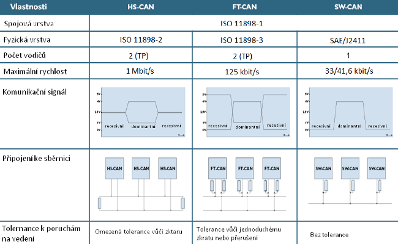
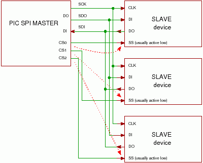
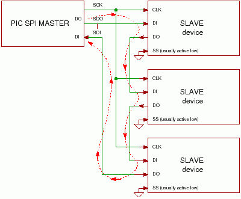
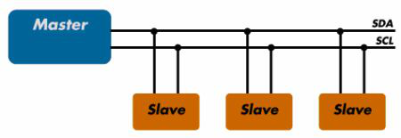

# 28. - Průmyslové komunikační systémy
>Významné průmyslové komunikační systémy a sběrnice v počítačových systémech (CAN, Ethernet, Modbus, SPI, I2C, RS-232, USB, PCI-e, SATA), topologie, charakteristické vlastnosti.

**Průmyslové komunikační systémy** vznikly pro usnadnění řízení rozsáhlých procesů v průmyslu. Patří sem například strojní, letadlový, automobilový, potravinový průmysl atd.

Komunikační systémy pro tato odvětví by měly být:

- **robustní** - decentralizované řešení rozložené po celé “hale”
- **oddolné** - nutné rychlé a bezporuchové měření spolu s ovládáním akčních členů, to i v zarušeném prostředí
-  **spolehlivé** - zpravidla nutnost dodržet zpracování v určitém intervalu (worst time)
-  **dostupné** - používají se stovky metrů, cena tedy hraje významnou roli
- **flexibilní** - nutnost přizpůsobit systém požadavkům zákazníka

**Standard** nebo také norma je specifikace chování a vlastností, které zaručují kompatibilituu více systémů (různých implementací). Časté jsou různé standardizační komise, které zabraňují drahým vendor lockům.

**Protokol** je konvence nebo standard, podle kterého probíhá elektronická komunikace a přenos dat mezi dvěma koncovými body.

**Sběrnice** je skupina signálových vodičů, kterou lze rozdělit na skupiny řídicích, adresových a datových vodičů v případě paralelní sběrnice nebo sdílení dat a řízení na společném vodiči (nebo vodičích) u sériových sběrnic. Sběrnice má za účel zajistit přenos dat a řídicích povelů mezi dvěma a více elektronickými zařízeními. Přenos dat na sběrnici se řídí stanoveným protokolem.

**Dělení sběrnic**

- podle provozu
 - **synchronní**
 - **asynchronní**
- podle uspořádání
 - **sériové** (všechny uvedené)
 - **paralelní** (dnes již velmi málo používané)
 - **serioparalelní**
- podle směru přenosu
 - **jednousměrné**
 - **obousměrné**
- podle umístění
  - **intení**
  - **externí**

**Sériové sběrnice** jsou dnes používany téměř výlučně, důvody k postupnému ústupu paralelních sběrnic jsou v zásadě dva. Synchronizace přenosu jednotlivých bitů paralelně je při vyšších rychlostech a délkách vedení velmi složitá a narážíme zde na technologické limity (viz clock skew), proto může být sériová sběrnice na vyšších taktech paradoxně mnohem rychlejší. Vodiče pro sériovou komunikaci jsou podstatně tenčí a tedy praktičtější na dlouhé rozvody, to následně odráží na výsledné ceně použité kabeláže. Pro realizaci delších sběrnic se jedná o poměrně významný faktor. Pro sériové sběrnice je typická **arbitrace sběrnice** a **paketový systém komunikace**.

## Pomyslné rozdělení uvedených systémů

Uvedená směs sběrnic je hodně různoroda a můžeme jí rozdělit do několika pomyslných skupin podle specifického použití. (moje neoficiální dělení)

- **Průmyslové** (CAN, RS-232 a asi i Ethernet)
    - pracují na vzdálenost desítky metrů
    - nejsou potřeba velké přenosové rychlosti
    - odolné proti rušení (kompromis na úkor přenosové rychlosti)
    - hardware je obvykle odolný na vysoké teploty, prach a elektromagnetické záření
    - povětšinou sériové (dlouhé paralelní sběrnice jsou drahé)
- **Mikrokontrolerové** (SPI, I2C)
    - komunikují na krátkou vzdálenost (mezi komponenty na desce nebo mezi systémy)
    - nenáročná implementace a integrace
    - realizováno na jednoduchém hardware
    - obvykle také sériové
    - nejsou potřeba velké přenosové rychlosti
    - obvykle spojené na pevno (nemá konektor)
- **Počítačové** (USB, PCI-e, SATA)
    - krátká až střední komunikační vzdálenost
    - obvykle velké nároky na přenosovou rychlost

## Používané systémy

**USART**

Synchronní / asynchronní sériové rozhraní USART (Universal Synchronous / Asynchronous Receiver and Transmitter). Jde o zařízení pro sériovou komunikaci, které lze nastavit buď pro asynchronní režim (SCI – např. pro linky RS232 resp. RS485), anebo pro synchronní režim (běžně označovaný jako SPI).

### CAN
CAN (Controller Area Network) je sběrnice typu multimaster, která je určena k propojování mikropočítačů, různých inteligentních čidel a akčních členů nejen v průmyslu, ale i v automobilech. Její základní koncepce je následující: Jednotlivé stanice připojené na sběrnici vysílají svá data bez ohledu na to, je-li v sytému nějaký „zájemce“ nebo nikoliv. Datové rámce proto neobsahují adresu příjemce, nýbrž jen identifikaci která určuje, jaká data rámec obsahuje. Rámec je přijat všemi přijímači na sběrnici. Každý z přijímačů nezávisle použije identifikaci rámce k rozhodnutí, má-li být právě přijatý rámec akceptován, tj. předán k dalšímu zpracování nebo má-li být vymazán.

- [http://home.zcu.cz/~dudacek/NMS/Seriova_rozhrani.pdf](http://home.zcu.cz/~dudacek/NMS/Seriova_rozhrani.pdf)
- [http://vyvoj.hw.cz/navrh-obvodu/rozhrani/aplikovani-sbernice-can.html](http://vyvoj.hw.cz/navrh-obvodu/rozhrani/aplikovani-sbernice-can.html)
- [https://cs.wikipedia.org/wiki/CAN_bus](https://cs.wikipedia.org/wiki/CAN_bus)

**Vrstvy**

- **Fyzická** a **Linková** vrstva (CAN Bosch)
- **Aplikační** vrstva (CANopen, DeviceNet)

**Linková vrstva:**

- CAN nepoužívá adresu ale identifikátor
- Každý uzel pomocí masky a filtru rozhodne, zda zprávu přijme či nikoli
- Tento způsob umožňuje zasílání zpráv pouze určitým skupinám uzlů
- Různé rámce mají různou prioritu, rámce s větší prioritou se dostanou na sběrnici rychleji a častěji
- **LLC – Logica Link Control**
 - Filtrování zpráv
 - Signalizace přetížení
 - Správa zotavování
- **MAC – Medium Access Control**
 - Zabalení dat do rámce / rozbalení dat z rámce
 - Kódování rámce (vkládání, vyhazování bitu)
 - Řízení přístupu k médiu
 - Detekce a signalizace chyb
 - Správa potvrzování příjmu
 - Serializace / deserializac

**Fyzická vrstva:**

- **PLS – Physical Signaling**
 - Kódování / vzorkování bitu
 - Časování bitu
 - Synchronizace
- **PMA – Physical Medium Attachment** (Charakteristiky budičů)
- **MDI – Medium Dependent Interface** (Konektory, kabely)

Norma pro protokol CAN uvádí dvě specifikace rámců: CAN 2.0A a CAN 2.0B, které se liší v délce identifikátoru. Identifikátor základního formátu CAN 2.0A má délku **11bitů**, identifikátor rozšířeného formátu CAN 2.0B má délku **29bitů**.

Pracuje nad sběrnicí, k níž přistupuje metodou **CSMA/CD+AMP**

- CSMA - náhodný přístup k médiu
- CD - detekce kolizí
- AMP - Arbitration on Message Priority (řidí se prioritami zpráv)

Komunikace na sběrnici CAN probíhá tak, že každý uzel může za určitých okolností využívat sběrnici pro vysílání svých zpráv. Zpráva vysílaná po sběrnici obsahuje identifikační číslo vysílajícího uzlu. Identifikátor definuje nejen obsah zprávy, ale i prioritu přístupu na sběrnici. Tímto způsobem je možno zaslat zprávu z jednoho uzlu do jiného uzlu nebo několik jiných uzlů současně. Komunikační síť CAN může pracovat jak v režimu multi-master (více nadřízených uzlů), nebo v režimu master-slave (jeden uzel nadřízený a více podřízených uzlů).

**Synchronizace se provádí pomocí vkládání bitu:**

- po 5. bitu jedné úrovně je vložen(navíc) bit opačné úrovně
- po přijetí 5 bitů stejné úrovně musí být přijat bit opačné úrovně a je vyjmut (odstraněn)
- je-li přijat 6. bit stejné úrovně, je indikována chyba

*Typy CAN*

Komunikační protokol CAN definuje formát přenášených zpráv na aplikační úrovni. Zprávy jsou přenášené v tzv. rámcích. V definici CAN jsou určeny čtyři typy rámců:

- datový rámec (DATA FRAME)
- žádost o data (REMOTE FRAME)
- chybový rámec (ERROR FRAME)
- rámec přeplnění (OVERLOAD FRAME)

Datový rámec (**DATA FRAME**)
Datový rámec zabezpečuje přenos informací z vysílajícího uzlu všem ostatním uzlům na sběrnici. Tento rámec se skládá z následujících částí:

- START OF FRAME – úvodní jednobitové pole s dominantní hodnotou
- ARBITRATION FIELD – arbitrážní pole sestávající se z identifikátoru a bitu RTR (Remote Transmission Request), který identifikuje, zda-li se jedná o datový rámec (DATA FRAME) nebo žádost o vysílání (REMOTE FRAME). Toto pole určuje prioritu vysílané zprávy. Uzel při vysílání neustále monitoruje stav na sběrnici. Zjistí-li uzel, že vyslal recesní bit a na sběrnici je bit dominantní, okamžitě přestává vysílat. Tímto způsobem je zabezpečeno, aby přistup ke sběrnici dostal ten, jehož zpráva má nejvyšší prioritu. Současně je zabezpečeno, aby při nárůstu zatížení sběrnice nedošlo ke snížení přenosového výkonu sítě.
- CONTROL FIELD – řídící pole, které obsahuje bit IDE (Identifikátor Expresion) pro rozlišení základního a rozšířeného formátu, rezervní bit a 4 bity DLC (Data Length) určující počet byte datového pole (0 až 20 byte). Poměrně malá délka tohoto pole vychází z původního záměru CAN, tj. především zabezpečení rychlého přenosu zpráv s vysokou prioritou. Delší bloky dat je nutno segmentovat v aplikační úrovni. Všechna data na sběrnici jsou dostupná všem uzlům současně.
- DATA FIELD – datové pole o velikosti 0 až 8 bajtů
- CRC FIELD (Cyclic Redundancy Code) – nese 15 kontrolních bitů cyklického redundantního kódu při zahrnutí všech předcházejících polí. Pole je ohraničeno recesivním bitem ERC (END OF CRC)
- ACKNOWLEDGE FIELD – potvrzující pole, které sestává z bitů ACK SLOT a ACK DELIMITER. Vysílač vysílá bit ACK SLOT jako recesivní. Pokud alespoň jeden uzel přijal zprávu bez chyby, přepíše tento bit na dominantní, čímž oznámí vysílači potvrzení příjmu. ACK DELIMITER je recesivní bit, takže ACK SLOT je ohraničen dvěma recesivními bity
- END OF FRAME – konec rámce se skládá z nejméně sedmi recesivních bitů, za nimiž následují nejméně 3 bity pro uklidnění všech vysílačů. V této době mohou přijímací uzly informovat vysílací uzel o chybách přenosu.
- INTERMISSION FIELD + BUS IDLE – mezilehlé pole + uklidnění sběrnice – 3 bity oddělující jednotlivé zprávy

Žádost o rámec (**REMOTE FRAME**)
Žádost o rámec má obdobný formát jako datový rámec. Neobsahuje však datové pole a bit RTR je recesivní (v datovém rámci je dominantní). Uzel takto žádá některý jiný uzel na síti o vysílání datového rámce se shodným identifikátorem, jaký je v žádosti.

Chybový rámec (**ERROR FRAME**)
Chybový rámec sestává z polí ERROR FLAG a ERROR DELIMITER. Uzel, který zjistí chybu v řetězci přijímaných bitů, začne vysílat 6 dominantních bitů, čímž poruší strukturu rámce. Ostatní uzly začnou též vysílat 6 dominantních bitů. Celková délka ERROR FLAG tak může být 6 až 12 bitů. Za nimi následuje pole ERROR DELIMITER s 8 recesivními bity.

Rámec přeplnění (**OVERLOAD FRAME**)
Rámec přeplnění má obdobnou strukturu, jako chybový rámec. Uzel vyšle tento rámec především tehdy, když potřebuje určitý čas na zpracování předchozí zprávy.

**Výhody**

- Vysoká rychlost přenosu dat 1Mbit/s při délce sběrnice do 40m
- Rozlišení zpráv identifikátorem CAN 2.0A 11bitů a CAN 2.0B 29bitů
- Selekce přijímaných identifikátorů zpráv
- Prioritní přístup zabezpečující urychlené doručení významných zpráv
- Diagnostika sběrnice např.: chyba doručení zprávy, chyba CRC, přetečení bufferu
- Značná úroveň zabezpečení přenosu
- Vysoká provozní spolehlivost
- Stále se rozšiřující součástková základna
- Nízká cena

**Nevýhody**

- Omezený počet dat přenášených v rámci jedné zprávy (0 až 8 Byte)
- Prvotní náročnost nastavení registrů CAN sběrnice

### Ethernet

[https://cs.wikipedia.org/wiki/Ethernet](https://cs.wikipedia.org/wiki/Ethernet)

[http://www.svetsiti.cz/clanek.asp?cid=Ethernet-1992000&s=CFE74B0513B385BE1F8FE7EC8CC13A105D7E1A86](http://www.svetsiti.cz/clanek.asp?cid=Ethernet-1992000&s=CFE74B0513B385BE1F8FE7EC8CC13A105D7E1A86)

### Modbus

[http://automatizace.hw.cz/clanek/2004082301](http://automatizace.hw.cz/clanek/2004082301)

[http://home.zcu.cz/~ronesova/bastl/files/modbus.pdf](http://home.zcu.cz/~ronesova/bastl/files/modbus.pdf)

[https://cs.wikipedia.org/wiki/Modbus](https://cs.wikipedia.org/wiki/Modbus)

### SPI
Sběrnice SPI (*Serial Peripheral Interface*) představuje jednu z forem sériových externích sběrnic sloužících pro vzájemné propojení dvou či více komunikujících uzlů, přičemž jeden uzel obvykle vystupuje v roli takzvaného řadiče sběrnice (**master**), ostatní uzly pracují v režimu **slave**. Uzel, který pracuje jako master, obsahuje generátor hodinového signálu, který je rozveden do všech ostatních uzlů, čímž je umožněn zcela synchronní (navíc ještě obousměrný) přenos dat. Hodinový signál je rozváděn vodičem označovaným symbolem **SCK**. Kromě vodiče s hodinovým signálem jsou uzly propojeny dvojicí vodičů označovaných většinou symboly **MISO** (Master In, Slave Out) a **MOSI**(Master Out, Slave In), pomocí nichž se obousměrně (**full duplex**) přenáší data. Posledním signálem, který se u této sběrnice používá, je signál **SSEL** (Slave Select), jenž slouží – jak již jeho název napovídá – k výběru některého uzlu pracujícího v režimu slave. V následujících kapitolách si ukážeme, jak a kdy se tento signál používá. Všechny čtyři signály – **SCK**, **MISO**, **MOSI** i **SSEL**, pro svoji funkci vyžadují pouze jednosměrné porty, což přispívá k jednoduché a především levné implementaci této sběrnice.

- oddělený datový signál mastera od datového signálu slave (MOSI, MISO) (full-duplex)
- sériové, synchronní
- mono-master(jeden master, více slavů)
- 2 konfigurace(nezávislá, kaskádová)

[http://www.root.cz/clanky/externi-seriove-sbernice-spi-a-i2c/](http://www.root.cz/clanky/externi-seriove-sbernice-spi-a-i2c/)

[https://cs.wikipedia.org/wiki/Serial_Peripheral_Interface](https://cs.wikipedia.org/wiki/Serial_Peripheral_Interface)

[http://home.zcu.cz/~dudacek/NMS/Seriova_rozhrani.pdf](http://home.zcu.cz/~dudacek/NMS/Seriova_rozhrani.pdf)

**Obvody:**

- Analogové ADC, DAC
- Paměti EEPROM, FLASH
- Řadiče CAN, USB, UART
- Budiče LED, LCD
- CPU supervizory
- RTC obvody

*Způsob komunikace s více zařízeními pomocí výběru uzlu signálem SSEL. Čím více existuje uzlů typu slave, tím větší množství pinů CSx je nutné použít. Vzhledem k tomu, že v danou chvíli může být vybrána jen jedna komunikující dvojice uzlů, lze mezi uzel typu master a ostatní uzly vložit demultiplexor pracující v režimu výběru „jedna z n“.*

*Propojení zařízení do řetězu (daisy chain) vede ke snížení požadovaného počtu vodičů, ale také k prodloužení cesty (a tím i času) dat při jejich vysílání a příjmu. V případě, že jedno z připojených zařízení nebude funkční, celý řetězec se rozpadne.*

### I2C
I2C je zkratka z celého názvu *Inter-Integrated Circuit*. V určitých ohledech se jedná o sběrnici podobnou SPI (existence hodinového signálu, jediný uzel typu master), ovšem některé vlastnosti těchto sběrnic jsou odlišné. Zatímco u sběrnice SPI byl umožněn obousměrný přenos dat díky použití dvojice vodičů MISO a MOSI, je sběrnice I2C vybavena „pouze“ jedním datovým vodičem **SDA** (**SCL** (Synchronous Clock)), z čehož vyplývá, že se data přenáší **poloduplexně**. Také to znamená poněkud složitější interní strukturu všech připojených zařízení, protože příslušné piny musí být možné přepínat ze vstupního režimu na režim výstupní. Též zde není použit výběr zařízení typu slave pomocí zvláštních signálů, protože každému uzlu je přiřazena jednoznačná adresa - kromě elektrických charakteristik je totiž přesně stanoven i komunikační protokol, což je další rozdíl oproti výše popsané sběrnici SPI. Obecně je možné říci, že I2C je sice poněkud složitější, ale zato flexibilnější sběrnice, která se velmi často používá i pro komunikaci na delší vzdálenosti (řádově metry, viz například DDC u monitorů), než tomu je u sběrnice SPI. 

- jediná datová linka (Serial Data Line) (half-duplex)
- sériové, synchronní
- halfduplex
- může být multi-master
- pevný protokol (startovní, ukončovací podmínka => podmínky generuje master)
- až 128 různých zařízení
- individuální adresu o délce 7 nebo 10 bitů pro všechny zařízení

[http://vyvoj.hw.cz/navrh-obvodu/strucny-popis-sbernice-i2c-a-jeji-prakticke-vyuziti-k-pripojeni-externi-eeprom-24lc256](http://vyvoj.hw.cz/navrh-obvodu/strucny-popis-sbernice-i2c-a-jeji-prakticke-vyuziti-k-pripojeni-externi-eeprom-24lc256)

[http://www.root.cz/clanky/externi-seriove-sbernice-spi-a-i2c/](http://www.root.cz/clanky/externi-seriove-sbernice-spi-a-i2c/)

[https://cs.wikipedia.org/wiki/I%C2%B2C](https://cs.wikipedia.org/wiki/I%C2%B2C)

[http://www.root.cz/clanky/komunikace-po-seriove-sbernici-isup2supc/](http://www.root.cz/clanky/komunikace-po-seriove-sbernici-isup2supc/)

[http://home.zcu.cz/~dudacek/NMS/Seriova_rozhrani.pdf](http://home.zcu.cz/~dudacek/NMS/Seriova_rozhrani.pdf)

**Obvody:**

- Analogové ADC, DAC
- Paměti EEPROM, FLASH
- Řadiče CAN, USB, UART
- Budiče LED, LCD
- CPU supervizory
- RTC obvody
- I/O expandery

*Zapojení uzlů na sběrnici I2C*

### RS-232
- [http://vyvoj.hw.cz/rozhrani/hw-server-predstavuje-seriova-linka-rs-232.html](http://vyvoj.hw.cz/rozhrani/hw-server-predstavuje-seriova-linka-rs-232.html)
- [http://www.root.cz/clanky/seriovy-port-rs-232c/](http://www.root.cz/clanky/seriovy-port-rs-232c/)
- [https://cs.wikipedia.org/wiki/RS-232](https://cs.wikipedia.org/wiki/RS-232)

### USB
- [http://vyvoj.hw.cz/navrh-obvodu/rozhrani/rs-485-rs-422/usb-20-dil-1.html](http://vyvoj.hw.cz/navrh-obvodu/rozhrani/rs-485-rs-422/usb-20-dil-1.html)
- [http://vyvoj.hw.cz/navrh-obvodu/rozhrani/rs-485-rs-422/usb-20-dil-2.html](http://vyvoj.hw.cz/navrh-obvodu/rozhrani/rs-485-rs-422/usb-20-dil-2.html)
- [http://www.root.cz/clanky/universalni-seriova-sbernice-usb/](http://www.root.cz/clanky/universalni-seriova-sbernice-usb/)
- [https://cs.wikipedia.org/wiki/Universal_Serial_Bus](https://cs.wikipedia.org/wiki/Universal_Serial_Bus)

### SATA
Serial ATA (SATA) označuje v informatice počítačovou sběrnici, která využívá datové rozhraní pro připojení velkokapacitních paměťových zařízení, jako jsou pevné a optické disky. Délká kabelu je maximálně 1 metr.Topologie je point to point a každé zařízení je připojeno přímo do řadiče. SATA je fullduplexní a poskytuje vyšší výkon díky vestavěnému řadiči DMA.

- [https://cs.wikipedia.org/wiki/SATA](https://cs.wikipedia.org/wiki/SATA)

| Generace SATA | Standard      | Datovápropustnost | Frekvence |
|---------------|---------------|-------------------|-----------|
| 1.            | SATA 1,5 Gb/s | 150 MB/s          | 1,5 GHz   |
| 2.            | SATA 3 Gb/s   | 300 MB/s          | 3 GHz     |
| 3.            | SATA 6 Gb/s   | 600 MB/s          | 6 GHz     |

**Na dohled jsou další revize zohledňující nástup SSD a různých SSDlike mini uložišť, které dále navyšují podporu a komunikační rychlosti.**

**Již v PATA** (tlustá 40 žil kšanda)

**PIO** (legacy podpora, nahrazeno DMA)

[PIO](https://cs.wikipedia.org/wiki/PIO) (Programmed Input Output) je režim přenosů dat po sběrnici v počítači mezi periferiemi (CD-ROM, pevný disk, síťová karta apod.) a operační pamětí. Data jsou přenášena za účasti procesoru. Procesor je tedy plně zaměstnán přenosem a nemůže vykonávat jinou práci.

**DMA**

[DMA](https://cs.wikipedia.org/wiki/DMA) (Direct Memory Access) je způsob přímého přenosu dat mezi operační pamětí a vstupně/výstupními zařízeními. Data neprocházejí skrze procesor a lze tak dosáhnout vyššího výkonu (během přenosu dat může procesor zpracovávat jiné strojové instrukce). DMA se používá pro přenos větších objemů dat například řadič pevných disků, grafická karta, síťová karta, zvuková karta a podobně. DMA je odchylkou od Von Neumannovy architektury počítače. DMA je řízené speciálním řadičem, který je součástí základní desky počítače.

**Ve standartu SATA**

**Advanced Host Controler**

SATA řadič využívá jako standardní rozhraní [AHCI](https://cs.wikipedia.org/wiki/AHCI) (Advanced Host Controller Interface), které umožňuje využívat některé pokročilé funkce jako například SATA hotplug a Native Command Queuing (NCQ). Pokud není AHCI povoleno základní deskou nebo chipsetem (resp. nastavením v BIOSu), SATA řadič obvykle pracuje v módu „IDE emulace“

**HotPlug**

Technologie [Hot Plug](https://cs.wikipedia.org/wiki/Hot_swapping) umožňuje odpojit či připojit daný disk i za běhu a v případě podpory i při spuštěném operačním systému.

**NCQ**

[NCQ](https://cs.wikipedia.org/wiki/NCQ) (Native Command Queuing) je technologie, která v některých případech umožňuje zvýšit výkon pevných disků s rozhraním SATA. Při použití NCQ pevný disk sám optimalizuje pořadí, ve kterém jsou vykonány požadavky na zápis nebo čtení. Tato optimalizace může redukovat nadbytečný pohyb hlaviček disku. Tím se zvýší rychlost přenosu dat mezi řadičem a diskem a také se mírně sníží opotřebení disku.

**Specifikace datového vodiče** (specifikuje i vlastní napájecí konktor)

| Vodič | Funkce  |
|-------|---------|
| 1.    | Zem     |
| 2.    | DATA A+ |
| 3.    | DATA A- |
| 4.    | Zem     |
| 5.    | DATA B+ |
| 6.    | DATA B- |
| 7.    | Zem     |

Existuje i standart eSATA pro externí zařízení a eSATAp, která je i napájena.

### PCI-e
[PCI-Express](https://cs.wikipedia.org/wiki/PCI-Express) (též PCIe, PCI-E nebo 3GIO = 3rd Generation I/O) je standard systémové sběrnice, který byl vytvořen jako náhrada za starší standardy PCI, PCI-X a AGP. Označení sběrnice není zcela správné, protože se jedná o dvoubodové spoje, na kterých jsou data přenášena bez potřeby adresy (adresace zařízení). Sběrnice PCI-Express používá sériový přenos dat (na rozdíl od svých předchůdců), protože to přináší proti paralelnímu přenosu některé výhody, zejména možnost dále zvyšovat frekvenci, na které sběrnice pracuje a tím i přenosovou rychlost.

- [http://vyvoj.hw.cz/teorie-a-praxe/dokumentace/pci-express-obecny-popis.html](http://vyvoj.hw.cz/teorie-a-praxe/dokumentace/pci-express-obecny-popis.html)
- [http://www.root.cz/clanky/interni-sbernice-pci-express/](http://www.root.cz/clanky/interni-sbernice-pci-express/)
- [https://cs.wikipedia.org/wiki/PCI-Express](https://cs.wikipedia.org/wiki/PCI-Express)
- [http://www.svethardware.cz/technologie-sbernice-pci-express/11606](http://www.svethardware.cz/technologie-sbernice-pci-express/11606)

| Verze        | Kódování  | Přenosová rychlost | Propustnost 1x | Propustnost 4x | Propustnost 8x | Propustnost 16x |
|--------------|-----------|--------------------|----------------|----------------|----------------|-----------------|
| 1.0          | 8b/10b    | 2.5 GT/s           | 250 MB/s       | 1 GB/s         | 2 GB/s         | 4 GB/s          |
| 2.0          | 8b/10b    | 5 GT/s             | 500 MB/s       | 2 GB/s         | 4 GB/s         | 8 GB/s          |
| 3.0          | 128b/130b | 8 GT/s             | 984.6 MB/s     | 3.938 GB/s     | 7.877 GB/s     | 15.754 GB/s     |
| 4.0 (future) | 128b/130b | 16 GT/s            | 1.969 GB/s     | 7.877 GB/s     | 15.754 GB/s    | 31.508 GB/s     |

PCI-e pracuje na systému jednotlivých drah ×1 (jedna dráha), ×2 (dvě dráhy), ×4, ×8, ×12, ×16 až ×32. Zajímavé a užitečné je, že i v konektoru ×16 je možné použít kartu, která má menší počet drah (×1, ×2 atd.). Taková karta bude pracovat, i když samozřejmě na nižší rychlosti. Některé základní desky dokonce obsahují kratší konektory s jedním otevřeným koncem, do kterých je možné zasunout i karty delší, čímž se teoreticky dá karta například s šestnácti drahami umístit do konektoru ×1.

Od všech konektorů vedou jednotlivé dráhy do přepínače (switch), který (teoreticky) dokáže libovolné dvě dráhy propojit a vytvořit tak strukturu typu point-to-point. Na jednu stranu je sice nutné, aby byl na základní desce přítomen poměrně složitý přepínač, na stranu druhou však odpadá arbitrážní obvod (který také nebyl zcela jednoduchý) a především: každá dráha může přenášet data maximální rychlostí (samozřejmě obousměrně, čehož se však nedá vždy zcela využít) a zařízení se tak nemusí dělit o jedno přenosové pásmo tak, jak tomu bylo například u sběrnice PCI. 

