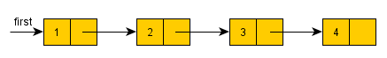
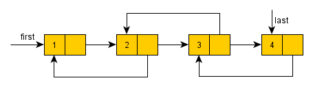
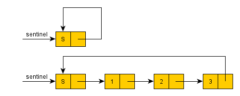
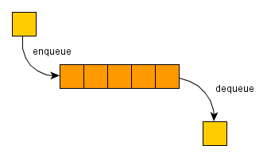
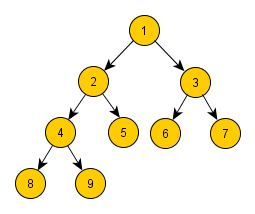

# 29. - Abstraktní datové typy
>Abstraktní datové typy, seznam, fronta, zásobník, halda, strom, asociativní pole.

**Abstraktní datové typy** jsou nezávislé na vlastní implementaci. Hlavním cílem je zjednodušit a zpřehlednit program, který provádí operace s daným datovým typem. Protože některé abstraktní datové typy jsou velmi užitečné a běžně používané, různé programovací jazyky používají tyto **ADT** jako primitivní datové typy, které jsou přidány do jejich standardních knihoven. Při programování je ADT reprezentován rozhraním, které skrývá vlastní implementaci. Programátor tak pouze využívá poskytované rozhraní a definované operace.  V praxi je rozdíl mezi abstraktním datovým typem a datovou strukturou použitou pro jeho implementaci. Například seznam jako ADT může být implementován jako pole, nebo jako spojový seznam. Výběr vhodné abstraktní datové struktury je tedy rozhodující pro design účinných algoritmů a pro odhad jejich složitosti.

**Datový typ** je rozsah hodnot, které může proměnná určitého datovému typu přijmout, a množina
operací (funkce, metody nebo procedury), které jsou pro tento datový typ specifikovány. "+" je například
definován pro numerické typy, a v některých programovacích jazycích pro typ string (řetězec). "-" je naproti
tomu zpravidla definován jen pro numerické typy dat.

## Vlastnosti
Nejdůležitější vlastnosti abstraktního typu dat jsou:

- **Všeobecnost implementace:** Jednou navržený ADT může být zabudován a bez problémů používán v jakémkoli programu.
- **Přesný popis:** Propojení mezi implementací a rozhraním musí být jednoznačné a úplné.
- **Jednoduchost:** Při používání se uživatel nemusí starat o vnitřní realizaci a správu ADT v paměti.
- **Zapouzdření:** Rozhraní by mělo být pojato jako uzavřená část. Uživatel by měl přesně vědět, co ADT dělá, ale ne jak to dělá.
- **Integrita:** Uživatel nemůže zasahovat do vnitřní struktury dat. Tím se výrazně sníží riziko nechtěného smazání nebo změna již uložených dat.
- **Modularita:** „Stavebnicový“ princip programování je přehledný a umožňuje snadnou výměnu části kódu. Při hledání chyb mohou být jednotlivé moduly považovány za kompaktní celky. Při zlepšování ADT není nutné zasahovat do celého programu.

Pokud je ADT programován objektově, jsou většinou tyto vlastnosti splněny.

## Operace
Na abstraktním datovém typu rozlišujeme tři druhy operací: **konstruktor**, **selektor** a **modifikátor**. Operace, která ze zadaných parametrů vytváří novou hodnotu abstraktního datového typu, se nazývá konstruktor. Úkolem *konstruktoru* je sestavení platné vnitřní reprezentace hodnoty na základě dodaných parametrů. Operace označovaná jako *selektor* slouží k získání hodnot, které tvoří složky nebo vlastnosti konkrétní hodnoty abstraktního datového typu, a konečně operace typu *modifikátor* provádí změnu hodnoty datového typu.

## Příklady
K základním abstraktním datovým typům můžeme zařadit následující konstrukce:

- **zásobník** (stack)
- **fronta** (queue)
- **seznam** (list)
- **množina** (set)
- **strom** (tree) - speciálním typem stromu je **halda** (heap)
- **zobrazení** (map) - také známé jako **asociativní pole**

### Seznam
Seznam (Lineární seznam, Spojový seznam) je kontejner určený k ukládání dat předem neznámé délky. Základní stavební jednotkou spojového seznamu je uzel, který vždy obsahuje ukládanou hodnotu a ukazatel na následující prvek. Operace vkládání a nebo vyhledávání tedy musí seznamem procházet, což je složitější než jendoduše použít index. Lineární seznamy mohou existovat **jednosměrné** a **obousměrné**. V jednosměrném seznamu odkazuje každá položka na položku následující a v obousměrném seznamu odkazuje položka na následující i předcházející položky. Zavádí se také ukazatel nebo reference na aktuální (vybraný) prvek seznamu. Na konci (a začátku) seznamu musí být definována zarážka označující konec seznamu. Pokud vytvoříme cyklus tak, že konec seznamu navážeme na jeho počátek, jedná se o **kruhový seznam**.

*Jednosměrný seznam*

*Obousměrný seznam*

*Kruhový seznam*

### Fronta
Fronta je v programování abstraktní datový typ typu FIFO (z anglického First In, First Out, česky První dovnitř, první ven). Fronta používaná v operačních systémech pro meziprocesovou komunikaci je také nazývána roura (angl. pipe). Opakem fronty FIFO je zásobník (LIFO).

*Fronta*

Typické operace:

- **enqueue**: vložení hodnoty na konec fronty,
- **dequeue**: odstranění hodnoty ze začátku fronty,
- **front**: čtení hodnoty na začátku fronty a
- **empty**: testování, zda je fronta prázdná.

### Zásobník
Zásobník (stack) je jednou ze základních datových struktur, která se využívá především pro dočasné ukládání dat v průběhu výpočtu. Zásobník data ukládá způsobem, kterému se říká LIFO - last in, first out - čili poslední vložený prvek jde na výstup jako první, předposlední jako druhý a tak dále. Opačným způsobem funguje datový typ fronta - FIFO - first in, first out.

*Zásobník*

Typické operace:

- **push**: vložení hodnoty na vrchol zásobníku,
- **pop**: odstranění hodnoty z vrcholu zásobníku,
- **top**: čtení hodnoty z vrcholu zásobníku a
 -**empty**: testování, zda je zásobník prázdný.

### Strom
Jedná se o hierarchickou strukturu, kde každý otec má 0 až mnoho dětí a každé dítě právě jednoho otce takovým způsobem, že v této struktuře nejsou cykly. Uzel, který je praotcem všech ostatních uzlů nazveme kořenem (z pohledu teorie grafů tím vytvoříme orientovaný strom). Uzel, který nemá žádné potomky nazýváme listem. Být stromem je rekurzívní vlastnost - každý podstrom stromu S je také stromem. Strom je velmi populární pro svoji jednoduchost a použitelnost. Příkladem mohou být vyhledávací stromy nebo haldy.

*Strom*

Vlastnosti:

- **N-arita** - Kolik smí mít každý uzel maximálně potomků, z tohoto hlediska patří mezi neoblíbenější binární stromy (každý uzel má 0, 1 nebo 2 potomky).
- **Hloubka** - Hloubkou rozumíme maximální hloubku libovolného uzlu (kořen je v hloubce 0, potomci v hloubce 1, vnuci v hloubce 2...).
- **Pravidelnost** - N-ární strom je pravidelný, pokud má každý uzel 0 nebo N potomků.
- **Vyváženost** - N-ární strom je vyvážený, pokud pro všechny listy platí, že jsou nejsou o nic více hlouběji, než kterýkoliv jiný list. Definice „o nic více hlouběji“ se liší v závislosti na konkrétní implementaci.
- **Úplná pravidelnost** - Úplným N-árním pravidelným stromem hloubky k je strom, jehož každý uzel má 0 nebo N potomků a všechny uzly jsou ve hloubce k.

Procházení stromem:

- **Preorder** - zpracuje se napřed kořen, poté levý podstrom a nakonec pravý podstrom.
- **Inorder** - zpracuje se napřed levý podstrom, poté kořen a nakonec pravý podstrom.
- **Postorder** - zpracuje se napřed levý podstrom, poté pravý podstrom a nakonec kořen.

### Halda
Halda je v informatice stromová datová struktura splňující tzv. vlastnost haldy: pokud je B potomek A, pak x(A) >= x(B). To znamená, že v kořenu stromu je vždy prvek s nejvyšším klíčem (klíč udává funkce x). Taková halda se pak někdy označuje jako max heap (heap je v angličtině halda), halda s reverzním pořadím prvků se analogicky nazývá min heap. Díky této vlastnosti se haldy často používají na implementaci prioritní fronty. Efektivita operací s haldou je klíčová pro mnoho algoritmů.

- Vlastnost tvaru – strom je buď perfektně vyvážený binární strom, nebo pokud je poslední úroveň stromu nekompletní, uzly plní strom zleva doprava
- Vlastnost haldy - každý uzel je větší nebo roven všem svým potomkům

*Binární minimální halda*

Operace s haldou:

- INSERT - přidání nového prvku do haldy
- DELETE MAX nebo DELETE MIN - vyjmutí kořenu v max heap nebo v min heap
- DELETE(v) - smaže uzel „v“
- MIN, MAX - vrátí minimální resp. maximální klíč v haldě
- DECREASE KEY(v, okolik) - zmenšení klíče uzlu „v“ o hodnotu „okolik“
- INCRESE KEY(v, okolik) - zvětšení klíče uzlu „v“ o hodnotu „okolik“
- MERGE - spojení dvou hald do jedné nové validní haldy obsahující všechny prvky obou původních
- MAKE - dostane pole N prvku a vytvoří z nich haldu

Složitost operací:

- Stavba haldy - O(n)
- Získání hodnoty kořene - O(1)
- Vyjmutí kořene - O(log n)
- Vložení prvku - O(log n)
- Odstranění prvku - O(log n)
- Sloučení 2 hald - O(n1 + n2)

### Asociativní pole
Datový typ zobrazení (map) je založen na matematickém pojmu zobrazení, které prvkům z množiny vzorů přiřazuje (nejvýše jeden) prvek z množiny obrazů. Tento datový typ se v mnoha programovacích jazycích označuje také jako asociativní pole; množina vzorů pak odpovídá datovému typu indexu pole a množina obrazů datovému typu hodnoty uložené na zadaném indexu. Proti "obyčejnému" poli nabízí asociativní pole zobecnění v tom smyslu, že typem indexu může být libovolný datový typ, nad kterým je definována alespoň operace porovnání. Z hlediska implementace to ale většinou znamená, že nemůžeme jednoduchou matematickou úpravou hodnoty indexu získat jednoznačně umístění požadovaného prvku, a je tedy nutné pro zpřístupnění prvku využít nějaké formy vyhledávání.

Protože přímo z klíče nelze spočítat index nebo adresa adresu prvku v poli, je zapotřebí prvek podle klíče vyhledat. Nejpoužívanější metodou je mechanismus zvaný hašovací funkce.

Zde se to trochu míchá a různá označení se překrývají. (asociative array, hashmap, hashtable, dictonary)

- "Map" is used by Java, C++
- "Dictionary" is used by .Net, Python
- "Associative array" is used by Javascript, PHP

"Map" is the correct mathematical term, but it is avoided because it has separate meaning in functional programming. ([Stackoverflow](http://stackoverflow.com/questions/2884068/what-is-the-difference-between-a-map-and-a-dictionary))
