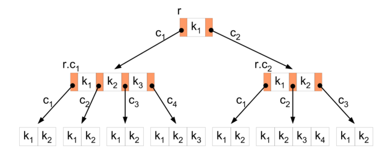
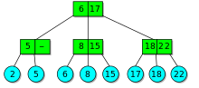
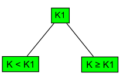
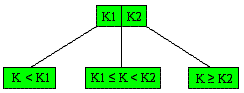
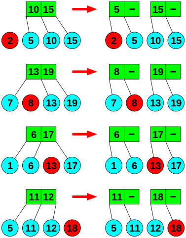
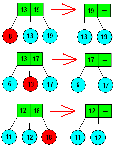

# 30\. - Vyhledávání

> Vyhledávání lineární a binární, datové struktury optimalizované pro vyhledávání a práce s nimi, binární vyhledávací strom, 2-3 strom, B strom, hashování.

## Lineární vyhledávání

Postupné sekvenční procházení prvků seznamu od začátku do konce, známe také jako **sekvenční vyhledávaní**.

- Složitost vyhledávání je **O(N)**.

  - Nejlepší je O(1), je-li prvek na první pozici.
  - Průměrně pak O(N/2).
  - Nejhorší O(N), je-li prvek na poslední pozici.

- Narozdíl od binárního vyhledávání lze použít na **neuspořádaný** (neseřazený) seznam.

- V některých případech jde o jediný možný způsob prohledávání (spojový seznam).

**Princip:** (máme pole **p** a prvek **h**)

- Porovnáme první prvek pole p s prvkem h.
- Pokud se rovnají vrátíme index prvku jako výsledek.
- V opačném případě posuneme ukazatel a porovnáme další prvek z p s prvkem h.
- Tento postup opakujeme, dokud nenajdeme požadovanou hodnotu nebo nedorazíme na konec pole.
- Jsme-li na konci a žádný prvek nyvyhověl h, tak se v poli požadovaná hodnota nenachází.

```java
/**
  * Linearni vyhledavani
  * @param array pole, ve kterem hledame
  * @param value hodnota, kterou hledame
  * @return index hledaneho prvku, -1 v pripade nenalezeni
  */
 public static int linearSearch(int[] array, int value){
     for(int i = 0; i < array.length; i++){
         if(array[i] == value) return i;
     }
     return -1;
 }
```

## Binární vyhledávání

Vyhledávací algoritmus na pricipu **půlení intervalu**.

- Složitost procházení je **O(log2(N))**, tedy lepší (rychlejší) než u lineárního vyhledávání.
- Funguje pouze na **uspořádáném** (seřazeném) seznamu.
- Algoritmus je typu divide and conquer a možný je rekurzivní i iterativní zápis. (iteratívní nevolá funkce a je nepatrně rychlejší)

**Princip:** (máme pole **p** a prvek **h**)

- Porovnáme prostřední prvek pole p s prvkem h.
- Pokud se rovnají vrátíme ho jako výsledek.
- V případě, že je h menší, musí se hledaný prvek v vyskytovat ve zbytku pole nalevo. (a naopak)
- Tento postup opakujeme (rekurzivně) na zbytkovém poli. (v kódu níže reprezentováno jako zarážky)
- Zbyde-li nám pouze dílčí pole s jedním prvkem a jeho hodnota neodpovídá h, hodnota h se v poli nevyskytuje.

```java
    /**
     * Binarni vyhledavani (rekurzivni zapis)
     * @param array prohledavane pole (setridene od nejvyssiho)
     * @param leftIndex prvni index, na ktery smime sahnout
     * @param rightIndex posledni index, na ktery smime sahnout
     * @param value hodnota k nalezeni
     * @return index hodnoty, -1 v pripade nenalezeni
     */
    public static int binarySearch(int[]  array, int leftIndex, int rightIndex, int value){
        if(leftIndex == rightIndex && array[leftIndex] != value) return -1;

        int middleIndex = leftIndex + (rightIndex - leftIndex)/2;
        if(array[middleIndex] == value) return middleIndex;
        else if(array[middleIndex] > value)
            return binarySearch(array, middleIndex + 1, rightIndex, value);
        else return binarySearch(array, leftIndex, Math.max(leftIndex, middleIndex - 1), value);
}
```

## Datové struktury optimalizované pro vyhledávání

### Binární vyhledávací strom (BST)

Datová struktura založená na binárním stromu, v němž jsou jednotlivé prvky (uzly) uspořádány tak, aby v tomto stromu bylo možné rychle vyhledávat danou hodnotu.

- Postaveno na principu binárního vyhledávání. (vyvážený BST strom má složitost vyhledávání O(log2(N))
- Jedná se o binární strom, každý uzel tedy má nanejvýš dva potomky − levého a pravého.
- Každému uzlu je přiřazen určitý klíč. Podle hodnot těchto klíčů jsou uzly uspořádány.
- Levý podstrom uzlu obsahuje pouze klíče menší než je klíč tohoto uzlu.
- Pravý podstrom uzlu obsahuje pouze klíče větší než je klíč tohoto uzlu.
- Může (multimnožina) i nemusí (množina) podporovat duplicitní hodnoty. (ostrá a neostrá nerovnost, záleží na implementaci)
- Základ pro konstrukci abstraktnějších datových struktur jako jsou množiny, multimnožiny a asociativní pole.


_Binární vyhledávací strom_

**Operace**

Všechny operace na binárním stromě opakovaně porovnávají hodnoty klíčů. Může se jednat o triviální porovnání dvou čísel či řetězců, ale také o složitější podprogram, pokud úlohu klíče hraje kombinace několika datových položek uzlu. Kromě klíče uzel zpravidla nese další datové položky, které tvoří vlastní obsah datové struktury. Operacemi vzniká problém s vyvážením, proto byl tvořen samovyvažovací strom (**AVL**), který tyto problémy řeší automaticky.

_Vyhledávání_

Vyhledání konkrétní hodnoty v binárním vyhledávacím stromu typicky probíhá rekurzivně. Začíná zpravidla v kořeni. V každém kroku porovná hledanou hodnotu s klíčem zkoumaného uzlu. Pokud jsou si rovny, hodnota byla nalezena. Je-li hledaná hodnota menší, pokračuje hledání v levém podstromu. Je-li větší, bude hledání pokračovat v pravém podstromu. Díky uspořádání stromu je cesta k hledané hodnotě jednoznačně určena.

_Přidání uzlu_

Vložení nového uzlu začíná hledáním jeho pozice ve stromu – postupuje se stejně jako při vyhledávání, jako hledaná hodnota se použije klíč vkládaného uzlu. Tato fáze může vést ke dvěma různým výsledkům:

- Klíč byl nalezen, strom tedy dotyčnou hodnotu již obsahuje a není třeba ji vkládat (komplikovanější varianty připouštějící vícenásobný výskyt stejného klíče by pokračovaly dál do podstromu připouštějícího rovnost).
- Algoritmus narazil na neexistující uzel, nový uzel bude vložen na toto místo, protože sem podle hodnoty svého klíče patří.

_Odstranění uzlu_

Zde nastává několik případů ke zvážení.

- _Odstranění listu_: Odstranění uzlu bez potomků se jednoduše provede odstraněním uzlu ze stromu.
- _Odstranění uzlu s jedním potomkem_: Provede se nahrazením uzlu uzlem potomka.
- _Odstranění uzlu se dvěma potomky_: Nechť se odstraněný uzel nazývá N. Pak je hodnota uzlu N nahrazena nejbližší vyšší (nejlevější uzel pravého podstromu), nebo nižší hodnotou (nejpravější uzel levého podstromu). Takový uzel má nanejvýš jednoho potomka, lze jej tedy ze stromu vyjmout podle jednoho z předchozích pravidel.

_Procházení_

Průchod binárním vyhledávacím stromem nijak nevyužívá jeho speciální vlastnosti a odpovídá průchodu běžným stromem. Viz strom v otázce [29\. Abstraktní datové struktury](https://github.com/tomaskrizek/tul-szz-it-nv/blob/master/29_abstraktni_datove_typy/29_abstraktni_datove_typy.md).

### B strom

Druh stromu, který zavádí limity na maximální (konstantou n), i minimální (n/2) počet potomků vrcholu. B-strom je díky této vlastnosti vyvážený, operace přidání, vyjmutí i vyhledávání tedy probíhají v logaritmickém čase. Tato struktura je často používána v aplikacích, kdy není celá struktura uložena v paměti RAM, ale v nějaké sekundární paměti, jako je pevný disk (například databáze). Protože přístup do tohoto typu paměti je náročný na čas (hlavně vyhledání náhodné položky), snažíme se minimalizovat počet přístupů do této paměti.

**B+ Strom** - všechny hodnoty musí být v listech.



_B strom_

- Všechny listy (tj.uzly které nemají žádné potomky) jsou na stejné úrovni (ve stejné hloubce).
- Všechny vnitřní uzly kromě kořene mají maximálně n a minimálně n/2 potomků.
- Kořen má nejvýše n potomků, spodní hranice není omezena.

Strom je vyvažován požadavkem, aby byly všechny listy na stejné úrovni. Tato hloubka pozvolna roste s tím, jak do stromu přidáváme další data, nebo klesá spolu s vymazáváním dat ze stromu.

**Operace**

_Vyhledávání_

_Přidání uzlu_

_Odstranění uzlu_

### 2-3 strom

**2-3 strom** je druh stromu, který se označuje v počítačové terminologii jako **B-strom** obsahující pouze uzly s dvěma nebo třemi potomky. Všechny listy ve stejné hloubce, proto se 2‑3 strom řadí mezi vyvážené stromy.



_2-3 strom_

Vnitřní uzly neobsahují uvnitř data, ale obsahují některé informace o tom, co je uloženo v jejich potomcích (podstromech).

- Všechny cesty od kořene k listům jsou stejně dlouhé.
- Data jsou zapsána v listech v poslední úrovni stromu.
- Listy jsou seřazeny podle klíče z leva (minimum) doprava (maximum).
- Jestliže vnitřní část uzlu obsahuje jeden klíč, uzel má dva potomky. Pokud vnitřní část uzlu má dva klíče, uzel má tři potomky. V případě listu uzel nemá žádné potomky.

**Operace**

2-3 stromy se využívají v datových strukturách, jako jsou seznamy nebo databáze, kde se pracuje se základními operacemi vyhledávání, vkládání a mazání prvků. Usnadňují tak daleko více práci s daty, než kdybychom měli data uspořádána libovolně v paměti (obtížné vyhledávání) nebo naopak uložená jako seznam v řadě za sebou (obtížné vkládání).

_Vyhledávání_

Při vyhledávání dat podle klíče začínáme u kořene stromu a postupujeme podle klíčových atributů shora dolů.

- Procházíme uzel se dvěma potomky:

  - Pokud hledaný klíč K je menší než klíčový atribut uzlu K1, hledáme dále v levém podstromu.
  - Jestliže hledaný klíč K je větší nebo roven K1, pak hledáme dál v pravém podstromu.



_2-3 strom 2 listy_

- Procházíme uzel se třemi potomky:

  - Pokud hledaný klíč K je menší než klíčový atribut uzlu K1, hledáme dále v levém podstromu.
  - Jestliže je hledaný klíč K větší nebo roven K1 a zároveň pokud je ve vnitřní části uzlu klíčový atribut K2 větší než K pak hledáme v prostředním podstromu.
  - Pokud K je větší nebo rovno K2, hledáme dále v pravém podstromu.



_2-3 strom 3 listy_

Tímto způsobem pokračujeme, až do poslední úrovně stromu, kde se nachází listy s daty.

_Přidání uzlu_

Při vkládání nové větve do 2-3 stromu je nutné vyhledat pozici, kam novou větev vložíme. Poté co je nalezena pozice, vložíme větev do příslušného rodiče r.

- Jestliže počet potomků rodiče r se rozšíří ze dvou na tři u 2-3 stromu můžeme daný prvek rovnou vložit.
- Pokud počet potomků r po vložení se zvýší ze tří na čtyři, r se rozdělí na dva uzly po dvou potomcích a tím se zvýší počet potomků předka r o jeden viz obrázek.



_2-3 strom vkládání_

_Odstranění uzlu_

Nejprve je nutné vyhledat větev, kterou budeme odebírat. Poté se odebere větev z jejího rodiče r.

- Pokud se sníží počet potomků r ze tří na dva u 2-3 stromu provedou se jednoduché změny viz obrázek 11.
- Jestliže počet potomků r se sníží ze dvou na jeden

  - r se sloučí se svými dvěma sourozenci a vzniknou tak dvě větve, které si rozdělí potomky.
  - r převezme jednu větev z jednoho ze svých sourozenců, který leží vedle.
  - Pokud po odebrání r má dohromady se svým sourozencem jen tři potomky vezme si r jednu větev ze svého rodiče.



_2-3 strom odebírání_

### Hashovaní

Hashování se používá pro efektivní vyhledávání.

Obecně jsou pro vyhledávání možné dva způsoby:

- první způsob je záznamy uspořádat nesekvenčně a potom je sekvenčně prohledávat
- druhý způsob je znát předem index požadovaného záznamu a tak se dostat k záznamu bez jakéhokoli vyhledávání

Sekvenční vyhledávání vyžaduje však při velkém objemu dat velké množství času a přímý přístup zase velké množství paměti. Proto vznikl kompromis mezi těmito způsoby, který je postaven na **hashovaní**. Pro hashování je velice důležitá **hashovací funkce**, která převádí vstupní data na index v poli, kde by měl být uložen požadovaný záznam.

Na tomto principu jsou postaveny různé datové typy nebo databázové indexi, které pracují na principu klíč hodnota. Například tedy **asociační tabulka**, **hashmap** nebo **hashtable**, tyto struktury mohou být indexovány libovolným datovým typem.

Platí tedy:

- Rychlejší než lineární nebo binární vyhledávání, O(1).
- Je potřeba celý klíč.
- Nejsou možné intervalové dotazy.
- Nebezpečí kolize (dva klíče ukazují na stejná data)
